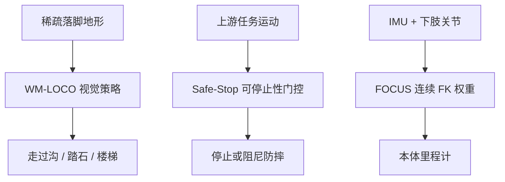

# 落脚、急停、本体里程计：三篇独立节点

> **本页定位**：给 WM-LOCO、Safe-Stop、FOCUS 提供 **横切阅读坐标**；方法细节只在各自 `paper-*` 页。Safe-Stop 在 [八篇可靠性地图](./open-source-system-reliability-8-papers-technology-map.md) 已有节点，本次 **复用**。

## 一句话观点

**穿越稀疏地形、决定能不能急停、以及腿式里程计该不该信这只脚，是三条不该塞进同一详情页的问题。**

## 英文缩写速查

| 缩写 | 英文全称 | 简要说明 |
|------|----------|----------|
| WM-LOCO | World-Model-Augmented Visual Locomotion | G1 单深度 + RSSM 预测特征 |
| Safe-Stop | Humanoid Safe Stop via Learned Stoppability Value | G1 双估计门控急停 |
| FOCUS | Foot Observation Confidence from Unannotated Simulation | A3 Ultra 连续 FK 可靠度 |
| G1 | Unitree G1 | WM-LOCO 与 Safe-Stop 真机 |

## 为什么单独做这张地图

- 三篇 arXiv 同日窗口（2609.02542 / 02358 / 02222），问题正交：策略落脚、安全停止、状态估计。
- **3/3 独立详情节点**：新建 WM-LOCO、FOCUS；**复用** [paper-safe-stop-humanoid](../entities/paper-safe-stop-humanoid.md)；**0 重复 arXiv 节点**。
- FOCUS 真机是 **AgiBot A3 Ultra**，不要读成「又一篇 G1 论文」。

## 流程总览

## 三篇速查

| # | 论文 | 平台 | 开源（2026-09-04） | 详情 |
|---|------|------|-------------------|------|
| 1 | WM-LOCO | G1 | **待发布** | [paper-wm-loco](../entities/paper-wm-loco.md) |
| 2 | Safe-Stop | G1 | **待发布** | [paper-safe-stop-humanoid](../entities/paper-safe-stop-humanoid.md) |
| 3 | FOCUS | A3 Ultra | **确认未开源** | [paper-focus-foot-observation-confidence](../entities/paper-focus-foot-observation-confidence.md) |

## 怎么连着读

1. **要过沟/踏石** — [WM-LOCO](../entities/paper-wm-loco.md) 与 [楼梯障碍任务页](../tasks/stair-obstacle-perceptive-locomotion.md)。
2. **要在运动中急停** — [Safe-Stop](../entities/paper-safe-stop-humanoid.md)；认证边界对照 [Fail-Passive Gap](../entities/paper-fail-passive-gap.md)。
3. **外感知不可用、还要腿式 odom** — [FOCUS](../entities/paper-focus-foot-observation-confidence.md) 与 [EKF](../formalizations/ekf.md)。

## 关联页面

- [Humanoid Locomotion](../tasks/humanoid-locomotion.md)
- [开源系统可靠性 8 篇](./open-source-system-reliability-8-papers-technology-map.md) — Safe-Stop 的另一索引

## 参考来源

- [wm_loco_arxiv_2609_02542](../../sources/papers/wm_loco_arxiv_2609_02542.md)
- [safe_stop_humanoid_arxiv_2609_02358](../../sources/papers/safe_stop_humanoid_arxiv_2609_02358.md)
- [focus_foot_observation_confidence_arxiv_2609_02222](../../sources/papers/focus_foot_observation_confidence_arxiv_2609_02222.md)

## 推荐继续阅读

- [WM-LOCO 项目页](https://m0puppet.github.io/wm-loco/)
- [Safe-Stop 项目页](https://junfeng-long.github.io/safestop/)
- [FOCUS HTML](https://arxiv.org/html/2609.02222)
