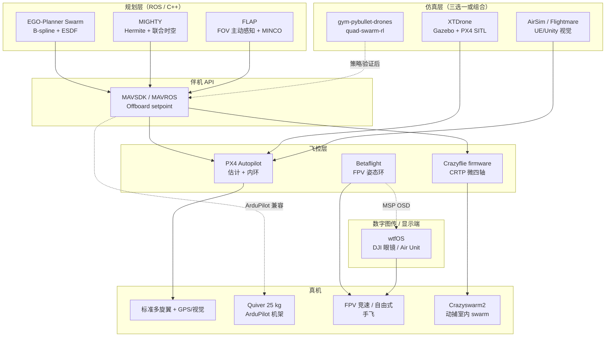

# 多旋翼仿真—规划—飞控开源栈总览

> **本页回答：** 做四旋翼/多旋翼研究或工程时，**PX4、XTDrone、EGO-Planner、PyBullet Gym、AirSim、群体 RL、Crazyflie、Flightmare、MAVSDK** 各在什么层？如何组合而不混用职责？

## 一句话总结

**飞控与通信** 分两支：**自主导航 / 研究** 以 [PX4](../entities/px4-autopilot.md) + [MAVSDK](../entities/mavsdk.md) 为事实标准；**FPV 手飞 / 竞速** 走 [Betaflight](../entities/betaflight.md)（MSP + Betaflight App，非 MAVLink）。**数字图传 / 眼镜端**（DJI HD FPV）社区扩展见 [wtfOS](../entities/wtfos.md)（opkg 包、MSP OSD 叠加，**非飞控**）。**运动规划** 常用 [EGO-Planner Swarm](../entities/ego-planner-swarm.md)，新一代联合时空优化可参考 [MIGHTY](../entities/paper-mighty-hermite-spline-trajectory-planning.md)（Hermite 样条 · RA-L 2026）；**无先验地图 + 有限 FOV 主动感知** 见 [FLAP](../entities/paper-flap-fov-active-perception-3d-navigation.md)（传感器系 FOV 惩罚 · arXiv 2026）；**仿真** 分三路——**Gazebo 教学栈**（[XTDrone](../entities/xtdrone.md)）、**高保真视觉**（[AirSim](../entities/airsim.md)、[Flightmare](../entities/flightmare.md)）、**轻量 RL**（[gym-pybullet-drones](../entities/gym-pybullet-drones.md)、[quad-swarm-rl](../entities/quad-swarm-rl.md)）；**真机微四轴 swarm** 走 [Crazyflie Firmware](../entities/crazyflie-firmware.md) + [Crazyswarm2](../entities/crazyswarm2.md)。**户外作业级开源机架** 见 [Project Quiver](../entities/project-quiver.md)（25 kg MTOW、ArduPilot、三接口载荷）。

## 英文缩写速查

| 缩写 | 英文全称 | 简要说明 |
|------|----------|----------|
| Sim2Real | Simulation to Real | 把仿真中学到的策略迁移落地真机的工程主线 |
| RL | Reinforcement Learning | 通过与环境交互最大化长期回报来学习策略的范式 |
| CAN | Controller Area Network | 电机/关节常用的现场总线通信协议 |
| SLAM | Simultaneous Localization and Mapping | 同步定位与建图 |
| Isaac Lab | NVIDIA Isaac Lab | 基于 Omniverse 的机器人学习训练框架 |
| ROS 2 | Robot Operating System 2 | 机器人系统集成与通信的常用中间件 |
| API | Application Programming Interface | 应用程序编程接口 |
| PWM | Pulse-Width Modulation | 脉宽调制，驱动电机与功率器件 |
| PD | Proportional–Derivative | 关节位置/阻抗底层控制，策略输出常为其 setpoint |
| WBC | Whole-Body Control | 协调全身关节满足多任务/约束的控制基础设施 |
| MuJoCo | Multi-Joint dynamics with Contact | 接触丰富的刚体物理仿真引擎 |

## 为什么重要

- 本仓库主线以 **腿式/人形** 为主，但 **空中 VLN、群体避障、视觉 Sim2Real** 与地面机器人共享「仿真—规划—低层控制—部署」方法论。
- 十仓覆盖从 **纳级微四轴** 到 **标准多旋翼 + PX4** 的完整谱系；后续补上 [Quiver](../entities/project-quiver.md) 作为 **25 kg / ArduPilot** 开源机架，避免把「有飞控固件」当成「有可制造真机」。选型错误常见表现：在 PyBullet Gym 里调 PX4 参数、或用 AirSim 期望精确接触动力学。
- 与 [DroneCAN / UAVCAN](../../sources/sites/cia_dronecan_uavcan.md) 衔接：PX4 外设总线与地面机器人 CAN 栈对照阅读。

## 流程总览

## 分层选型表

| 需求 | 优先选型 | 备选 | 避免 |
|------|----------|------|------|
| 工业/研究飞控、SITL、固定翼+多旋翼 | [PX4](../entities/px4-autopilot.md) | ArduPilot 上游固件（无独立实体页） | 仅 PyBullet 环境不调参就上真机 |
| 户外作业级开源机架、热插拔载荷、可制造 CAD | [Project Quiver](../entities/project-quiver.md)（25 kg / ArduPilot） | 自组 PX4 机架 | 把 Quiver 当 PX4 固件仓或室内微四轴 |
| FPV 竞速 / 自由式、低延迟手飞 | [Betaflight](../entities/betaflight.md) | — | 期待 MAVLink Offboard 或 ROS 任务栈 |
| DJI 数字图传 / 眼镜 MSP OSD、社区包 | [wtfOS](../entities/wtfos.md) | — | 当作飞控或期待 Goggles 2/3、O4 主线支持 |
| 伴机 Offboard / 自动化测试 | [MAVSDK](../entities/mavsdk.md) | MAVROS（[XTDrone](../entities/xtdrone.md) 教程栈） | 手写裸 MAVLink 除非必要 |
| 未知环境快速重规划、多机避碰 | [EGO-Planner Swarm](../entities/ego-planner-swarm.md) | [MIGHTY](../entities/paper-mighty-hermite-spline-trajectory-planning.md)（单机联合时空 Hermite） | 把规划器当飞控内环 |
| 无先验地图、窄 FOV 下主动感知穿越未知区 | [FLAP](../entities/paper-flap-fov-active-perception-3d-navigation.md) | EGO + 手工限速/双轨迹 | 忽视垂直 FOV 与竖向机动耦合 |
| 中文教程 + Gazebo + PX4 全链路 | [XTDrone](../entities/xtdrone.md) | — | 期待与 AirSim 相同画质 |
| 视觉 SLAM / 深度学习、UE 场景 | [AirSim](../entities/airsim.md) | [Flightmare](../entities/flightmare.md) | 用作高保真接触/桨叶 FEM |
| 敏捷飞行 RL、高并行 | [Flightmare](../entities/flightmare.md) | [gym-pybullet-drones](../entities/gym-pybullet-drones.md) | 首版就上真机无保护 |
| 课程/论文标准 UAV RL 基准 | [gym-pybullet-drones](../entities/gym-pybullet-drones.md) | [quad-swarm-rl](../entities/quad-swarm-rl.md) | 与 Isaac Lab 腿式环境混为一谈 |
| 公平比较 RL vs \(SE(3)\) 几何控制 | [RL vs GC](../entities/paper-rl-vs-gc.md)（Isaac Lab DirectRLEnv） | gym-pybullet-drones + 自写 PID | 用手调悬停增益或固件 PID 当 agile 基线 |
| 室内 50+ 微四轴灯光秀 | [Crazyswarm2](../entities/crazyswarm2.md) | — | 无动捕硬飞 swarm |
| ESC/电池 DroneCAN 外设 | DroneCAN 规范 | — | 与 CiA 402 关节伺服混淆 |
| 机载开源相控阵雷达 / 低成本主动测距 | [AERIS-10](../entities/aeris-10-plfm-radar.md) | 商用毫米波模组 | 无伴机桥接时直接接 PX4 内环 |

## Wiki 实体节点（10 仓）

本批每个 GitHub 仓库均对应独立 **entity** 详情页（图谱可点击）：

| 仓库 | Wiki 实体 |
|------|-----------|
| PX4/PX4-Autopilot | [px4-autopilot](../entities/px4-autopilot.md) |
| mavlink/MAVSDK | [mavsdk](../entities/mavsdk.md) |
| ZJU-FAST-Lab/ego-planner-swarm | [ego-planner-swarm](../entities/ego-planner-swarm.md) |
| microsoft/AirSim | [airsim](../entities/airsim.md) |
| robin-shaun/XTDrone | [xtdrone](../entities/xtdrone.md) |
| uzh-rpg/flightmare | [flightmare](../entities/flightmare.md) |
| utiasDSL/gym-pybullet-drones | [gym-pybullet-drones](../entities/gym-pybullet-drones.md) |
| Zhehui-Huang/quad-swarm-rl | [quad-swarm-rl](../entities/quad-swarm-rl.md) |
| IMRCLab/crazyswarm2 | [crazyswarm2](../entities/crazyswarm2.md) |
| bitcraze/crazyflie-firmware | [crazyflie-firmware](../entities/crazyflie-firmware.md) |

## 各仓库角色摘要

### 飞控与协议

- **[PX4-Autopilot](../entities/px4-autopilot.md)**：模块化自动驾驶仪，SITL/HITL、QGroundControl、ROS2 `px4_ros_com` 生态。
- **[MAVSDK](../entities/mavsdk.md)**：高层 C++/Python API（起飞、任务、Offboard、遥测），连接 PX4/ArduPilot。
- **[Crazyflie Firmware](../entities/crazyflie-firmware.md)**：微四轴嵌入式栈，CRTP + 甲板扩展；与 PX4 **不同赛道**。
- **[Betaflight](../entities/betaflight.md)**：FPV 手飞固件，DShot + Blackbox + OSD；**MSP** 配置，非 MAVLink 自主栈。
- **[wtfOS](../entities/wtfos.md)**：DJI FPV 眼镜 / Air Unit 社区固件框架，**opkg** 包与 **msp-osd** 等；图传显示端，不替代 Betaflight/PX4。

### 规划

- **[EGO-Planner Swarm](../entities/ego-planner-swarm.md)**：ESDF + B-spline 局部规划，swarm 避碰；输出通常转为 **位置/速度设定点** 而非电机 PWM。
- **[MIGHTY](../entities/paper-mighty-hermite-spline-trajectory-planning.md)**：MIT ACL **五次 Hermite 样条** + **联合时空** 软约束 NLP（RA-L 2026）；ROS 2 Humble 开源，真机报告 **6.7 m/s**；与 EGO 同层但表示与优化更激进，**暂无原生 swarm 扩展**。
- **[FLAP](../entities/paper-flap-fov-active-perception-3d-navigation.md)**：ZJU **无先验地图** 规划；**传感器系 FOV** 主动感知惩罚 + 可优化 AP 子段 + MINCO；面向窄垂直 FOV 与 3D 竖向机动，仿真/真机（Mid-360、深度相机）验证。

### 仿真

- **[XTDrone](../entities/xtdrone.md)**：PX4 + ROS + Gazebo 教学与实验集合。
- **[AirSim](../entities/airsim.md)**：UE/Unity 视觉仿真；维护模式下降，仍是视觉 UAV 文献常见基线。
- **[Flightmare](../entities/flightmare.md)**：研究向敏捷飞行与并行渲染；Unity 客户端。
- **[gym-pybullet-drones](../entities/gym-pybullet-drones.md)**：Gymnasium 四旋翼 RL，轻量可复现。
- **[RL vs GC](../entities/paper-rl-vs-gc.md)**：UPenn GRASP 在 Isaac Lab 上对称比较 PPO 与 \(SE(3)\) 几何控制（RSS 2025，[已开源](https://github.com/PratikKunapuli/rl-vs-gc)）；协议与选型见 [RL vs 几何控制](../comparisons/rl-vs-geometric-control.md)。
- **[quad-swarm-rl](../entities/quad-swarm-rl.md)**：多机 Gym 环境补充，社区较小。

### 真机群体

- **[Crazyswarm2](../entities/crazyswarm2.md)**：Crazyflie 大规模编队，ROS2 + 动捕/UWB。

### 机载感知硬件（补充）

- **[AERIS-10（PLFM_RADAR）](../entities/aeris-10-plfm-radar.md)**：开源 **相控阵雷达** 全栈（非本批 10 仓之一）；README 面向 **drone developers**，可与 [MAVSDK](../entities/mavsdk.md) 伴机或地面站融合点迹，但 **无** PX4 官方驱动，亦不在 AirSim/PyBullet 仿真链内。

### 开源机架（补充）

- **[Project Quiver](../entities/project-quiver.md)**：Arrow Air **25 kg MTOW** 开源四旋翼（CERN-OHL-S）；三接口载荷 + 四块定制 PCB + build123d CAD。飞控是 **ArduPilot / Pix32 V6**，不是 PX4 分叉；伴机仍可用 [MAVSDK](../entities/mavsdk.md)。与 Crazyflie 不在同一尺度。

## 与腿式机器人栈的对照

| 维度 | 多旋翼（本页） | 腿式/人形（仓库主线） |
|------|----------------|----------------------|
| 低层执行 | PX4 姿态/位置环 | 关节力矩 / PD + WBC |
| 仿真 RL 热门 | PyBullet Gym、Flightmare | MuJoCo、Isaac Lab |
| 群体 | Crazyswarm、EGO swarm | 较少原生 swarm 仓 |
| 总线外设 | DroneCAN ESC | CANopen / 私有 CAN |
| Sim2Real | 气动/延迟/推力映射 | 接触摩擦、关节间隙 |

深入 Sim2Real 方法论见 [Sim2Real](../concepts/sim2real.md)；仿真器横向对比见 [仿真器选型指南](../queries/simulator-selection-guide.md)（以 locomotion 为主，空中可类比「视觉 vs 物理」权衡）。

## 常见误区或局限

- **误区：AirSim / Flightmare 可替代 PX4 做全栈飞控开发** — 它们提供 **简单动力学或外接 PX4**；真机法律与安全仍依赖飞控认证与试飞流程。
- **误区：gym-pybullet-drones 训练策略可直接上 PX4** — 观测/动作空间与 SITL 不一致，需 **系统辨识、接口转换或 domain randomization**。
- **误区：文献里「RL 全面超过几何控制」可直接当选型结论** — [RL vs GC](../entities/paper-rl-vs-gc.md) 显示，若解析基线未在同一目标/数据/前馈上优化，差距会被高估。
- **误区：Betaflight 可替代 PX4 做自主导航** — FPV 固件面向 **手飞性能**；规划器输出应接 PX4/MAVSDK，而非 Betaflight MSP。
- **误区：Quiver 是 PX4 固件仓或室内微四轴** — [Quiver](../entities/project-quiver.md) 是 **ArduPilot 机架**（25 kg）；SITL 参数与 Crazyflie / gym-pybullet-drones 尺度都不通用。
- **误区：wtfOS 等于开源飞控** — [wtfOS](../entities/wtfos.md) 改造 **DJI 图传/眼镜固件**；姿态环仍在 Betaflight，自主栈仍在 PX4。
- **局限：AirSim 维护状态** — 新课题应查 Colosseum 等 fork 与 Flightmare 活跃度。
- **局限：Crazyswarm** — 依赖室内定位，难扩展到 GPS 室外大编队。
- **局限：EGO-Planner / MIGHTY** — 算力与传感器标定要求高；软约束极端动态场景需额外安全层；MIGHTY 官方栈绑定 ROS 2 Humble。

## 参考来源

- [sources/repos/multirotor_uav_stack_catalog.md](../../sources/repos/multirotor_uav_stack_catalog.md)
- [sources/repos/px4_autopilot.md](../../sources/repos/px4_autopilot.md)
- [sources/repos/mavsdk.md](../../sources/repos/mavsdk.md)
- [sources/repos/ego_planner_swarm.md](../../sources/repos/ego_planner_swarm.md)
- [sources/papers/mighty_arxiv_2511_10822.md](../../sources/papers/mighty_arxiv_2511_10822.md)
- [sources/repos/mighty.md](../../sources/repos/mighty.md)
- [sources/repos/airsim.md](../../sources/repos/airsim.md)
- [sources/repos/xtdrone.md](../../sources/repos/xtdrone.md)
- [sources/repos/flightmare.md](../../sources/repos/flightmare.md)
- [sources/repos/gym_pybullet_drones.md](../../sources/repos/gym_pybullet_drones.md)
- [sources/papers/leveling_playing_field_rl_vs_gc_arxiv_2506_17832.md](../../sources/papers/leveling_playing_field_rl_vs_gc_arxiv_2506_17832.md)
- [sources/repos/rl-vs-gc.md](../../sources/repos/rl-vs-gc.md)
- [sources/repos/quad_swarm_rl.md](../../sources/repos/quad_swarm_rl.md)
- [sources/repos/crazyswarm2.md](../../sources/repos/crazyswarm2.md)
- [sources/repos/crazyflie_firmware.md](../../sources/repos/crazyflie_firmware.md)
- [sources/repos/betaflight.md](../../sources/repos/betaflight.md)
- [sources/sites/betaflight-com.md](../../sources/sites/betaflight-com.md)
- [sources/repos/wtfos.md](../../sources/repos/wtfos.md)
- [sources/sites/fpv-wtf.md](../../sources/sites/fpv-wtf.md)
- [sources/sites/cia_dronecan_uavcan.md](../../sources/sites/cia_dronecan_uavcan.md)
- [sources/repos/project-quiver.md](../../sources/repos/project-quiver.md)
- [sources/sites/arrowair-quiver.md](../../sources/sites/arrowair-quiver.md)

## 关联页面

- [PX4 Autopilot](../entities/px4-autopilot.md) · [MAVSDK](../entities/mavsdk.md) · [EGO-Planner Swarm](../entities/ego-planner-swarm.md) · [MIGHTY](../entities/paper-mighty-hermite-spline-trajectory-planning.md)
- [AirSim](../entities/airsim.md) · [XTDrone](../entities/xtdrone.md) · [Flightmare](../entities/flightmare.md)
- [gym-pybullet-drones](../entities/gym-pybullet-drones.md) · [quad-swarm-rl](../entities/quad-swarm-rl.md)
- [RL vs GC](../entities/paper-rl-vs-gc.md) · [RL vs 几何控制](../comparisons/rl-vs-geometric-control.md)
- [Crazyswarm2](../entities/crazyswarm2.md) · [Crazyflie Firmware](../entities/crazyflie-firmware.md) · [Betaflight](../entities/betaflight.md) · [wtfOS](../entities/wtfos.md)
- [Project Quiver](../entities/project-quiver.md) — 25 kg ArduPilot 开源机架
- [Sim2Real](../concepts/sim2real.md)
- [仿真器选型指南](../queries/simulator-selection-guide.md)
- [WorldVLN（空中 VLN）](../entities/paper-worldvln-aerial-vln-wam.md)
- [FSD-VLN（空中长程 VLN · 快慢双系统）](../entities/paper-fsd-vln.md)
- [电机驱动器底软通信协议总览](./motor-drive-firmware-bus-protocols.md)（DroneCAN 行）
- [野外微型飞行机器人蜂群](../entities/paper-swarm-micro-flying-robots-in-the-wild.md)
- [EuRoC MAV 数据集](../entities/euroc-mav-datasets.md)

## 推荐继续阅读

- [PX4 User Guide](https://docs.px4.io/) — 模式、校准、SITL
- [MAVSDK Guide](https://mavsdk.mavlink.io/main/en/) — Offboard 与任务 API
- [gym-pybullet-drones 文档](https://utiasdsl.github.io/gym-pybullet-drones/) — 环境与 RL 示例
- [EGO-Planner 论文与演示](https://github.com/ZJU-FAST-Lab/ego-planner) — 原版单机智规划
