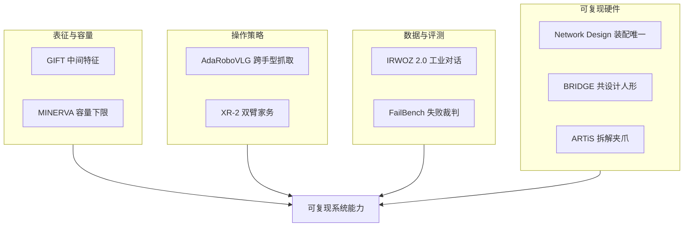

# 开源可复现性：9 篇论文的阅读坐标

> **本页定位**：为 [具身智能小站 · 9篇具身智能新论文开源](https://mp.weixin.qq.com/s/IDeWoG3ykIlyPJJcYpPLhg)（2026-09-04）提供 **按四类问题组织的阅读坐标**；不复述每篇方法细节。姊妹盘点见 [开源系统可靠性 8 篇](./open-source-system-reliability-8-papers-technology-map.md)、[接触丰富操作 7 篇](./contact-rich-manipulation-7-papers-technology-map.md)。

## 一句话观点

**这一批开源论文的价值不在又一个模型名，而在把表征、数据、评测与硬件同时变成可复现资产。**

## 英文缩写速查

| 缩写 | 英文全称 | 简要说明 |
|------|----------|----------|
| VLA | Vision-Language-Action | 视觉-语言-动作策略 |
| WAM | World Action Model | 联合未来观测与动作 |
| VLM | Vision-Language Model | 失败检测裁判 |
| LIBERO | Lifelong Robot Learning | MINERVA / GIFT 共用操作基准 |

## 为什么单独做这张地图

- 公众号把 9 篇串在「数据 / 代码 / 检查点 / 硬件 / 评测一起开源」叙事里。
- **9/9 独立 `paper-*` 节点**：本 ingest **新建 9**；**0 复用 / 0 重复 arXiv 节点**。
- 需要横切面索引，避免 9 个实体成孤岛，也避免把「有项目页」写成「已可复现」。

## 流程总览

## 分组索引

### 控制相关表征与容量

| # | 论文 | 开源（入库日） | 详情 |
|---|------|---------------|------|
| 01 | GIFT | **待发布** | [paper-gift-intermediate-feature-training](../entities/paper-gift-intermediate-feature-training.md) |
| 05 | MINERVA | **已开源** `k1000dai/MINERVA` | [paper-minerva-libero](../entities/paper-minerva-libero.md) |

### 可泛化操作与规模数据

| # | 论文 | 开源（入库日） | 详情 |
|---|------|---------------|------|
| 02 | AdaRoboVLG | **待发布** | [paper-adarobovlg](../entities/paper-adarobovlg.md) |
| 07 | XR-2 / 双臂家务 | **部分开源**（HF 数据；策略未见） | [paper-xr2-bimanual-household](../entities/paper-xr2-bimanual-household.md) |

### 对话数据与失败裁判

| # | 论文 | 开源（入库日） | 详情 |
|---|------|---------------|------|
| 03 | IRWOZ 2.0 | **部分开源**（Dataport + 旧仓） | [paper-irwoz-2](../entities/paper-irwoz-2.md) |
| 06 | FailBench | **部分开源**（站点镜像，harness 未见） | [paper-failbench](../entities/paper-failbench.md) |

### 可复现硬件与装配

| # | 论文 | 开源（入库日） | 详情 |
|---|------|---------------|------|
| 04 | Network Design | **已开源** `Barabasi-Lab/NetworkDesign` | [paper-network-design-reproducible](../entities/paper-network-design-reproducible.md) |
| 08 | BRIDGE | **部分开源**（`.stp` CAD；控制/BOM 待录用） | [paper-bridge-humanoid](../entities/paper-bridge-humanoid.md) |
| 09 | ARTiS | **部分开源**（CAD/BOM；控制未见） | [paper-artis-gripper](../entities/paper-artis-gripper.md) |

## 读法建议

1. **做 VLA 表征** — 从 [GIFT](../entities/paper-gift-intermediate-feature-training.md) 入手，对照 [WAM](../concepts/world-action-models.md)。
2. **读 LIBERO 分数** — 先看 [MINERVA](../entities/paper-minerva-libero.md) 的容量下限与 Plus 掉点。
3. **做跨手型抓取** — [AdaRoboVLG](../entities/paper-adarobovlg.md) + [抓取选型](../queries/grasp-policy-selection.md)。
4. **做家务双臂** — [XR-2](../entities/paper-xr2-bimanual-household.md) 先下数据，再等策略仓。
5. **做评测治理** — [FailBench](../entities/paper-failbench.md) 管视觉裁判；[IRWOZ 2.0](../entities/paper-irwoz-2.md) 管工业听懂。
6. **做开放硬件** — [BRIDGE](../entities/paper-bridge-humanoid.md) 看共设计，[ARTiS](../entities/paper-artis-gripper.md) 看末端，[Network Design](../entities/paper-network-design-reproducible.md) 看装配是否唯一。

## 关联页面

- [VLA](../methods/vla.md)
- [World Action Models](../concepts/world-action-models.md)
- [Manipulation](../tasks/manipulation.md)
- [Humanoid Locomotion](../tasks/humanoid-locomotion.md)
- [开源系统可靠性 8 篇](./open-source-system-reliability-8-papers-technology-map.md)

## 参考来源

- [具身智能小站 2026-09-04 九篇盘点](../../sources/blogs/wechat_embodied_station_9_papers_open_source_2026-09-04.md)
- [原始抓取](../../sources/raw/wechat_embodied_station_9_papers_open_source_2026-09-04.md)

## 推荐继续阅读

- [公众号原文](https://mp.weixin.qq.com/s/IDeWoG3ykIlyPJJcYpPLhg)
