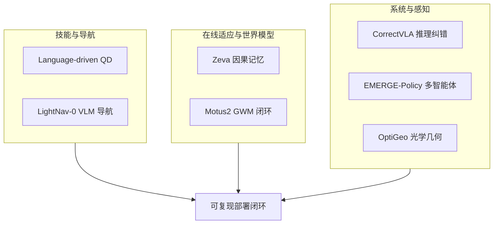

# 开源系统闭环：7 篇论文的阅读坐标

> **本页定位**：为 [具身智能小站 · 7 篇开源速递](https://mp.weixin.qq.com/s/IkK6lFCu4hjBX0sA1hMqgA)（2026-09-01）提供 **按七类问题组织的阅读坐标**；不复述每篇方法细节。姊妹盘点见 [CLAP 9 篇](./clap-cross-embodiment-vla-wm-9-papers-technology-map.md)、[WAM/VLA 9 篇](./wam-vla-cross-embodiment-9-papers-technology-map.md)。

## 一句话观点

**具身智能正进入「开源入口 + 系统闭环」阶段：语言生成技能档案、VLM 统一导航、记忆与世界模型自进化、推理期纠错、多智能体编排与光学几何感知一并推进可复现部署。**

## 英文缩写速查

| 缩写 | 英文全称 | 简要说明 |
|------|----------|----------|
| QD | Quality-Diversity | 多样技能档案优化范式 |
| VLM | Vision-Language Model | 视觉-语言模型 |
| GWM | General World Model | 统一预测—行动—评估的世界模型 |
| VLA | Vision-Language-Action | 视觉-语言-动作策略 |

## 为什么单独做这张地图

- 公众号把 7 篇串在「开源入口 + 系统闭环」叙事里。
- **7/7 独立 `paper-*` 节点**：本 ingest **新建 6**、**复用 Motus2**；**0 重复 arXiv 节点**。
- 需要横切面索引，避免 7 个实体成孤岛。

## 流程总览

## 分组索引

### 语言技能档案与 VLM 导航

| # | 论文 | 开源（入库日） | 详情 |
|---|------|---------------|------|
| 01 | Language-driven QD | **已开源** `EGarrabe/Language-driven-robotic-QD` | [paper-language-driven-robotic-qd](../entities/paper-language-driven-robotic-qd.md) |
| 02 | LightNav-0 | **已开源** `lightorigins/LightNav-0` + HF | [paper-lightnav-0](../entities/paper-lightnav-0.md) |

### 在线适应与世界模型闭环

| # | 论文 | 开源（入库日） | 详情 |
|---|------|---------------|------|
| 03 | Zeva | **已开源** `air-embodied-brain/Zeva` + HF | [paper-zeva](../entities/paper-zeva.md) |
| 04 | Motus2 | **未开源**（项目页无代码仓） | [paper-motus2](../entities/paper-motus2.md) |

### 系统编排、纠错与感知

| # | 论文 | 开源（入库日） | 详情 |
|---|------|---------------|------|
| 05 | CorrectVLA | **已开源** `owenk3/correct_vla` | [paper-correctvla](../entities/paper-correctvla.md) |
| 06 | EMERGE-Policy | **已开源** `EMERGE-Policy/EMERGE-Policy` | [paper-emerge-policy](../entities/paper-emerge-policy.md) |
| 07 | OptiGeo | **已开源** `mx-liu6/OptiGeo` + HF | [paper-optigeo](../entities/paper-optigeo.md) |

## 关联页面

- [VLA](../methods/vla.md)
- [生成式世界模型](../methods/generative-world-models.md)
- [World Action Models](../concepts/world-action-models.md)
- [视觉–语言导航（VLN）](../tasks/vision-language-navigation.md)

## 推荐继续阅读

- [公众号原文](https://mp.weixin.qq.com/s/IkK6lFCu4hjBX0sA1hMqgA)
- [具身智能小站归档](../../sources/blogs/wechat_embodied_station_7_papers_open_source_system_loop_2026-09-01.md)

## 参考来源

- [wechat_embodied_station_7_papers_open_source_system_loop_2026-09-01.md](../../sources/blogs/wechat_embodied_station_7_papers_open_source_system_loop_2026-09-01.md)
