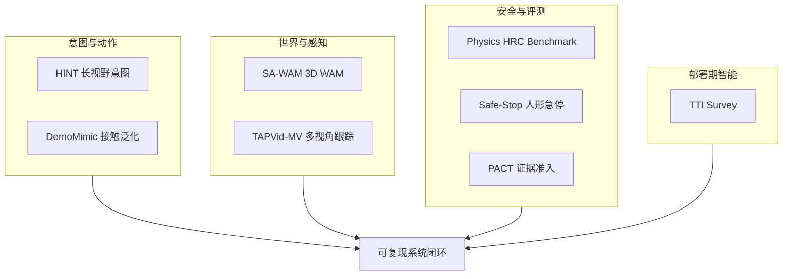

# 开源系统可靠性：8 篇论文的阅读坐标

> **本页定位**：为 [具身智能小站 · 具身智能机器人最新开源论文速览](https://mp.weixin.qq.com/s/-UqboKHaoG5eu79u9XQU0w)（2026-09-03）提供 **按八类问题组织的阅读坐标**；不复述每篇方法细节。姊妹盘点见 [开源可复现性 9 篇](./open-source-reproducibility-9-papers-technology-map.md)、[接触丰富操作 7 篇](./contact-rich-manipulation-7-papers-technology-map.md)、[开源系统闭环 7 篇](./open-source-system-loop-7-papers-technology-map.md)。

## 一句话观点

**具身智能的竞争点正从单一模型能力扩展到系统级可靠性：意图保持、3D 世界模型、接触安全评测、急停可恢复性、灵巧迁移、多视角几何、部署期自改进与证据可计数融合。**

## 英文缩写速查

| 缩写 | 英文全称 | 简要说明 |
|------|----------|----------|
| WAM | World Action Model | 联合预测未来观测与动作 |
| HRC | Human-Robot Collaboration | 人机协作 |
| TTI | Test-Time Intelligence | 测试时智能统一视角 |
| TAP | Tracking Any Point | 任意点跟踪 |

## 为什么单独做这张地图

- 公众号把 8 篇串在「开源入口 + 系统闭环可靠性」叙事里。
- **8/8 独立 `paper-*` 节点**：本 ingest **新建 7**；**DemoMimic 复用** complete 页；**0 重复 arXiv 节点**。
- 需要横切面索引，避免 8 个实体成孤岛。

## 流程总览

## 分组索引

### 长视野意图与灵巧操作

| # | 论文 | 开源（入库日） | 详情 |
|---|------|---------------|------|
| 01 | HINT | **待发布** | [paper-hint-robot-manipulation](../entities/paper-hint-robot-manipulation.md) |
| 05 | DemoMimic | **待发布**（复用既有页） | [paper-demomimic](../entities/paper-demomimic.md) |

### 3D 世界模型与多视角感知

| # | 论文 | 开源（入库日） | 详情 |
|---|------|---------------|------|
| 02 | SA-WAM | **待发布** | [paper-sa-wam](../entities/paper-sa-wam.md) |
| 06 | TAPVid-MV | **部分开源**（基准/Perpetua 经项目页） | [paper-tapvid-mv](../entities/paper-tapvid-mv.md) |

### 接触安全、急停与证据融合

| # | 论文 | 开源（入库日） | 详情 |
|---|------|---------------|------|
| 03 | Physics-Consistent HRC Benchmark | **部分/待发布** | [paper-physics-consistent-hrc-benchmark](../entities/paper-physics-consistent-hrc-benchmark.md) |
| 04 | Safe-Stop | **待发布** | [paper-safe-stop-humanoid](../entities/paper-safe-stop-humanoid.md) |
| 08 | PACT | **已开源** `ZekaiJ/PACT` | [paper-pact-hrc-action-admission](../entities/paper-pact-hrc-action-admission.md) |

### 部署期自改进

| # | 论文 | 开源（入库日） | 详情 |
|---|------|---------------|------|
| 07 | TTI Survey | **已开源** Awesome 列表 | [paper-test-time-intelligence-survey](../entities/paper-test-time-intelligence-survey.md) |

## 读法建议

1. **做长视野 VLA 编排** — 从 [HINT](../entities/paper-hint-robot-manipulation.md) 入手，对照 [VLA](../methods/vla.md)。
2. **做 3D-aware 策略** — [SA-WAM](../entities/paper-sa-wam.md) + [World Action Models](../concepts/world-action-models.md)。
3. **做护理/接触 HRC** — [Physics Benchmark](../entities/paper-physics-consistent-hrc-benchmark.md) 评物理，[PACT](../entities/paper-pact-hrc-action-admission.md) 管准入。
4. **做人形安全** — [Safe-Stop](../entities/paper-safe-stop-humanoid.md) 与 [Humanoid Locomotion](../tasks/humanoid-locomotion.md)；同日窗口的落脚/里程计姊妹节点见 [三篇坐标](./g1-foothold-safe-stop-focus-technology-map.md)。
5. **做灵巧单示范** — [DemoMimic](../entities/paper-demomimic.md)（既有 complete 页）。
6. **做多相机感知** — [TAPVid-MV](../entities/paper-tapvid-mv.md)。
7. **梳理部署期方法版图** — [TTI Survey](../entities/paper-test-time-intelligence-survey.md)。

## 关联页面

- [VLA](../methods/vla.md)
- [World Action Models](../concepts/world-action-models.md)
- [Manipulation](../tasks/manipulation.md)
- [Humanoid Locomotion](../tasks/humanoid-locomotion.md)

## 参考来源

- [具身智能小站 2026-09-03 八篇盘点](../../sources/blogs/wechat_embodied_station_8_papers_open_source_2026-09-03.md)
- [原始抓取](../../sources/raw/wechat_embodied_station_8_papers_open_source_2026-09-03.md)

## 推荐继续阅读

- [公众号原文](https://mp.weixin.qq.com/s/-UqboKHaoG5eu79u9XQU0w)
