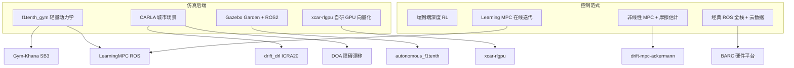
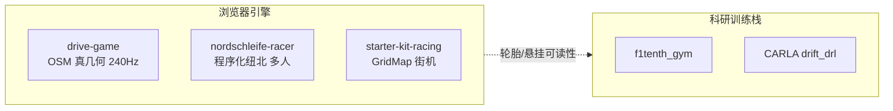

# 赛车漂移强化学习开源景观

> **本页定位：** 将用户指定的 10 个 GitHub 仓库整理为可按 **复现目标** 检索的地图；**不**替代各仓 README，也**不**固化 star 数。

## 一句话总结

赛车漂移研究的工程分叉主要在三层：**用什么仿真**（轻量 f1tenth_gym vs 高保真 CARLA vs ROS/Gazebo 全栈 vs **浏览器自研物理**）、**用什么控制**（端到端 RL vs 学习 MPC vs 显式轮胎模型 NMPC）、**是否上真机**（BARC / F1TENTH / 自研 1:10）。先选对层，再选仓库。

## 英文缩写速查

| 缩写 | 英文全称 | 简要说明 |
|------|----------|----------|
| RL | Reinforcement Learning | 从交互中学习漂移/竞速策略 |
| MPC | Model Predictive Control | 滚动时域优化；LMPC/NMPC 见下文 |
| LMPC | Learning Model Predictive Control | 用历史轨迹样本集在线改进终端约束与代价 |
| IWD | Individual Wheel Drive | 四轮独立驱动，利于漂移机动 |
| F1TENTH | — | 1/10 自主竞速国际标准平台与社区 |
| CARLA | Car Learning to Act | UE 城市驾驶开源仿真器 |
| SB3 | Stable-Baselines3 | Gym-Khana 默认 RL 库 |
| Sim2Real | Simulation to Real | 仿真策略迁移真车 |

## 景观总览

## 10 项开源栈速查

| 项目 | 核心贡献（归纳） | 仿真/硬件 | 开源 | 本站页 |
|------|------------------|-----------|------|--------|
| **xcar-rlgpu** | GPU 并行 IWD 漂移 RL + 域随机化 | 自研向量化 + rl_games | 已开源 MIT | [xcar-rlgpu](../entities/xcar-rlgpu.md) |
| **drift_drl** | CARLA 高速漂移 DRL 经典基线（ICRA 2020） | CARLA **0.9.5 定制包** | 已开源 MIT | [drift-drl](../entities/drift-drl.md) |
| **LearningMPC** | F1/10 在线 LMPC 逐圈缩短圈速 | UPenn ROS racecar_simulator | 已开源 | 本页 |
| **Gym-Khana** | f1tenth_gym + SB3/wandb 漂移课程学习 | f1tenth_gym | 已开源 MIT | 本页 |
| **BARC** | 伯克利 1/10 全栈：ROS + 硬件 + 云数据 | 真机 RC | 已开源 MIT | [barc](../entities/barc.md) |
| **DOA** | CARLA 突发障碍漂移避障 DRL | CARLA 0.9.14 | 已开源 MIT | 本页 |
| **drift-mpc-ackermann** | 低 μ 面 Ackermann 漂移 NMPC | 1:10 + ROS 2 Jazzy | 已开源 MIT | 本页 |
| **f1tenth_gym** | 社区标准 1/10 Gym 仿真 | 纯 Python | 已开源 MIT | [f1tenth-gym](../entities/f1tenth-gym.md) |
| **autonomous_f1tenth** | CARES RL + Gazebo 仿真/真车 | F1TENTH + ROS 2 | 已开源 | 本页 |
| **CARLA** | 城市 AD 仿真基础设施 | UE 城市 | 已开源 MIT | [carla](../entities/carla.md) |

## 浏览器纽北 / 赛道驾驶引擎（补充）

> 下列项目面向 **人类可玩模拟器 / 引擎源码阅读**，默认 **无 Gym RL API**；轮胎与悬挂实现可对照 MPC/漂移研究，但不宜与上表训练栈直接混比圈速。

| 项目 | 核心贡献（归纳） | 运行形态 | 开源 | 本站页 |
|------|------------------|----------|------|--------|
| **drive-game** | OSM/DEM 真几何纽北 + **240 Hz** Pacejka 物理；Web/Android | [drive-game.pages.dev](https://drive-game.pages.dev) 可本地 `npm run dev` | 已开源 MIT | [drive-game](../entities/drive-game.md) |
| **nordschleife-racer** | TS 程序化纽北 + 漂移物理 + Supabase 多人/榜 | 玩：[yassin.app](https://yassin.app)；仓为引擎切片 | 引擎 MIT；GLB/后端未入库 | [nordschleife-racer](../entities/nordschleife-racer.md) |
| **starter-kit-racing** | Kenney Godot→JS 街机移植；GridMap 编辑器 | [Pages 在线](https://mrdoob.github.io/Starter-Kit-Racing/)；CDN 零构建 | 已开源 MIT | [starter-kit-racing](../entities/starter-kit-racing.md) |

## 按复现目标选入口

| 你的首要目标 | 建议起点 | 常见坑 |
|-------------|----------|--------|
| 最快跑通 1/10 竞速/漂移 RL | [f1tenth_gym](../entities/f1tenth-gym.md) → [Gym-Khana](https://github.com/TeoIlie/Gym-Khana) | 轮胎参数与地图坐标系；Mac 渲染 OpenGL |
| GPU 大规模并行漂移训练 | [xcar-rlgpu](../entities/xcar-rlgpu.md) | 需 CUDA + submodule rl_games |
| 复现 CARLA 经典漂移论文 | [drift-drl](../entities/drift-drl.md) | **必须**下载作者 0.9.5 build，非 pip CARLA |
| CARLA 较新版本 + 障碍漂移 | [DOA](https://github.com/ustcly/DOA) | 0.9.14 与 drift_drl 环境不通用 |
| 模型驱动漂移（非 RL） | [drift-mpc-ackermann](https://github.com/Gelminaio/drift-mpc-ackermann) | ROS 2 Jazzy 多机分布式；摩擦估计调参 |
| 学习 MPC 缩圈 | [LearningMPC](https://github.com/mlab-upenn/LearningMPC) | ROS1 catkin + OSQP 工具链 |
| 真机 1/10 全栈 | [barc](../entities/barc.md) | 硬件 BOM + Odroid 刷机 + ROS 版本 |
| ROS 2 + Gazebo RL | [autonomous_f1tenth](https://github.com/UoA-CARES/autonomous_f1tenth) | 源码构建 Gazebo Garden + fork gz-sim |
| 城市 AD 通用仿真 | [carla](../entities/carla.md) | 漂移专用仓往往锁定**旧版** CARLA |
| 本地可 fork 的纽北模拟器 | [drive-game](../entities/drive-game.md) | `npm run dev`；非 RL 环境 |
| 读漂移/多人引擎源码 | [nordschleife-racer](../entities/nordschleife-racer.md) | 完整游玩靠 yassin.app；车模不在仓内 |
| 最小 Three.js 街机赛车样板 | [starter-kit-racing](../entities/starter-kit-racing.md) | arcade 物理非 Pacejka；CDN 离线需改 importmap |

## RL vs MPC：如何读这条线

- **RL 路线**（drift_drl、DOA、Gym-Khana、xcar-rlgpu、autonomous_f1tenth）假设奖励/课程能塑造侧滑稳定域，优势是模型误差容忍度高，代价是样本与 Sim2Real 成本高。
- **MPC 路线**（LearningMPC、drift-mpc-ackermann）显式用自行车模型 + 轮胎力饱和；优势是可解释与约束安全，代价是模型辨识与实时求解。
- **BARC** 更偏 **教学/研究全栈**：漂移只是能力之一，价值在硬件、数据闭环与 ROS 工程习惯。
- **浏览器引擎**（drive-game、nordschleife-racer、starter-kit-racing）提供 **轮胎/街机物理** 的可读实现与可玩 demo，适合对照直觉或快速 Web 原型，但需自行封装才适合 RL 训练。

## 与其他页面的关系

- [强化学习](../methods/reinforcement-learning.md) — 通用 RL 范式；本页是其 **轮式极限驾驶** 垂直切片
- [MPC](../methods/model-predictive-control.md) — LMPC/NMPC 理论基础
- [Sim2Real](../concepts/sim2real.md) — Gym-Khana、xcar-rlgpu、drift-mpc-ackermann 均强调域随机或摩擦自适应
- [仿真平台十年地图](../overview/sim-platforms-decade-technology-map.md) — CARLA 在 AD 基础设施中的位置

## 参考来源

- [赛车漂移 RL 开源景观（策展）](../../sources/papers/racing_drift_rl_open_source_landscape.md)
- 各仓库归档见 `sources/repos/` 对应文件

## 推荐继续阅读

- [F1TENTH Gym 文档](https://f1tenth-gym.readthedocs.io)
- [drift_drl 论文](https://arxiv.org/abs/2001.01377)（ICRA 2020）
- [BARC Wiki](https://github.com/MPC-Berkeley/barc/wiki)
