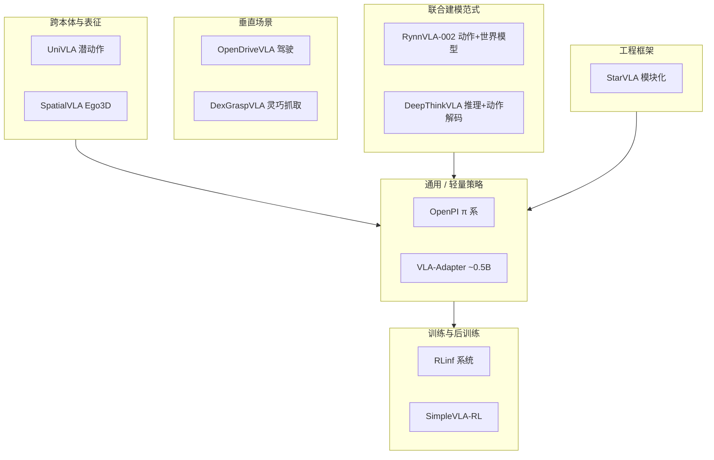

# VLA 开源复现景观（2025 策展）

> **本页定位：** 将深蓝具身智能微信公众号对 GitHub 高 star VLA 项目的「复现向」综述，整理为可按目标检索的地图；**不**替代各仓库 README，也**不**固化 star 快照。

## 一句话总结

VLA 的「智能」可以写在论文里，但**跑不通的训练脚本与权重**会直接暴露工程差距；2025 年开源生态同时在 **模型、RL 训练系统、跨本体与 VLA+世界模型** 四条线上铺开，复现时应先选对「你要验证的层」再选仓库。**2026 起** 可另见通义 [Qwen-VLA](../entities/qwen-vla.md)（**操作 + VLN 统一通才**、Qwen3.5-4B + DiT flow），本页 11 项表仍锁定 2025-12 策展快照。

**2026 补充入口（不入上表）：** [Dexmal DM0.5（OpenDM）](../entities/dexmal-dm05.md) 适合 **Gemma3-4B + flow-matching chunk VLA** 全栈复现（`dexmal/opendm` + HF `DM05` 及 LIBERO/RobotWin/Table30 下游权重；`script/dm05_launcher.sh` 统一 train/inference）。[RoboInter1.5](../entities/paper-robointer-1-5.md) 提供 **中间表示数据 + VLM +（待齐）VLA/World**——适合先复现 IR-VQA/Planner，再跟进 VLA 权重。[FabriVLA](../entities/paper-fabrivla.md) 适合 **Meta-World 轻量 flow-VLA** 对照（gated SA + shallow fusion，代码+93k 权重）；多基准相对位次见 [VLA SOTA Leaderboard](../entities/vla-sota-leaderboard.md)。[EgoSteer](../entities/paper-egosteer.md) 适合 **双灵巧手 + egocentric 预训练全栈**（EgoSmith / Robot Stack / WM-VLA；代码+权重已开源，全量处理后数据待发）。[G0.5](../entities/paper-galaxea-g05.md) 适合 **VLM-as-Actor 自回归** 复现（`OpenGalaxea/GalaxeaVLA` + HF `G05`；R1/LIBERO/RoboTwin/DROID 入口；Community License）。[ROS2SmolVLA](../entities/paper-ros2smolvla.md) 适合 **工业 UR10e + ROS 2 本地 SmolVLA**（Docker 入口 + HF 权重；arXiv:2608.23320）。[Perceptron Isaac 0.5](../entities/perceptron-isaac-05.md) 适合跟 **36B 稀疏通才 + LeRobot `perceptron_isaac`**（视频–teleop scaling；代码已开源、Hub 权重入库日 COMING SOON；**勿与 NVIDIA Isaac GR00T 混淆**）。

## 英文缩写速查

| 缩写 | 英文全称 | 简要说明 |
|------|----------|----------|
| VLA | Vision-Language-Action | 视觉-语言-动作多模态基础策略方向 |
| RL | Reinforcement Learning | 通过与环境交互最大化长期回报来学习策略的范式 |
| DiT | Diffusion Transformer | 以 Transformer 为骨干的扩散生成架构 |
| VLM | Vision-Language Model | 视觉-语言多模态理解模型，VLA 的上游 |
| Manipulation | Robot Manipulation | 抓取、移动、操作物体的任务总称 |
| URDF | Unified Robot Description Format | 统一机器人描述格式 |
| WM | World Model | 学习环境动态以供想象/规划的世界模型 |

## 为什么用「复现目标」而不是「榜单排名」

- 筛选口径（原文）：代码可获取、活跃度、star>400（截至 2025-12-22）——**遗漏仍多**，未上榜项目同样有参考价值。
- 同一 star 段的项目可能服务完全不同环节：**策略权重** vs **RL 集群** vs **VLM→VLA 脚手架** vs **自动驾驶栈**。
- 与本站 [VLA 方法页](../methods/vla.md)、[操作 VLA 选型 Query](../queries/manipulation-vla-architecture-selection.md) 互补：本页偏 **开源入口与复现路径**，彼处偏 **架构族与数据假设**。

## 景观总览

## 11 项开源栈速查（文内 01–12，缺 02）

| 项目 | 核心贡献（归纳） | 一手仓库 | 本站相关页 |
|------|------------------|----------|------------|
| **OpenPI** | Physical Intelligence 的 π0 / π0-FAST / π0.5；VLM 语义 + flow matching 动作；多真机平台微调 | [openpi](https://github.com/Physical-Intelligence/openpi) | [π0 Policy](../methods/π0-policy.md)、[π0.7](../methods/pi07-policy.md)、[VLA](../methods/vla.md) |
| **VLA-Adapter** | ~0.5B 轻量 VLA；Bridge Attention 注入 VL；强调低机器人预训练数据 | [VLA-Adapter](https://github.com/OpenHelix-Team/VLA-Adapter) | [VLA](../methods/vla.md)、[选型 Query](../queries/manipulation-vla-architecture-selection.md) |
| **RLinf** | 大规模 RL **系统**（流水线、通信、调度）；内置 **STEAM/RECAP** 离线 advantage + CFG 管线；对接 OpenPI | [RLinf](https://github.com/RLinf/RLinf) | [STEAM](../entities/paper-steam-advantage-modeling.md)、[VLA](../methods/vla.md)、[强化学习](../methods/reinforcement-learning.md) |
| **RPent** | RLinf 生态 **agentic 运行时**：LLM planner + 固定原语 + 冻结 VLA（`vla_act`）；Harness VLA（arXiv:2607.08448v3）官方实现 | [RPent](https://github.com/RLinf/RPent) | [Harness VLA](../entities/paper-harness-vla.md)、[VLA](../methods/vla.md) |
| **RoboHarness** | 异构策略（VLA+RL+TAMP）能力边界路由 + Memory Bridge；**仓暂为项目页镜像**，无可运行 harness | [RoboHarness](https://github.com/markli1hoshipu/RoboHarness) | [RoboHarness 论文](../entities/paper-robo-harness.md)、[VLA](../methods/vla.md) |
| **SimpleVLA-RL** | veRL 扩展；面向 VLA 的轨迹采样与并行；OpenVLA-OFT RL 实验 | [SimpleVLA-RL](https://github.com/PRIME-RL/SimpleVLA-RL) | [VLA](../methods/vla.md) |
| **UniVLA** | 从视频学 **潜动作**；跨平台轻量解码；减弱显式动作标签依赖 | [UniVLA](https://github.com/OpenDriveLab/UniVLA) | [DeFI](../methods/defi-decoupled-dynamics-vla.md)（潜动作路线对照）；**≠** 导航向 [Uni-NaVid](../overview/vln-open-source-repro-paradigms.md) |
| **RynnVLA-002** | 统一动作生成与环境预测的自回归 **动作-世界模型** | [RynnVLA-002](https://github.com/alibaba-damo-academy/RynnVLA-002) | [世界模型闭环分类](../overview/robot-world-models-training-loop-taxonomy.md)、[LeRobot](../entities/lerobot.md) |
| **StarVLA** | VLM / VLA /「用 VLM 训 VLA」模块化框架；单卡可训 | [starVLA](https://github.com/starVLA/starVLA) | [StarVLA](../methods/star-vla.md) |
| **VLAct** | StarVLA 上的 **VLA 持续预训练** 骨干；跨本体表征 + HF 权重 | [VLAct](https://github.com/starVLA/VLAct) | [VLAct](../entities/paper-vlact.md) |
| **SpatialVLA** | Ego3D 三维位置编码；百万级真机轨迹预训练 | [SpatialVLA](https://github.com/SpatialVLA/SpatialVLA) | [VLA](../methods/vla.md)、[3D 空间 VQA](../concepts/3d-spatial-vqa.md) |
| **OpenDriveVLA** | 端到端驾驶 VLA；2D/3D 实例 + 分层 VL 对齐 | [OpenDriveVLA](https://github.com/DriveVLA/OpenDriveVLA) | [VLA](../methods/vla.md)（驾驶域扩展） |
| **DexGraspVLA** | 分层 VLM 规划 + 扩散抓取控制；杂乱场景长程 | [DexGraspVLA](https://github.com/Psi-Robot/DexGraspVLA) | [Manipulation](../tasks/manipulation.md)、[抓取选型](../queries/grasp-policy-selection.md) |
| **DeepThinkVLA** | 先因果推理 token，再双向注意力 **并行** 动作解码 | [DeepThinkVLA](https://github.com/wadeKeith/DeepThinkVLA) | [VLA](../methods/vla.md) |
| **lehome_solution**（补充） | LeHome 2026 夺冠配方：π₀.₅ + AWR/RECAP **异步 RL**（HF Hub 总线）+ 真机 DAgger；双赛道权重 | [lehome_solution](https://github.com/IliaLarchenko/lehome_solution) | [Learning to Fold](../entities/paper-lehome-learning-to-fold.md)、[LeRobot](../entities/lerobot.md) |

## 按复现目标选入口

| 你的首要目标 | 建议起点 | 常见坑 |
|-------------|----------|--------|
| 复现 π 系多任务操作 | OpenPI 仓库 + 官方权重/数据说明 | 多机器人 URDF、相机标定与 action space 不一致 |
| 单卡 / 小团队试 VLA | VLA-Adapter 或 StarVLA；Meta-World 轻量对照可用 [FabriVLA](../entities/paper-fabrivla.md) / [Evo-1](../entities/paper-evo1-lightweight-vla.md) | 勿与 OpenPI 数据规模假设混用；FabriVLA 需 DeepSpeed FP32 master |
| 给已有 VLA 做 RL 后训练 | SimpleVLA-RL + 确认仿真/渲染依赖；或 **RLinf STEAM/RECAP**（离线 advantage + CFG，无需在线采样）；要 **在线异步 rollout 飞轮** 可对照 [lehome_solution](../entities/paper-lehome-learning-to-fold.md)；方法坐标可对照 [TEMPO](../entities/paper-tempo.md)（双频 TD3，**未开源**）与 [Temporal GRPO](../entities/paper-temporal-grpo.md)（阶段信用，**未开源**） | 需对齐 veRL 与 OpenVLA-OFT 版本；STEAM 见 [论文实体](../entities/paper-steam-advantage-modeling.md)；LeHome 需 Isaac Sim + HF Hub；TEMPO / Temporal GRPO 不可当复现栈 |
| 搭集群 RL 基建 | RLinf | 系统项目，不等同于单一策略 checkpoint |
| 冻结 VLA + LLM harness 评测 | RPent（Harness VLA）+ LIBERO-Pro | 需 LLM API key 与 π₀.₅ / 仿真依赖；≠ 训练新 VLA |
| 异构策略编排（VLA+TAMP…） | 先读 [RoboHarness](../entities/paper-robo-harness.md)；仓未发布可运行入口前勿当复现栈 | 与 RPent/Harness VLA 不同名不同设定；跟踪官方仓是否补齐 harness |
| 人视频 → 机器人 | UniVLA（对照 [DeFI](../methods/defi-decoupled-dynamics-vla.md) 解耦路线）；双灵巧手全栈可跟 [EgoSteer](../entities/paper-egosteer.md) | 潜动作语义与真机控制接口对齐；EgoSteer 全量处理后数据待 HF 发布 |
| VLA + 世界模型联合 | RynnVLA-002 | 数据收集（文内 SO100 抓取放置）与 WM 训练算力 |
| 换 VLM backbone 做消融 | StarVLA | 模块边界清晰，但 benchmark 需自对齐 |
| 强调 3D 几何的操作 | SpatialVLA | 预训练离散动作网格与目标机器人网格匹配 |
| 驾驶端到端 | OpenDriveVLA | 与室内操作 VLA 数据/评测完全不同域 |
| 灵巧长程抓取 | DexGraspVLA | 分层延迟与扩散推理实时性 |
| 可解释推理链 + 控制 | DeepThinkVLA | 推理数据构建成本 |
| 多基准相对位次导航（非复现） | [VLA SOTA Leaderboard](../entities/vla-sota-leaderboard.md) | 摘录分数、不重跑；跨基准不可比，须回原文核协议 |

## 与深蓝专栏其他篇的关系

- [《具身智能基础》专栏](../overview/shenlan-embodied-ai-fundamentals-series.md)（几何 01–05 + 运动学 08–10）补 **姿态、标定、FK/IK/雅可比**；VLA 部署时仍要面对 SE(3) 动作空间（见 [SE(3) 表示](../formalizations/se3-representation.md)）。
- 姊妹篇「12 个 VLA 开源项目」偏影响力盘点；**本篇偏「刷完 repo 后优先复现哪几个」**，索引重叠但叙事不同。

## 常见误区

- **star 高 ≠ 与你的机器人栈直接可用**：OpenPI 与 OpenDriveVLA 共享「VLA」缩写，数据与评测几乎不互通。
- **把 RLinf 当策略仓库**：它是训练系统；策略权重仍在各算法仓库。
- **忽略文内缺号 02**：索引表按抓取版保留 11 项有效条目，不虚构第 12 个「影响力」项。

## 关联页面

- [VLN 四范式复现路径](../overview/vln-open-source-repro-paradigms.md) — 导航域 VLA（Uni-NaVid）与操作域 VLA 分工
- [VLA（Vision-Language-Action）](../methods/vla.md)
- [StarVLA](../methods/star-vla.md)
- [操作 VLA 架构选型 Query](../queries/manipulation-vla-architecture-selection.md)
- [机器人世界模型训练闭环分类](../overview/robot-world-models-training-loop-taxonomy.md)
- [LeRobot](../entities/lerobot.md) — RynnVLA-002 文内 SO100 数据收集语境
- [Learning to Fold（LeHome 2026）](../entities/paper-lehome-learning-to-fold.md) — 竞赛级 π₀.₅ RL + DAgger 全链路开源
- [EgoSteer](../entities/paper-egosteer.md) — egocentric 策展 + HITL DAgger + WM-VLA 双灵巧手全栈（2026）
- [LW BENCHHUB TOUR](../entities/lw-benchhub-tour.md) — 2026 仿真侧：EnvHub + SmolVLA 双臂 Piper 闭环与自过滤飞轮（非 2025 表内项）

## 参考来源

- [深蓝具身智能：刷完 Github VLA 项目后的复现推荐（微信公众号归档）](../../sources/blogs/wechat_shenlan_vla_github_repro_survey_2025.md)

## 推荐继续阅读

- [Physical Intelligence openpi](https://github.com/Physical-Intelligence/openpi) — π 系官方开源入口
- [OpenHelix VLA-Adapter](https://github.com/OpenHelix-Team/VLA-Adapter) — 轻量 VLA 复现入口
- [WaytoAGI（通往 AGI 之路）](../entities/waytoagi.md) — 中文社区飞书库「AI硬件 / 硬核文章」标题雷达（SpatialVLA 等），复现仍以本页仓库表为准
- [Lumina 具身智能社区](../entities/lumina-embodied.md) — 具身 Talks / Guide 雷达；复现仍以本页仓库表为准
