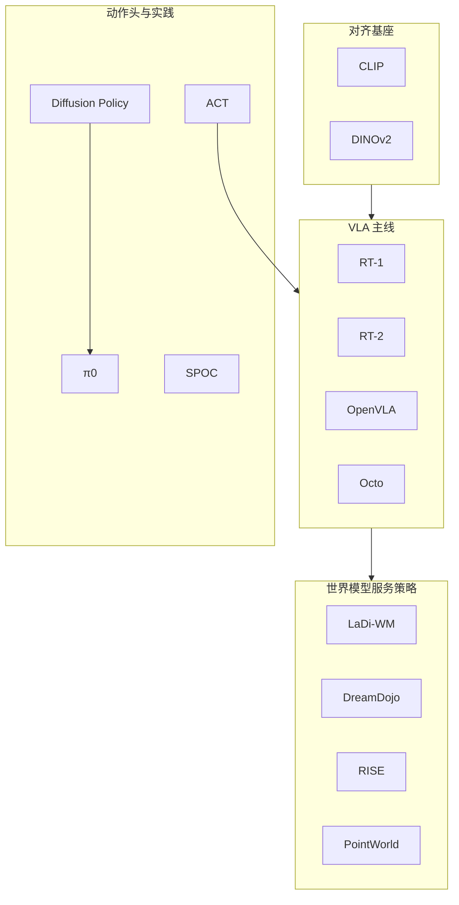

# VLA 与世界模型：14 篇论文的阅读路线

> **本页定位**：为 [具身智能研究室 · VLA 和世界模型阅读路线图](https://mp.weixin.qq.com/s/fNAyDttYIs5kzTQHwxc5Pw)（2026-09-02）提供 **按四段学习路径组织的阅读坐标**；不复述每篇方法细节。纵深课程序列见 [VLA 纵深](../../roadmap/depth-vla.md)；开源复现景观见 [VLA 2025 开源](./vla-open-source-repro-landscape-2025.md)。

## 一句话观点

**先对齐视觉–语言，再走 RT → 开源 VLA → 流匹配动作头；世界模型四篇回答「预测如何服务策略」，而不是再堆一条纯 VLA。**

## 英文缩写速查

| 缩写 | 英文全称 | 简要说明 |
|------|----------|----------|
| VLA | Vision-Language-Action | 视觉-语言-动作策略 |
| WM | World Model | 环境前向预测 |
| OXE | Open X-Embodiment | 跨本体数据 |
| FM | Flow Matching | π₀ 动作头 |

## 为什么单独做这张地图

- 公众号把 14 篇串成 **入门路线 + 进阶路线 + WM 补充**，不是平铺榜单。
- **14/14 独立 `paper-*` 节点**：本 ingest **新建 10**、**复用 4**（LaDi-WM / DreamDojo / RISE / PointWorld）；**0 重复 arXiv 节点**。
- Octo 的 `arxiv` 从方法页迁到 [paper-octo](../entities/paper-octo.md)，避免与方法页双节点。

## 流程总览

文内推荐顺序：

- **入门：** CLIP → RT-1 → RT-2 → OpenVLA；旁路 Diffusion Policy → π₀；动手 ACT。
- **进阶：** OpenVLA 源码 → Octo 架构 → π₀ Flow Matching。
- **WM：** LaDi-WM → DreamDojo → RISE → PointWorld。

## 分组索引

### 视觉–语言对齐基座

| # | 论文 | 开源（入库日） | 详情 |
|---|------|---------------|------|
| 07 | CLIP | **已开源** `openai/CLIP` | [paper-clip](../entities/paper-clip.md) |
| 10 | DINOv2 | **已开源** `facebookresearch/dinov2` | [paper-dinov2](../entities/paper-dinov2.md) |

### VLA 主线（规模化 → 开源通才）

| # | 论文 | 开源（入库日） | 详情 |
|---|------|---------------|------|
| 01 | RT-1 | **已开源** `google-research/robotics_transformer` | [paper-rt-1](../entities/paper-rt-1.md) |
| 02 | RT-2 | **官方训练未开源** | [paper-rt-2](../entities/paper-rt-2.md) |
| 03 | OpenVLA | **已开源** `openvla/openvla` | [paper-openvla](../entities/paper-openvla.md) |
| 05 | Octo | **已开源** `octo-models/octo` | [paper-octo](../entities/paper-octo.md) |

### 动作头、动手与仿真数据

| # | 论文 | 开源（入库日） | 详情 |
|---|------|---------------|------|
| 06 | Diffusion Policy | **已开源** `real-stanford/diffusion_policy` | [paper-diffusion-policy](../entities/paper-diffusion-policy.md) |
| 04 | π₀ | **已开源** `Physical-Intelligence/openpi`（非 `pi0` 仓） | [paper-pi0](../entities/paper-pi0.md) |
| 08 | ACT | **已开源** `tonyzhaozh/act` | [paper-act](../entities/paper-act.md) |
| 09 | SPOC | **已开源** `allenai/spoc-robot-training` | [paper-spoc](../entities/paper-spoc.md) |

### 世界模型如何服务策略

| # | 论文 | 开源（入库日） | 详情 |
|---|------|---------------|------|
| 11 | LaDi-WM | **已开源** `GuHuangAI/LaDiWM` | [paper-sa-2505-11528-…](../entities/paper-sa-2505-11528-ladi-wm-a-latent-diffusion-based-world-model-for.md) |
| 12 | DreamDojo | **已开源** `NVIDIA/DreamDojo` | [paper-hrl-stack-35-dreamdojo](../entities/paper-hrl-stack-35-dreamdojo.md) |
| 13 | RISE | **已开源** `OpenDriveLab/RISE` | [paper-sa-2602-11075-…](../entities/paper-sa-2602-11075-rise-self-improving-robot-policy-with-compositio.md) |
| 14 | PointWorld | **已开源** `NVlabs/PointWorld` | [paper-sa-2601-03782-pointworld](../entities/paper-sa-2601-03782-pointworld.md) |

## 交叉阅读

- [VLA 方法页](../methods/vla.md)
- [VLA 知识链](./hub-vla.md)
- [VLA 纵深路线](../../roadmap/depth-vla.md)
- [World Action Models](../concepts/world-action-models.md)
- [统一机器人学习综述](../entities/paper-unified-robot-learning-survey.md) — 读完 14 篇后用耦合类型判断系统缺哪段

## 关联页面

- [CLIP](../entities/paper-clip.md)
- [RT-1](../entities/paper-rt-1.md)
- [RT-2](../entities/paper-rt-2.md)
- [OpenVLA](../entities/paper-openvla.md)
- [π₀](../entities/paper-pi0.md)
- [LaDi-WM](../entities/paper-sa-2505-11528-ladi-wm-a-latent-diffusion-based-world-model-for.md)
- [DreamDojo](../entities/paper-hrl-stack-35-dreamdojo.md)

## 参考来源

- [具身智能研究室 2026-09-02 阅读路线](../../sources/blogs/wechat_embodied_ai_lab_vla_wm_reading_roadmap_2026-09-02.md)
- [原始抓取](../../sources/raw/wechat_embodied_ai_lab_vla_wm_reading_roadmap_2026-09-02.md)

## 推荐继续阅读

- [公众号原文](https://mp.weixin.qq.com/s/fNAyDttYIs5kzTQHwxc5Pw)
- [VLA 开源复现景观 2025](./vla-open-source-repro-landscape-2025.md)
- [接触丰富操作 7 篇地图](./contact-rich-manipulation-7-papers-technology-map.md)
