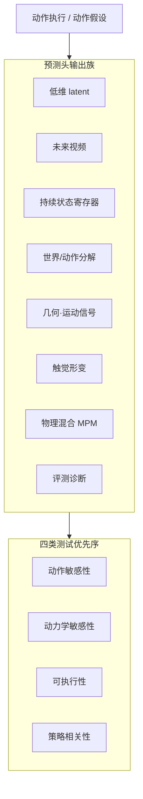

# 世界模型物理保真：输出阅读轴

> **本页定位**：编译自[具身智能研究室 · 世界模型物理保真](https://mp.weixin.qq.com/s/OawDKruG8zEepiy-x1nKuA)的策展判断——「世界模型」标签已经不够用；**先弄清预测头输出什么，再看网络结构**。方法细节与数字以各论文实体页为准。

## 一句话定义

**一套按「动作之后模型用什么记录世界变化」组织的阅读轴，用来判断机器人世界模型学到了多少可检验的物理，而不是只看生成观感。**

## 英文缩写速查

| 缩写 | 英文全称 | 简要说明 |
|------|----------|----------|
| WM | World Model | 预测动作后果以支撑规划 / 评估 / 想象学习 |
| WAM | World-Action Model | 世界预测与动作生成紧耦合的系统标签 |
| JEPA | Joint-Embedding Predictive Architecture | 表征空间预测（如 V-JEPA 2） |
| WSR | World State Registers | 跨片段持久状态（如 WorldWeaver） |
| CEM | Cross-Entropy Method | latent / 模型预测规划常用搜索 |
| IDM | Inverse Dynamics Model | 从视频/轨迹反推可执行动作 |
| iKCE | imagined Kinematic-Consistency Error | 想象相对运动学零模型的残差诊断 |
| CGDJ | Causal-Generative Dual-Judge | Thinking in Video 双轨一致性审计 |

## 为什么重要

- **同名不同物：** [Ego-VCP](../entities/paper-hrl-stack-33-ego_vision_world_model_for_humanoid.md)、[MotionWAM](../entities/paper-motionwam-humanoid-loco-manipulation-wam.md)、[RynnWorld-4D](../entities/paper-rynnworld-4d-rgb-depth-flow.md)、[VT-WAM](../entities/paper-vt-wam-visuotactile-contact-rich.md) 都叫 WM，内部保存/预测的东西差得很远（前两篇见姊妹篇 [WAM×运动控制五路径](./wam-motion-control-five-paths.md)）。
- **观感陷阱：** 未来视频「连续」不等于动力学正确；需要动作/动力学敏感性与策略相关性测试。
- **选型顺序：** 先定输出族与验收测试，再比骨干与数据规模。

## 核心信息

| 输出族 | 代表节点 | 读法 |
|--------|----------|------|
| **低维潜在状态** | [World Models](../entities/paper-ha-schmidhuber-world-models.md)、[PlaNet](../entities/paper-planet-latent-dynamics.md)、[DreamerV3](../entities/paper-shenlan-wm-13-dreamerv3.md)、[TD-MPC2](../entities/paper-td-mpc2.md) | 快；可能丢掉接触细节 |
| **未来图像/视频** | [UniSim](../entities/paper-unisim.md)、[IRASim](../entities/paper-irasim.md)、[Masked Visual Actions](../entities/paper-masked-visual-actions.md) | 可检查；防「画对做不对」 |
| **Latent 中间路线** | [V-JEPA 2](../entities/paper-vjepa2.md)、[ODEWorld](../entities/paper-odeworld.md)、[LeVJEPA](../entities/paper-levjepa.md) | 规划不必完整像素渲染；ODEWorld 再把离散步换成物理时间 ODE；LeVJEPA 只提供更便宜的因果视频表征，无 AC |
| **持续状态** | [WorldWeaver](../entities/paper-worldweaver.md) | 寄存器跨片段读写共享世界 |
| **动作 vs 世界效应** | [DWM Separating](../entities/paper-dwm-separating-world-effects.md) | 拆自主动态；≠ [Dexterous DWM](../methods/dwm.md) |
| **几何/运动信号** | [RynnWorld-4D](../entities/paper-rynnworld-4d-rgb-depth-flow.md)、[MECo-WAM](../entities/paper-meco-wam-4d-geometry-cotraining.md) | RGB+深度+光流；训练期 4D vs 推理期 4D |
| **触觉** | [VT-WAM](../entities/paper-vt-wam-visuotactile-contact-rich.md) | 视觉·触觉形变·动作联合 |
| **物理混合** | [PhysCoRe](../entities/paper-physcore.md) | 可微 MPM + 材料估计 + 残差 |
| **评测诊断** | [Imagined Rollouts…](../entities/paper-imagined-rollouts-kinematic-not-dynamic.md)、[KineBench](../entities/paper-kinebench.md)、[Thinking in Video](../entities/paper-thinking-in-video.md) | iKCE / IDM-free 可执行性 / CGDJ Gap |

## 流程总览

## 核心原理

阅读一篇 WM 论文时，优先回答：

1. **输出是什么？** 潜变量、像素、寄存器、分解残差，还是深度/光流/触觉/物理粒子？
2. **哪些变化被监督？** 仅外观，还是接触、重力、镜头外状态、材料？
3. **下游怎么用？** 规划、评估、数据合成，还是只做生成展示？
4. **用哪类测试证伪？** 见下节四类优先序（动力学敏感 → [iKCE](../entities/paper-imagined-rollouts-kinematic-not-dynamic.md)；可执行性 → [KineBench](../entities/paper-kinebench.md)；因果读写 → [Thinking in Video](../entities/paper-thinking-in-video.md)）。

## 工程实践

| 测试 | 问什么 |
|------|--------|
| **动作敏感性** | 方向/幅度/时机变了，预测是否跟着变 |
| **动力学敏感性** | 质量/摩擦/外力/材料变化是否进入 rollout |
| **可执行性** | 轨迹放回机器人或高保真仿真能否跑 |
| **策略相关性** | 模型排序与真机测试是否对齐 |

开源与复现边界写在各实体页「工程实践 / 源码运行时序图」。

## 实验与评测（索引）

| 节点 | 可引用锚点（详见实体页） |
|------|--------------------------|
| [World Models](../entities/paper-ha-schmidhuber-world-models.md) / [PlaNet](../entities/paper-planet-latent-dynamics.md) / [DreamerV3](../entities/paper-shenlan-wm-13-dreamerv3.md) / [TD-MPC2](../entities/paper-td-mpc2.md) | 低维 latent 规划谱系；开见各页 |
| [UniSim](../entities/paper-unisim.md) | 通用视频模拟器叙事；**未开源** |
| [IRASim](../entities/paper-irasim.md) | Push-T IoU 0.637→0.961；已开源 |
| [V-JEPA 2](../entities/paper-vjepa2.md) | <62h Droid → latent 规划；MIT |
| [LeVJEPA](../entities/paper-levjepa.md) | 无启发式视频预训练；因果表征、无规划；MIT+NC |
| [ODEWorld](../entities/paper-odeworld.md) | 物理时间 ODE + 子目标；推理已开源 |
| [WorldWeaver](../entities/paper-worldweaver.md) | world score 81.0→105.1；coming soon |
| [DWM Separating](../entities/paper-dwm-separating-world-effects.md) | CEM +13.1pp；未开源 |
| [INTACT](../entities/paper-intact.md) | 意图→动作 Direct 2.9–5.5 ms；文档仓 Coming Soon |
| [Masked Visual Actions](../entities/paper-masked-visual-actions.md) | RoboCasa r=0.982 |
| [RynnWorld-4D](../entities/paper-rynnworld-4d-rgb-depth-flow.md) | RGB-DF + Policy ~9Hz |
| [MECo-WAM](../entities/paper-meco-wam-4d-geometry-cotraining.md) / [VT-WAM](../entities/paper-vt-wam-visuotactile-contact-rich.md) | 训练期 4D；触觉联合 WAM |
| [PhysCoRe](../entities/paper-physcore.md) | MPM+MfM+RfD；**未开源** |
| [Imagined Rollouts…](../entities/paper-imagined-rollouts-kinematic-not-dynamic.md) | iKCE ∼180×；摩擦扫描平坦 |
| [KineBench](../entities/paper-kinebench.md) | IDM-free 6D EEF→ManiSkill3；MIT |
| [Thinking in Video](../entities/paper-thinking-in-video.md) | CGDJ Perception-Prediction Gap |

## 结论

**先按输出族读世界模型，再用四类物理相关测试逼近「学到了多少真实物理」；生成指标只是起点。**

1. 输出族决定可检验性与失败模式。
2. 视频连续 ≠ 动力学；latent 快 ≠ 可肉眼验真。
3. 有自主动态时优先看转移是否分解（DWM Separating）。
4. 多智能体/长时看持续状态（WorldWeaver）。
5. 开源状态与验收测试写进选型表，避免只收藏 arXiv。

## 局限与风险

- 本页是 **策展 taxonomy**，不是新算法。
- 输出族 **非严格互斥**；一篇论文可跨多族。
- **DWM** 名称碰撞：分解效应（2607.18715）vs 灵巧视频（2512.17907）。

## 与其他工作对比

| 本页 | [训练闭环 taxonomy](./robot-world-models-training-loop-taxonomy.md) | [WAM×运动控制五路径](./wam-motion-control-five-paths.md) |
|------|---------------------------------------------------------------------|-------------------------------------------------------------|
| 按 **预测输出** 读物理 | 按 **训练/数据闭环** 读 | 按 **运动控制接口位置** 读 |
| 回答「存了什么变化」 | 回答「怎么训」 | 回答「控制接在哪」 |

## 关联页面

- [World Models](../entities/paper-ha-schmidhuber-world-models.md)
- [PlaNet](../entities/paper-planet-latent-dynamics.md)
- [DreamerV3](../entities/paper-shenlan-wm-13-dreamerv3.md)
- [TD-MPC2](../entities/paper-td-mpc2.md)
- [UniSim](../entities/paper-unisim.md)
- [IRASim](../entities/paper-irasim.md)
- [V-JEPA 2](../entities/paper-vjepa2.md)
- [LeVJEPA](../entities/paper-levjepa.md) — 更便宜的因果视频 JEPA 编码器（无 AC / 规划）
- [ODEWorld](../entities/paper-odeworld.md) — 连续时间 latent 速度场（无动作条件）
- [WorldWeaver](../entities/paper-worldweaver.md)
- [DWM（Separating World Effects）](../entities/paper-dwm-separating-world-effects.md)
- [INTACT](../entities/paper-intact.md) — 意图→动作无搜索接口（LeWM 族对照）
- [Masked Visual Actions](../entities/paper-masked-visual-actions.md)
- [RynnWorld-4D](../entities/paper-rynnworld-4d-rgb-depth-flow.md)
- [MECo-WAM](../entities/paper-meco-wam-4d-geometry-cotraining.md) / [VT-WAM](../entities/paper-vt-wam-visuotactile-contact-rich.md)
- [PhysCoRe](../entities/paper-physcore.md)
- [Imagined Rollouts are Kinematic, Not Dynamic](../entities/paper-imagined-rollouts-kinematic-not-dynamic.md)
- [KineBench](../entities/paper-kinebench.md)
- [Thinking in Video](../entities/paper-thinking-in-video.md)
- [运动学可行与动力学可行](../concepts/kinematic-vs-dynamic-feasibility.md)
- [Dexterous DWM](../methods/dwm.md) — 同名消歧
- [Generative World Models](../methods/generative-world-models.md)
- [Video-as-Simulation](../concepts/video-as-simulation.md)

## 参考来源

- [具身智能研究室：世界模型物理保真（微信）](../../sources/blogs/wechat_embodied_ai_lab_world_model_physics_fidelity.md)

## 推荐继续阅读

- [微信原文](https://mp.weixin.qq.com/s/OawDKruG8zEepiy-x1nKuA)
- [WAM × 运动控制五路径](./wam-motion-control-five-paths.md)
- [robot-world-models-training-loop-taxonomy](./robot-world-models-training-loop-taxonomy.md)
