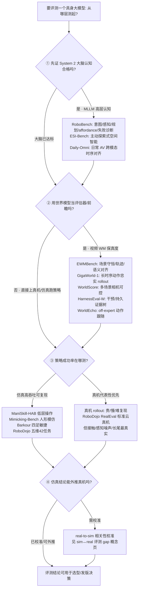

# Query：具身大模型评测基准选型闭环知识链

> **Query 产物**：本页由以下问题触发：「我训了一个具身大模型，接下来到底怎么『测/证明它』——从『大脑看懂没』到『真机能不能做成』中间分几层评测、每层测什么、用哪个代表性基准、指标要复现性还是真实代表性、看过程指标还是结果指标、哪一层评测结论最容易骗人？」
> 综合来源：[RoboBench（MLLM 具身大脑评测）](../entities/robo-bench.md)、[ESI-Bench（具身空间智能）](../entities/esi-bench.md)、[Daily-Omni（日常 AV 时序对齐）](../entities/paper-daily-omni.md)、[EWMBench（世界模型生成评测）](../entities/ewmbench.md)、[WorldScore（开放域世界生成）](../entities/paper-worldscore.md)、[HarnessEval-W（交互式世界 agentic 评测）](../entities/paper-harnesseval-w.md)、[GigaWorld-1（策略评估器）](../entities/paper-gigaworld-1-policy-evaluation.md)、[仿真评测基础设施](../concepts/simulation-evaluation-infrastructure.md)。它是[具身大模型分类学选型闭环](../queries/embodied-fm-taxonomy-loop.md)（选哪一类模型）的姊妹链——回答「选完之后怎么评测/证明它」。

## TL;DR：四层评测选型闭环一句话定位

「评测一个具身大模型」不是「跑一个成功率就完事」，而是一条**从认知到执行、再由 sim↔real 校准兜底的分层评测链**。每一层测的对象、代表性基准、指标语义都不同，**上一层评分高不代表下一层能成**——认知评分 ≠ 可执行动作，视频逼真 ≠ 策略收益，仿真成功率 ≠ 真机成功率。选错评测层，就会用「测得漂亮的假信号」掩盖「真正会崩的地方」：

| 层 | 测什么 | 代表性基准 | 主指标 | 这一层评测最容易骗人的地方 |
|----|--------|-----------|--------|--------------------------|
| ① 具身大脑/MLLM 认知 | System 2 高层认知：意图理解、场景感知、规划、affordance、失败诊断；另含 **日常音视频时序对齐** | [RoboBench](../entities/robo-bench.md)、[ESI-Bench](../entities/esi-bench.md)、[Daily-Omni](../entities/paper-daily-omni.md) | QA 正确率 / 认知维度分 / AV Align | 认知评分高 ≠ 能下发可执行动作；AV 高分 ≠ 操纵 affordance |
| ② 世界模型预测保真度 | 给定动作，模型能否忠实推演未来帧/物理状态 | [EWMBench](../entities/ewmbench.md)、[GigaWorld-1 / WMBench](../entities/paper-gigaworld-1-policy-evaluation.md)；开放域多场景另见 [WorldScore](../entities/paper-worldscore.md)；交互干预/持久另见 [HarnessEval-W](../entities/paper-harnesseval-w.md)；**off-expert 动作跟随**另见 [WorldEcho](../entities/paper-worldecho-worldsync.md) | 场景守恒 / 轨迹一致 / 语义对齐；（WorldScore：相机可控 / 质量 / 动态；HarnessEval-W：Observation / Transition / Persistence + 证据树；WorldEcho：视觉门控 + \(\mathrm{SE}(3)\) NDTW） | 短时视觉逼真 ≠ 长时序动作忠实 ≠ 下游策略收益；WorldScore 高分 ≠ 操纵保真；HarnessEval Overall 高 ≠ 末端轨迹对；**专家回放好看 ≠ off-expert 仍跟命令** |
| ③ 策略任务成功率 | 策略在任务上真做成没有 | [ManiSkill-HAB](../entities/paper-notebook-maniskill-hab-a-benchmark-for-low-level-manipula.md)、[Mimicking-Bench](../entities/paper-notebook-mimicking-bench-a-benchmark-for-generalizable-hu.md)、[Barkour](../entities/paper-barkour-quadruped-agility-benchmark.md)；桌面 VLA 相对位次见 [VLA SOTA Leaderboard](../entities/vla-sota-leaderboard.md)；**接触安全**另见 [SoftVTBench](../entities/paper-softvtbench.md)；**过程评测**见 [PRM-as-a-Judge](../entities/paper-prm-as-a-judge.md)；**延迟感知动态任务**见 [ReflexVLA / ReflexBench](../entities/paper-reflexvla.md)；**工业灵巧规格**见 [DexBench](../entities/dexbench.md)（18 任务 / OSC，官方评测仓待发布）；**真机扑克灵巧**见 [DexHoldem](../entities/paper-dexholdem.md)（SPSR / 感知 exact match）；**意图级模仿**见 [Imitator Game](../entities/paper-imitator-game.md)（L0–L3，目标等价而非轨迹相似） | 任务成功率 / 敏捷分；软体另报 Safety Success；过程侧报 OPD；DexBench 主张 breakdown curve 而非单一 SR；DexHoldem 另报 SPSR 与场面保持；Imitator Game 另报 L3 / unseen 零样本 | 成功率均值掩盖长尾失败；魔法抓取虚高；跨基准直接比榜；**只报 Goal 掩盖过压**；**SR 与进度曲线排名不一致**；**把 DexBench 规范页当成可跑仿真榜**；**把 DexHoldem TCR 当成场面仍可继续**；**只报 L0 seen 掩盖 L3 功能替代崩溃** |
| ④ sim↔real 评测 gap 校准 | 仿真评测结论能否外推到真机 | [仿真评测基础设施](../concepts/simulation-evaluation-infrastructure.md) + real-to-sim 相关性 | sim↔real 排名相关性 | 仿真可复现 ≠ 真机代表性；评测集与训练分布重叠 |

**总原则**：评测选型的第一问永远是「**这层指标测的到底是能力本身，还是能力的易测代理**」。越靠上层（认知、视频质量）越好测、越可复现，但离「真机做成」越远；越靠下层（真机成功率、sim↔real 校准）越贵、越难复现，但代表性越强。一条负责任的评测链要**逐层往下压实**，而不是停在某个漂亮的上层代理指标上。

---

## 四层评测选型决策树

---

## 1. ① 具身大脑/MLLM 认知评测层：先证「大脑」合格

整条评测链的入口是**在双系统范式下把 MLLM 当 embodied brain 单独考核**，把「机器人最终能不能做成」拆出「System 2 是否具备操纵所需的完整高层认知」这一前置问题：

- **测什么**：意图理解 → 场景感知 → 规划与泛化 → affordance 细化 → 失败诊断的全流水线认知。[RoboBench](../entities/robo-bench.md) 沿五维 14 能力 25 任务 6092 QA 出题，并用 **MLLM-as-world-simulator** 检验规划是否能在物理/视觉约束下达成关键物体状态变化；[ESI-Bench](../entities/esi-bench.md) 进一步把空间智能从「被动看图」推进到「观察者即行动者」，要求主动感知–行动闭环。[Daily-Omni](../entities/paper-daily-omni.md) 则专测 **日常场景音视频跨模态时序对齐**（684 视频 / 1197 MCQA；模态消融常掉 10–28 个百分点），补上「环境声与画面是否对齐理解」这一维。
- **可复现 vs 代表性**：QA 式评分**高度可复现、可自动打分**，是四层里最便宜的一层；代价是它测的是**认知代理**而非动作能力。
- **典型误判**：把认知评分当动作能力用——RoboBench 的价值恰恰在于它证明了「认知分与 CALVIN/LIBERO-10 下游 VLA 成功率显著相关」这件事**需要专门验证**，而不是默认成立。认知评分只是**下游成功率的必要不充分条件**。同理，Daily-Omni 全模态高分只说明 **AV 时序对齐推理**，不证明操纵 affordance 或可下发动作指令。

## 2. ② 世界模型预测保真度评测层：视频逼真 ≠ 策略收益

当团队用世界模型做前瞻推演或当策略评估器时，必须先评测 **WM 本身预测得准不准**，否则「用一个不忠实的 WM 去评策略」会双重放大误差：

- **测什么**：给定初始帧 + 指令（及可选动作序列），模型自回归续写未来帧，评测其**场景守恒、末端轨迹正确性、语义/逻辑对齐**（[EWMBench](../entities/ewmbench.md) 在 Agibot-World 子集上统一初始化后三轴打分）。若评的是开放域 **3D/4D/视频多场景世界生成**（显式相机轨迹、跨场景一致性），改用 [WorldScore](../entities/paper-worldscore.md) 的 Ctrl/Quality/Dynamics。若评的是 **交互式世界是否执行指定干预、长程是否持久**（探索/意图/物理转移 + drift/revisit/offscreen），改用 [HarnessEval-W](../entities/paper-harnesseval-w.md) 的案例路由技能与证据树——**不要**用 WorldScore 代替操纵保真，**不要**用 EWMBench 代替相机可控世界生成，也**不要**用 HarnessEval Overall 代替末端轨迹。若评的是 **off-expert 数值动作是否被忠实执行**（视觉仍有效 + \(\mathrm{SE}(3)\) 末端对齐），改用 [WorldEcho](../entities/paper-worldecho-worldsync.md)——**不要**用专家回放分数代替策略改进时会遇到的动作分布。
- **过程 vs 结果的关键结论**：[GigaWorld-1](../entities/paper-gigaworld-1-policy-evaluation.md) 在 WMBench 上用 7 类视频 WM × 4 种动作编码 × 32.4 万+ rollout 实证——**长时序动作忠实一致性比短时视觉逼真更决定 evaluator 质量**。这直接推翻了「视频看起来越真、当评估器越好」的直觉。
- **典型误判**：① 用短时视觉逼真度（FVD 类）代表长时序动作忠实度；② 把 WM 的视频质量当成下游策略收益——视频质量是**过程/中间指标**，策略成功率才是**结果指标**，二者不可互相替代；③ 把 WorldScore Static 高分当成具身操纵可用；④ 把 HarnessEval-W Overall（I2V 族常领先）当成操纵保真或策略收益；⑤ 只在专家演示上评 AC-WM，掩盖 off-expert 的视觉崩或动作无视。

## 3. ③ 策略任务成功率评测层：均值成功率的陷阱

到这一层才第一次直接测「策略做成没有」，但**成功率这个结果指标本身也有可信度分层**：

- **测什么/用什么基准**：[ManiSkill-HAB](../entities/paper-notebook-maniskill-hab-a-benchmark-for-low-level-manipula.md) 用**真实低层控制**替代「魔法抓取」测家庭重排（GPU 加速、可控演示生成）；[Mimicking-Bench](../entities/paper-notebook-mimicking-bench-a-benchmark-for-generalizable-hu.md) 用大规模人类技能参考系统比较重定向/跟踪/模仿学习组合，测人形全身交互技能泛化；[Barkour](../entities/paper-barkour-quadruped-agility-benchmark.md) 用犬敏捷赛式障碍课 + 0–1 敏捷分测四足敏捷性。[RoboDojo](../entities/robodojo.md) 用 **42 仿真五维任务 + 18 真机任务** 与 [XPolicyLab](../entities/xpolicylab.md) 统一接口，对通用操纵策略做 **官方重跑** 的 sim-and-real 公益榜（verified 上榜须开源训推与权重）。桌面语言条件 VLA 的社区相对位次可先扫 [VLA SOTA Leaderboard](../entities/vla-sota-leaderboard.md)（LIBERO / Meta-World / RoboTwin 等**摘录分数**，不重跑），再回原文核协议——例如 [FabriVLA](../entities/paper-fabrivla.md) 的 MT50 **90.0%** 与 [Evo-1](../entities/paper-evo1-lightweight-vla.md) 的 **80.6%** 同属该层，但训练配方与评测面不同。
- **可复现 vs 代表性**：仿真成功率**高吞吐、可复现、可控**，适合 recipe 迭代；但「魔法抓取」这类抽象化实现会**系统性虚高**成功率——ManiSkill-HAB 的意义正是把重排基准**落到真实低层操作**上，缩小这道代表性缺口。榜站聚合视图**不能替代**官方评测脚本与协议脚注；RoboDojo verified 条目另加 **云管线 + 开源产物** 约束。
- **典型误判**：① **成功率均值掩盖长尾失败模式**——同样 80% 成功率，均匀失败 vs 集中在某类物体/初值上的失败，工程含义天差地别；② 单任务过拟合冒充跨任务泛化，需 Mimicking-Bench 这类**跨任务/跨物体**基准把关；③ 离线回放评测（固定初值重放）≠ 在线闭环评测（策略自己滚出轨迹），后者才暴露复合误差；④ **跨基准直接比榜**（LIBERO vs Meta-World vs RoboTwin）——[VLA SOTA Leaderboard](../entities/vla-sota-leaderboard.md) Methodology 明确禁止；⑤ **本地公开布局分 = RoboDojo verified 榜**——官方另有 hidden-layout 与开源门槛；⑥ **只报 SR、看不见过程**——走到 99% 与停在 5% 都叫失败；[PRM-as-a-Judge](../entities/paper-prm-as-a-judge.md) 用冻结 PRM 进度曲线给出 OPD（含 FNS/DRR/SQS），在冻结 [RoboDojo](../entities/robodojo.md) 视频上打乱 SR 排名；⑦ **仿真暂停世界掩盖延迟**——静态 LIBERO 高分不蕴含动态任务；[ReflexVLA](../entities/paper-reflexvla.md) 的 ReflexBench 把同步/异步延迟写进评测。

## 4. ④ sim↔real 评测 gap 校准层：评测结论能否外推真机

前三层多数在仿真里完成，最后必须回答**「仿真里测出来的结论，能不能外推到真机」**——否则再漂亮的仿真榜单也只是自证：

- **测什么**：不是再测一次策略，而是测**评测本身的可外推性**——[仿真评测基础设施](../concepts/simulation-evaluation-infrastructure.md)把可信仿真当作**可扩展闭环评测引擎**，其前提是仿真 rollout 与真机 rollout **统计相关**，且训练管线**刻意不与评测共享同一仿真分布**（避免评测集泄漏）。[RoboDojo](../entities/robodojo.md) 用同一 XPolicyLab 接口同时报告仿真与 **RealEval 真机**，是「③+④ 同协议」的工程样本，但 **sim 高分仍不自动蕴含真机高分**。
- **为什么必须单独一层**：仿真在可复现性/吞吐/可控性上的优势，是**以牺牲真实接触、感知噪声、长尾分布代表性**换来的。这条 gap 的物理根因与三条缩小路线，单独沉淀为姊妹概念页 [仿真评测可复现性 ↔ 真实代表性取舍（sim↔real 评测 gap）](../concepts/sim-vs-real-eval-gap.md)。
- **典型误判**：① 仿真基准饱和（刷到接近满分）当成「真实场景就绪」；② 评测集与训练分布重叠导致虚高（数据泄漏）；③ 静态基准不覆盖部署时的分布漂移。校准手段是**用少量真机 rollout 锚定 sim↔real 排名相关性**，而非用仿真绝对分。[PRM-as-a-Judge](../entities/paper-prm-as-a-judge.md) 在冻结 RoboDojo 上报告过程指标的 Sim–Real Spearman ρ 约 0.18–0.58，说明过程评测同样不能默认外推。

---

## 评测层选型矛盾速查（按取舍归因）

| 矛盾 | 一端 | 另一端 | 选型第一判据 |
|------|------|--------|-------------|
| 可复现 vs 代表性 | 仿真基准高吞吐可复现 | 真机 rollout 代表性强 | 结论要外推真机就必须校准 gap |
| 过程 vs 结果指标 | 视频质量/认知分好测 | 任务成功率才是收益 | 上层分只是下游成功率的代理 |
| 均值 vs 长尾 | 平均成功率一个数 | 长尾失败模式分布 | 是否关心最坏情形/安全 |
| 离线 vs 在线 | 回放固定初值可复现 | 闭环滚动暴露复合误差 | 部署是闭环就必须在线评 |
| 单任务 vs 跨任务 | 单任务榜单好刷 | 跨任务/跨物体泛化 | 是否宣称通用能力 |

## 典型失败模式速查（按评测层归因）

| 现象 | 最可能测错的评测层 | 第一优先排查 |
|------|------------------|-------------|
| 认知榜单高但真机不动 | ① 拿认知分当动作能力 | 补 ③ 真机成功率闭环评测 |
| WM 视频很真但选出的策略更差 | ② 用视觉逼真代替动作忠实 | 换长时序动作忠实指标（GigaWorld-1） |
| 仿真成功率高真机崩 | ③/④ 魔法抓取虚高 / sim↔real 未校准 | 落到真实低层控制 + real-to-sim 相关性 |
| 平均成功率好但偶发大事故 | ③ 均值掩盖长尾 | 按失败模式/物体分层看成功率 |
| SR 与进度曲线排名打架 | ③ 只用终局 SR | 换 [PRM-as-a-Judge](../entities/paper-prm-as-a-judge.md) OPD，分清近成功失败 vs 早停 |
| LIBERO 高分但接球/传送带崩 | ③ 静态榜、仿真暂停世界 | 换 [ReflexBench](../entities/paper-reflexvla.md) 延迟感知动态任务 |
| 可变形 Goal 高但物体被捏坏 | ③ 只用 Goal、未报 Safety | 换 [SoftVTBench](../entities/paper-softvtbench.md) 式 Goal/Safety + 形变分布 |
| 榜单饱和但新场景失效 | ④ 基准饱和 ≠ 场景就绪 / 分布漂移 | 换分布外测试集，查评测集泄漏 |

---

## 英文缩写速查

| 缩写 | 英文全称 | 简要说明 |
|------|----------|----------|
| MLLM | Multimodal Large Language Model | 多模态大语言模型，②层充当具身大脑 System 2 |
| WM | World Model | 世界模型，②层预测未来状态/帧的评测对象 |
| WMBench | World Model Benchmark | GigaWorld-1 提出的世界模型策略评估器基准 |
| WMES | World Model Evaluation Score | GigaWorld-1 的世界模型评估综合分 |
| EWM | Embodied World Model | 具身世界模型，EWMBench 的评测对象 |
| VLA | Vision-Language-Action | 视觉–语言–动作端到端策略，③层被评对象 |
| HAB | Home Assistant Benchmark | 家庭助理基准，ManiSkill-HAB 的评测场景 |
| sim2real | Simulation-to-Real | 仿真到真机迁移，④层校准 gap 的核心 |

## 参考来源

- [robo_bench_arxiv_2510_17801.md](../../sources/papers/robo_bench_arxiv_2510_17801.md) — RoboBench，①层 MLLM 具身大脑五维认知评测与「认知分↔下游成功率相关」实证
- [ewmbench.md](../../sources/papers/ewmbench.md) — EWMBench，②层具身世界模型视频生成三轴评测
- [worldscore_arxiv_2504_00983.md](../../sources/papers/worldscore_arxiv_2504_00983.md) — WorldScore，②层相邻：开放域多场景世界生成统一评测
- [harnesseval_w_arxiv_2608_16859.md](../../sources/papers/harnesseval_w_arxiv_2608_16859.md) — HarnessEval-W，②层相邻：交互式世界 agentic 评测
- [esi_bench_arxiv_2605_18746.md](../../sources/papers/esi_bench_arxiv_2605_18746.md) — ESI-Bench，①层主动探索式具身空间智能评测
- [daily_omni_arxiv_2505_17862.md](../../sources/papers/daily_omni_arxiv_2505_17862.md) — Daily-Omni，①层日常音视频跨模态时序对齐 AVQA
- [wechat_embodied_ai_lab_robot_world_models_action_consequence_2026.md](../../sources/blogs/wechat_embodied_ai_lab_robot_world_models_action_consequence_2026.md) — GigaWorld-1「长时序动作忠实 > 短时视觉逼真」策略评估器结论
- [robodojo_arxiv_2607_04434.md](../../sources/papers/robodojo_arxiv_2607_04434.md) — RoboDojo，③/④ 层统一 sim-and-real 操纵评测
- [prm_as_a_judge_arxiv_2608_14284.md](../../sources/papers/prm_as_a_judge_arxiv_2608_14284.md) — PRM-as-a-Judge，③ 层过程评测（OPD）与 judge 校准
- [reflexvla_arxiv_2608_14379.md](../../sources/papers/reflexvla_arxiv_2608_14379.md) — ReflexBench，③ 层延迟感知动态操纵评测
- [softvtbench_arxiv_2607_04234.md](../../sources/papers/softvtbench_arxiv_2607_04234.md) — SoftVTBench，③ 层可变形接触安全 Goal/Safety
- [robodojo_open_longterm_eval_2026-07.md](../../sources/blogs/robodojo_open_longterm_eval_2026-07.md) — 长期公益评测与 verified 开源上榜公告

## 关联页面

- [运控模型评测指标](../concepts/motion-control-policy-evaluation-metrics.md) — 本链 ③ 层在 **运控模型**（locomotion / whole-body tracking / MPC-WBC）这一被测对象上的展开

- 所属路线：[具身评测基准选型闭环（知识链汇总）](../overview/hub-embodied-eval-benchmark.md) — 四层评测基准的统一入口与图谱纵深枢纽
- [Embody](../entities/anthropic-embody.md) — 评 **LLM 控制接口** 而非 VLA SOTA；与 LIBERO 成功率榜正交
- [LLM 机器人控制接口](../concepts/llm-robotics-control-interfaces.md) — 暂停仿真上界 vs 实时力矩环的读数陷阱
- [仿真评测可复现性 ↔ 真实代表性取舍（sim↔real 评测 gap）](../concepts/sim-vs-real-eval-gap.md) — ④层 gap 校准的姊妹概念页，双向回链
- [RoboBench（MLLM 具身大脑综合评测）](../entities/robo-bench.md) — ①层 MLLM 认知评测代表基准
- [ESI-Bench（具身空间智能基准）](../entities/esi-bench.md) — ①层主动探索式空间智能评测
- [Daily-Omni（日常 AV 时序对齐）](../entities/paper-daily-omni.md) — ①层音视频跨模态时序对齐诊断
- [EWMBench（具身世界模型生成评测）](../entities/ewmbench.md) — ②层世界模型预测保真度评测
- [WorldScore](../entities/paper-worldscore.md) — ②层相邻：3D/4D/视频多场景世界生成统一榜
- [HarnessEval-W](../entities/paper-harnesseval-w.md) — ②层相邻：交互式世界 agentic 评测（干预/持久证据树）
- [GigaWorld-1（世界模型策略评估器）](../entities/paper-gigaworld-1-policy-evaluation.md) — ②层「动作忠实 > 视觉逼真」策略评估器
- [DriftWorld](../entities/paper-driftworld.md) — ②层外延：1-step drifting 快评估 + 推理时搜索（相关性最高约 0.99）
- [Masked Visual Actions](../entities/paper-masked-visual-actions.md) — ②层外延：掩码动作条件 WM，RoboCasa 策略评估 **r=0.982**
- [Ctrl-World](../entities/paper-ctrl-world.md) — ②层外延：多视角可控 WM，VLA 想象评估 + 合成轨迹改进（ICLR 2026）
- [WALL-SS](../entities/paper-wall-ss.md) — ②/④ 层外延：next-scale AR 流式 WM，600 对虚实成功率校准 \(r=0.93\)（训练代码待发布）
- [CurrentWorld-0](../entities/current-robotics-currentworld.md) — ②层产业样本：跨本体交互模拟器 + 失败态回滚后训练（确认未开源）
- [SC3-Eval](../entities/paper-sc3-eval.md) — ②层外延：自一致视频策略评估器，真机闭环 \(r=0.929\) / MMRV \(0.119\)（确认未开源）
- [WorldEcho / WorldSync](../entities/paper-worldecho-worldsync.md) — ②层：off-expert 动作跟随（视觉门控 + \(\mathrm{SE}(3)\) NDTW）；确认未开源
- [H2R-Bench](../entities/paper-h2r-bench.md) — ②层跨本体切面：人手视频→机器人本体视频五维诊断（本体正确性/功能接触），评测代码与标注待发布
- [Hydra-0](../entities/paper-hydra-0.md) — ②→③ 桥接：RoboLab 开环 replay 排名与参考成功率 **r=0.96**（κ=0.82），但策略不被生成观测查询，不能当闭环 prospective 成功率读（确认未开源）
- [RoboSynChallenge](../entities/paper-robosynchallenge.md) — ③/④ 层：合成 state-action 训练、**仅真实世界未见环境**终评的灵巧操作挑战赛协议（框架 + HF 数据已开源）
- [VLA SOTA Leaderboard](../entities/vla-sota-leaderboard.md) — ③层社区聚合：多基准 VLA / 灵巧手摘录榜（不重跑）
- [All Hands Up](../entities/all-hands-up.md) — 硬件层：腕装灵巧手 URDF 画廊与仿真 Kapandji
- [Imitator Game](../entities/paper-imitator-game.md) — ③ 层意图级模仿：L0–L3 目标等价；L3 功能替代崩溃，未见任务零样本 <13%（MIT 仓 + IG-10K 已开源）
- [DexBench](../entities/dexbench.md) — ③ 层工业灵巧规格（OSC / 18 任务）；规范已公开，Arena 评测栈仍标 coming soon，不要和仿真 SR 榜混读
- [DexHoldem](../entities/paper-dexholdem.md) — ③ 层真机扑克灵巧：SPSR 47.5% ≠ TCR 61.2%；感知 exact match 最高 34.3%（已开源）
- [RoboDojo](../entities/robodojo.md) — ③/④ 层：通用操纵官方 sim-and-real 公益榜（重跑 + 开源上榜）
- [PRM-as-a-Judge](../entities/paper-prm-as-a-judge.md) — ③ 层：冻结 PRM 进度曲线 + OPD；工具仓已开源
- [ReflexVLA](../entities/paper-reflexvla.md) — ③ 层：ReflexBench 延迟感知动态任务；代码待开放
- [SoftVTBench](../entities/paper-softvtbench.md) — ③ 层：可变形视触觉 Goal/Safety Success
- [Physics-Consistent HRC Benchmark](../entities/paper-physics-consistent-hrc-benchmark.md) — ③ 层接触安全切面：辅助护理 HRC 名义成功率经区域+力安全筛查后 72.9%→56.4%（`benchmark/` 待发布）
- [TAPVid-MV](../entities/paper-tapvid-mv.md) — ② 层前置感知：多同步移动相机长时 3D 任意点跟踪基准；30+ baseline 未接近解决，瓶颈在几何恢复而非跟踪头
- [HumanTracker](../entities/paper-humantracker.md) — ③ 层：人形 motion tracking 四族 153 h 光学基准 + 偏好对齐 HumanScore（数据集待发布）
- [XPolicyLab](../entities/xpolicylab.md) — RoboDojo/RoboTwin 策略适配、O(N+M) 契约与 verified 开源口（arXiv:2608.09892）
- [FabriVLA](../entities/paper-fabrivla.md) — ③层轻量 VLA Meta-World 对照条目
- [仿真评测基础设施](../concepts/simulation-evaluation-infrastructure.md) — ④层可信仿真作闭环评测引擎的前提
- [HumanoidVLN](../entities/paper-humanoidvln.md) — ③/④ 层：人形物理 VLN 成功率 + FR + 小规模 sim–real 相关（待开源）
- [Cartpole 问题](../concepts/cartpole.md) — ③层最小经典控制基准（CartPole-v1 / Isaac-Cartpole-v0），不是具身大模型榜
- [Sim2Real](../concepts/sim2real.md) — ④层评测结论外推真机的迁移背景
- 姊妹 Query：[具身大模型分类学选型闭环](../queries/embodied-fm-taxonomy-loop.md) — 「选哪一类模型」，本页承接「选完怎么评测」
