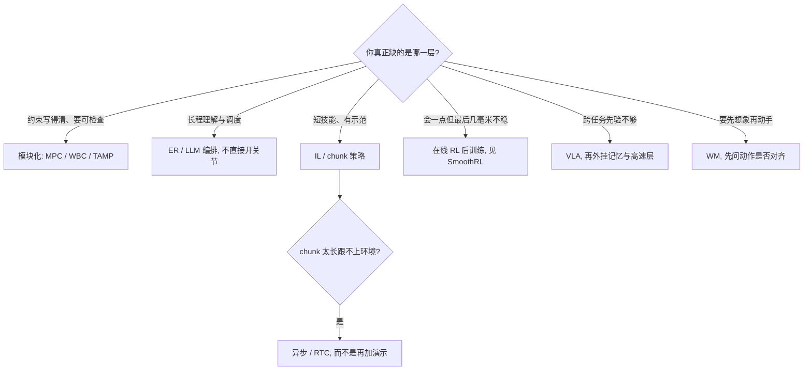

> **Query 产物**：本页由以下问题触发：「具身智能的六条主流路线分别卡在哪，2026 年还该不该用『端到端 vs 模块化』当第一刀？」
> 综合来源：[五大范式](../comparisons/robot-learning-five-paradigms-taxonomy.md)、[五大模型族选型闭环](./embodied-fm-taxonomy-loop.md)、[VLA](../methods/vla.md)、[强化学习](../methods/reinforcement-learning.md)、[Action chunking](../methods/action-chunking.md)、[生成式世界模型](../methods/generative-world-models.md)、[SmoothRL](../entities/paper-smoothrl.md)。

# 六条路线的窟窿：按时间尺度缝合，而不是赌一条终局

深蓝具身智能 2026-09-04 长文（[公众号](https://mp.weixin.qq.com/s/k7CR03ZHaSQRMVvutpSnCg)）用 Figure Helix 02 已能收拾房间、却仍发 Index、仍囤算力开场：演示「会一点」与数据/算力饥渴可以同时成立。下面把文内六条拆成可对照的窟窿表，并接到站内已有节点——**不新建论文空壳**。

## 一句话定义

**六条产业叙事不在同一分类轴；各自的窟窿已经从「完全不会」换成数据、实时、记忆、最后一毫米和动作对齐的物理正确——2026 前沿是按时间尺度划分的学习模块，不是端到端消灭模块。**

## 英文缩写速查

| 缩写 | 英文全称 | 简要说明 |
|------|----------|----------|
| VLA | Vision-Language-Action | 文内最受关注的通才策略族 |
| WM | World Model | 预测「这么动之后世界怎样」 |
| IL | Imitation Learning | ACT / Diffusion Policy 等示范路线 |
| RL | Reinforcement Learning | 从仿真全身控制转向基础模型后训练 |
| ER | Embodied Reasoning | Gemini Robotics ER 2：高层脑，不直接开电机 |
| TAMP | Task and Motion Planning | 模块化路线在开放世界的组合爆炸点 |
| RTC | Real-Time Chunking | 异步 chunk 交接，避免停下来等推理 |

## 为什么重要

线上常问「哪条路线会赢」。文内更有用的问法是：每条路把上一代的哪个洞补上了、又露出哪个新洞，以及这些洞能不能用**另一条路的模块**补。站内已有两套正交坐标——[按学习信号的五大范式](../comparisons/robot-learning-five-paradigms-taxonomy.md) 与 [按 I/O 的五层模型族](./embodied-fm-taxonomy-loop.md)——本页补第三套：**产业叙事并置的六条，加上「窟窿在哪」**。

## TL;DR 决策路径

1. **先承认六条不可比。** 模块化是工程框架，IL/RL 是学习范式，LLM+技能 / VLA / WM 是模型家族。并置只因为行业这么讲；选型时先回到站内两套正交轴。
2. **「会收拾房间」不否定数据饥渴。** 文称 Figure Index 截至 2026-08-25 自称 **1600 万** 条人视频、并转述 Nscale 算力意向——**金额以官方为准**，本页只取「演示与数据闭环可以同时饥渴」这一结构。
3. **RL 的现实位置是后训练，不是从零教会一切。** 文举 RL Token；站内真机对照看 [SmoothRL](../entities/paper-smoothrl.md)（异步环内 value-gradient，250 ep 把三任务拉到 83–94%）与 [ARLI](../entities/paper-arli.md)。
4. **IL 没有被 VLA 淘汰，它变成解码底座。** ACT / Diffusion Policy 的窟窿是分布偏移与推理延迟；补丁是 RTC / 异步，不是再堆一个更大的独立 policy。
5. **WM 的验收从「像不像」改成「值不值得拿身体相信」。** 动作对齐、接触、幻觉、闭环评测，见 [生成式世界模型](../methods/generative-world-models.md)。
6. **2026 前沿重新分层。** Helix 02 的 System 2 / 1（200 Hz）/ 0（1 kHz）、[Gemini Robotics ER 2](../entities/gemini-robotics.md) 的脑–手分离、π 系外挂 memory / WM subgoal / 在线 RL，都是**学习出来的模块**，不是回到手写规则栈。

## 核心原理：六条窟窿对照

| 路线 | 文内卡点 | 文内趋势 | 站内怎么用 |
|------|----------|----------|------------|
| 模块化 | 开放世界规则写不完；TAMP 组合爆炸 | 学习替换可行性 / affordance 等最难手写块 | [MPC](../methods/model-predictive-control.md)、[WBC](../concepts/whole-body-control.md)、[ScheduleStream](../entities/schedulestream.md) |
| LLM+技能 | 计划 ≠ 底层技能；失败难恢复 | 高层变成编排：ER → VLA / Planner / 工具 / 他机 | [Gemini Robotics](../entities/gemini-robotics.md)、[LLM 控制接口](../concepts/llm-robotics-control-interfaces.md) |
| 模仿学习 | 分布偏移 + 扩散延迟；长 chunk 钝 | 被吸进 VLA 当动作解码器 | [Action chunking](../methods/action-chunking.md)、[Diffusion Policy](../methods/diffusion-policy.md) |
| 强化学习 | 真机试错贵；仿真 ≠ 现实 | 从零练会 → 基础模型后训练 | [RL](../methods/reinforcement-learning.md)、[Sim2Real](../concepts/sim2real.md)、[SmoothRL](../entities/paper-smoothrl.md) |
| VLA | 数据、实时、记忆、最后一毫米 | 单体网 → 记忆 + 触觉 + RL + 高速层 | [VLA](../methods/vla.md)、[Figure AI](../entities/figure-ai.md)、[OpenVLA](../entities/paper-openvla.md) |
| 世界模型 | 画面合理 ≠ 该动作的物理后果 | 评测转向「能否改善决策」 | [生成式 WM](../methods/generative-world-models.md)、[WAM](../concepts/world-action-models.md) |

文内 Helix 02 分层、Index 条数、Nscale 意向、Cosmos 3 / RL Token 等均为**公众号转述**。已有实体只回链；RL Token（arXiv:2604.23073）与 Cosmos 3 **待升格**，不要把转述数字当成官方财报。

## 工程实践

| 场景 | 先补哪条窟窿 | 不要做什么 |
|------|--------------|------------|
| 示范够、任务短 | IL + chunk，卡延迟再上 RTC | 为了叙事强行换成巨型 VLA |
| 会做但差几毫米 / 半拍 | 在线 RL 后训练；异步部署用 [SmoothRL](../entities/paper-smoothrl.md) 的执行区梯度，不要假装推理瞬时 | 同步 RL 直接套异步环 |
| 长程家务、要调度 | ER / 记忆在上，VLA 在下 | 让 reasoning 模型直控关节 |
| 开放接触、要可检查约束 | 模块化 / 高速层留下 | 用「端到端」当免责声明 |
| 先想象再执行 | 先问 WM 是否动作对齐 | 用视频观感代替闭环评测 |

## 局限与风险

- **分类轴混用：** 把六条当成互斥产品选型会选错层。先用五大范式（信号）或五层模型族（I/O）。
- **转述时效：** Figure / Google / PI 发布节奏快；Index 条数与算力协议以官方博客为准。
- **SmoothRL 不能代表全部「RL 后训练」：** 它绑定 π₀.₅ + S1 + 残差头，且截至 2026-09-04 **未开源**。
- **不覆盖本库已有的 VLN / VLX 轴：** 文内六条没有单独拆导航族，空间任务仍走 [选型闭环](./embodied-fm-taxonomy-loop.md)。

## 关联页面

- [机器人学习五大范式](../comparisons/robot-learning-five-paradigms-taxonomy.md) — 按学习信号划分
- [具身大模型分类学选型闭环](./embodied-fm-taxonomy-loop.md) — 按 I/O 五层划分
- [VLA](../methods/vla.md)
- [强化学习](../methods/reinforcement-learning.md)
- [SmoothRL](../entities/paper-smoothrl.md) — 异步在线 value-gradient 后训练
- [ARLI](../entities/paper-arli.md) — 另一条异步 RL
- [Gemini Robotics](../entities/gemini-robotics.md)
- [Figure AI](../entities/figure-ai.md)

## 参考来源

- [深蓝六条路线公众号归档](../../sources/blogs/wechat_shenlan_embodied_six_routes_holes_2026-09-04.md)
- [公众号原文抓取](../../sources/raw/wechat_shenlan_embodied_six_routes_holes_2026-09-04.md)
- [SmoothRL 论文归档](../../sources/papers/smoothrl_arxiv_2608_29768.md)

## 推荐继续阅读

- [原文](https://mp.weixin.qq.com/s/k7CR03ZHaSQRMVvutpSnCg) — 六条「现状 / 卡点 / 趋势」全文
- [SmoothRL 项目页](https://www.astribot.com/en/research/SmoothRL) — 把「RL 作后训练」落到异步真机环
- [Gemini Robotics ER 2 博文](https://blog.google/innovation-and-ai/models-and-research/google-deepmind/gemini-robotics-er-2/) — 高层脑与 VLA 手的官方分界
