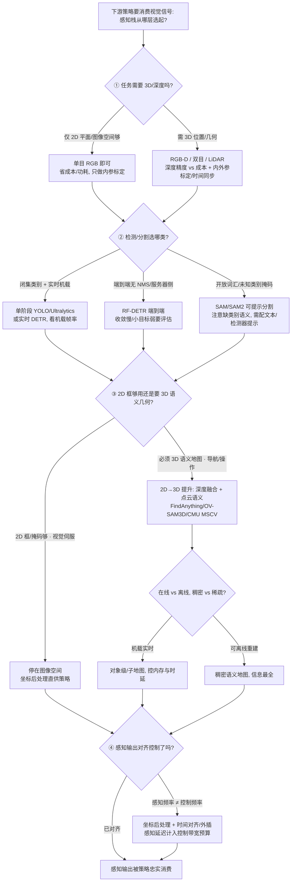

# Query：机器人视觉感知栈选型闭环知识链

> **Query 产物**：本页由以下问题触发：「机器人策略/操作/导航要消费的视觉感知信号，到底从哪来、怎么一层层选出来——从选传感与标定（RGB / RGB-D / LiDAR、内外参标定、深度精度 vs 成本），到 2D 检测/分割选型（单阶段 YOLO vs 两阶段 vs DETR、闭集 vs 开放词汇、实时机载 vs 服务器侧），再到 2D→3D 提升与语义建图（深度融合、点云语义、在线 vs 离线、稠密 vs 稀疏），最后到下游策略怎么消费感知输出（坐标后处理、感知频率 vs 控制频率对齐）？中间分几层、每层选什么、精度和时延/算力怎么取舍、什么时候 2D 框就够、什么时候非上 3D 语义几何不可？」
> 综合来源：[Ultralytics YOLO（单阶段实时检测）](../entities/ultralytics.md)、[RF-DETR（端到端 DETR）](../entities/rf-detr.md)、[YOLO 奠基论文](../entities/paper-yolo-unified-realtime-detection.md)、[Segment Anything（可提示分割）](../entities/paper-segment-anything.md)、[SAM2（视频可提示分割）](../entities/paper-sam2.md)、[FindAnything（对象级开放词汇 3D 语义建图）](../entities/findanything.md)、[CMU MSCV 语义 3D 建图](../entities/cmu-mscv-semantic-3d-mapping.md)、[OV-SAM3D（开放词汇 3D 分割）](../entities/ov-sam3d.md)。它位于策略的**输入端**，是[执行器驱动链选型闭环](./actuator-drive-chain-selection-loop.md)（策略**输出端**「力矩指令怎么被硬件执行」）的**镜像姊妹链**，也与[具身大模型分类学选型闭环](./embodied-fm-taxonomy-loop.md)（选哪一类策略）、[具身大模型评测基准选型闭环](./embodied-eval-benchmark-selection-loop.md)（怎么证明它）互补——回答「策略要消费的感知信号从哪来、怎么选这条感知栈」。

## TL;DR：四层感知栈选型闭环一句话定位

「给机器人一双能用的眼睛」不是「装个相机跑个 YOLO 就行」，而是一条**从传感标定到语义建图、层层要对齐「像素 ↔ 可供策略消费的物理量」的分层感知链**。每一层选的对象、代价、易踩的坑都不同，**上一层指标漂亮不代表下一层能被策略忠实消费**——检测 mAP 高 ≠ 3D 定位准、SAM 掩码精细 ≠ 有类别语义、稠密语义地图信息全 ≠ 建得起/跑得动、感知帧率高 ≠ 控制闭环带宽高。选错某一层的判据，就会让「感知输出 = 策略可信输入」这个下游赖以成立的抽象在真机上悄悄破掉：

| 层 | 选什么 | 代表性工具/方案 | 核心取舍 | 这一层最容易骗人的地方 |
|----|--------|----------------|----------|------------------------|
| ① 传感与标定 | RGB / RGB-D / LiDAR 输入模态、内外参标定、深度精度 vs 成本 | 单目 / 双目 / 结构光 / ToF / LiDAR + 标定流程；只有 RGB 时可用 [PointDiT](../entities/paper-pointdit.md) 出仿射点图 | 深度精度 vs 成本/功耗；模态互补 vs 标定/同步复杂度；单目点图省传感器但不是 metric | 有深度图 ≠ 深度在远处/反光/低纹理处可信；点图 Rel 低 ≠ 毫米尺度已对齐 |
| ② 2D 检测/分割选型 | 单阶段 vs 两阶段 vs DETR、闭集 vs 开放词汇、机载 vs 服务器侧 | [YOLO/Ultralytics](../entities/ultralytics.md)、[RF-DETR](../entities/rf-detr.md)、[SAM/SAM2](../entities/paper-segment-anything.md) | 实时机载算力 vs 服务器侧精度；闭集准 vs 开放词汇泛 | mAP 高 ≠ 机载帧率够；SAM 掩码强 ≠ 有类别语义 |
| ③ 2D→3D 提升与语义建图 | 深度融合、点云语义、在线 vs 离线、稠密 vs 稀疏 | [FindAnything](../entities/findanything.md)、[OV-SAM3D](../entities/ov-sam3d.md)、[CMU MSCV Semantic 3D](../entities/cmu-mscv-semantic-3d-mapping.md) | 2D 框够用 vs 必须 3D 语义几何；稠密信息全 vs 内存/时延 | 2D 检测准 ≠ 提升到 3D 后尺度/遮挡不歧义 |
| ④ 下游策略消费 | 坐标后处理、感知-控制频率对齐、感知输出接口 | [坐标后处理](../concepts/perception-coordinate-postprocessing.md) + 导航/操作/WBC 消费 | 感知延迟 vs 控制带宽；富语义 vs 策略实际用得上 | 感知 30fps ≠ 控制闭环能吃 30Hz 新信息 |

**总原则**：感知栈选型的第一问永远是「**这一层的指标，和它在真机（远距/反光/遮挡/机载算力/控制频率）条件下能被下游忠实消费的程度，差在哪、什么时候差到会破坏上层假设**」。越靠上层（传感、2D 检测）越好量化、越可复现基准；越靠下层（2D→3D 语义建图、策略消费）越依赖场景与下游任务、越难一次调对。一条负责任的感知栈要**逐层把「感知输出 = 策略可信输入」这个抽象压实到真机与具体下游任务**，而不是停在某个 benchmark 指标漂亮的中间层上。

---

## 四层感知栈选型决策树

---

## 1. ① 传感与标定层：有深度图 ≠ 深度处处可信

整条感知栈的物理入口是**相机/雷达等传感器的选型与标定**，第一道选型是**需不需要 3D/深度**，以及需要时**RGB-D / 双目 / LiDAR 怎么选**：

- **选什么**：纯 2D 平面任务（图像空间视觉伺服、屏幕坐标操作）单目 RGB + 内参标定即可；需要 3D 位置/几何时才上 RGB-D（结构光/ToF）、双目或 LiDAR，并要做内外参标定与多传感时间同步。
- **取舍主线**：**深度精度 vs 成本/功耗**——结构光近距精度高但室外/反光失效，ToF 抗环境光但分辨率有限，LiDAR 远距稳但贵且稀疏，双目省钱但低纹理处退化；**模态互补 vs 标定/同步复杂度**——多模态融合（RGB-D + LiDAR）覆盖面广，但外参标定与时间同步一旦对不齐，融合反而引入系统性误差。
- **典型误判**：把「相机给了深度图」当成「每个像素深度都能信」——远距、反光、低纹理、遮挡边缘的深度是主要失效区，这些误差会一路传到 ③层 2D→3D 提升里放大成尺度/位置错误。

## 2. ② 2D 检测/分割选型层：mAP 高不是万能旗标

传感器给出图像后，**2D 检测/分割把像素变成「框 / 掩码 / 类别」**，核心是三条正交的选型轴：

- **选什么/调什么**：闭集、类别已知且要实时机载——[YOLO 单阶段](../entities/paper-yolo-unified-realtime-detection.md) / [Ultralytics](../entities/ultralytics.md) 生态（速度-精度可裁剪）；要端到端、去掉 NMS/anchor 手工件——[RF-DETR](../entities/rf-detr.md) 等实时 DETR；类别开放/未知、要精细掩码——[SAM / SAM2](../entities/paper-segment-anything.md) 可提示分割。选型三轴见[目标检测模型选型 Query](./object-detection-model-selection.md)，骨干/表征层见[感知骨干选型 Query](./perception-backbone-selection.md)。
- **取舍主线**：**实时机载算力 vs 服务器侧精度**——机载（Jetson 级）要卡帧率预算，大模型精度高但跑不动；**闭集准 vs 开放词汇泛**——闭集检测器对训练类别准但遇到未见类别失明，开放词汇/可提示分割泛化强但类别语义弱、易过分割。
- **典型误判**：① 把「benchmark mAP 高」当「机载能实时」——mAP 与机载帧率是两回事，部署要按目标硬件重测时延；② 把「SAM 掩码很精细」当「知道这是什么」——[SAM/SAM2](../entities/paper-sam2.md) 输出的是**无类别语义的掩码**，类别标签要靠额外文本提示或检测器配套，直接拿来当语义分割用会缺语义。

## 3. ③ 2D→3D 提升与语义建图层：2D 准 ≠ 提升到 3D 不歧义

到这一层才正面回答**「2D 框/掩码够不够用，还是必须提升到 3D 语义几何」**——一旦下游是导航/操作，就要把 2D 结果融合进 3D 空间：

- **选什么/建什么**：2D 框/掩码够用（图像空间视觉伺服、平面抓取）就停在图像空间，靠坐标后处理直供策略；需要 3D 语义地图时，把 2D 检测/分割结果用深度融合提升成点云语义——路线分**对象级/子地图开放词汇建图**（[FindAnything](../entities/findanything.md) 强调机载实时、对象级体素子地图；[OV-SAM3D](../entities/ov-sam3d.md) 开放词汇 3D 分割）、**稠密语义建图**（[CMU MSCV Semantic 3D Mapping](../entities/cmu-mscv-semantic-3d-mapping.md)、[GO2 三维语义建图 SAM 流水线](./go2-3d-semantic-mapping-sam-pipeline.md)），以及**离线多粒度辐射场**（[LEGO](../entities/paper-lego-leveled-language-gaussian-splatting.md) 把多视角 SAM 重分级成结构层级再接 CLIP / 场景图，按场景优化、非机载）。这一层的信息损失与歧义根因见专页 [2D→3D 语义提升 Gap](../concepts/2d-to-3d-semantic-lifting-gap.md)。
- **取舍主线**：**2D 框够用 vs 必须 3D 语义几何**——图像空间够就别过度建图；**稠密信息全 vs 内存/时延**——稠密语义地图信息最全但吃内存/算力，对象级子地图省资源但只保留感兴趣对象；**在线实时 vs 离线完整**——机载在线建图要控延迟、边走边建，离线可重建更完整但不能实时消费。
- **典型误判**：① 把「2D 检测很准」当「提升到 3D 也准」——尺度不确定、遮挡、时序不一致会让 2D→3D 提升系统性偏（见 [Gap 专页](../concepts/2d-to-3d-semantic-lifting-gap.md)）；② 无脑上稠密语义建图——机载内存/时延撑不住，对象级子地图往往才是实时正解。

## 4. ④ 下游策略消费层：感知帧率 ≠ 控制闭环带宽

最后一层把检测/分割/语义地图**交给导航/操作/WBC 策略消费**，核心误区是把感知帧率直接当控制闭环带宽：

- **选什么/配什么**：把感知输出（框/掩码/3D 语义）经[坐标后处理](../concepts/perception-coordinate-postprocessing.md)转到策略需要的坐标系与表示，并做**感知-控制频率对齐**——感知延迟计入控制带宽预算、必要时对慢感知做时间外插/滤波。
- **取舍主线**：**感知延迟 vs 控制带宽**——闭环带宽受限于整条链路里最慢的环节（曝光 → 检测/建图 → 坐标变换 → 策略），感知只是其中一环；**富语义 vs 策略实际用得上**——把每个像素都语义化很爽，但策略常只需少数几个对象的位姿，过度语义化白白吃算力/延迟。
- **典型误判**：① 把「相机 30fps」当「控制闭环能吃 30Hz 新感知信息」——真实可用的感知更新率受端到端延迟限制，通常远低于相机帧率；② 忽略坐标系/外参误差，直接把像素坐标喂策略，导致「检测很准但抓偏了」（问题在坐标后处理，不在检测器）。

---

## 感知栈选型矛盾速查（按取舍归因）

| 矛盾 | 一端 | 另一端 | 选型第一判据 |
|------|------|--------|-------------|
| 精度 vs 时延 | 服务器侧大模型精度高 | 机载算力受限要实时 | 部署硬件与帧率预算 |
| 闭集 vs 开放词汇 | 闭集检测对已知类准 | 开放词汇/可提示泛化强 | 类别集合是否封闭已知 |
| 掩码 vs 语义 | SAM 零样本掩码精细 | 缺类别语义标签 | 下游要几何还是要类别 |
| 2D vs 3D | 2D 框/掩码够用省资源 | 3D 语义几何供导航/操作 | 任务是否需要空间几何 |
| 稠密 vs 子地图 | 稠密语义信息最全 | 对象级子地图省内存/时延 | 机载资源与感兴趣对象数 |
| 在线 vs 离线 | 在线建图边走边用 | 离线重建更完整 | 是否需实时消费 |
| 深度精度 vs 成本 | LiDAR/结构光精度高 | 双目/单目省成本功耗 | 场景距离/光照与预算 |
| 感知率 vs 控制带宽 | 相机帧率高 | 端到端延迟限可用更新率 | 最慢环节 + 延迟裕度 |

## 典型失败模式速查（按感知栈层归因）

| 现象 | 最可能出错的感知栈层 | 第一优先排查 |
|------|--------------------|-------------|
| 检测框很准但抓偏了 | ④ 坐标后处理/外参 | 查相机外参标定与坐标变换，非检测器 |
| benchmark 强真机机载卡顿 | ② mAP 高但机载算力不够 | 按目标硬件重测时延，换轻量模型 |
| 远处/反光物体 3D 位置乱跳 | ①/③ 深度不可信被提升放大 | 查深度失效区，对不可信深度设门限 |
| SAM 掩码好但不知道是什么 | ② 分割无类别语义 | 配文本提示/检测器补类别标签 |
| 稠密建图机载 OOM/掉帧 | ③ 稠密 vs 子地图选错 | 换对象级/子地图，只建感兴趣对象 |
| 控制增益一拉就滞后振荡 | ④ 把感知帧率当控制带宽 | 按端到端延迟重估可用感知更新率 |

---

## 英文缩写速查

| 缩写 | 英文全称 | 简要说明 |
|------|----------|----------|
| RGB-D | RGB-Depth | ①层带深度的彩色相机（结构光/ToF） |
| ToF | Time-of-Flight | ①层飞行时间深度传感，抗环境光但分辨率有限 |
| LiDAR | Light Detection and Ranging | ①层激光雷达，远距稳但稀疏且贵 |
| mAP | mean Average Precision | ②层检测/分割精度主指标 |
| NMS | Non-Maximum Suppression | ②层单阶段/两阶段的后处理去重，DETR 想去掉它 |
| DETR | DEtection TRansformer | ②层端到端集合预测检测器（无 anchor/NMS） |
| YOLO | You Only Look Once | ②层单阶段实时检测奠基范式 |
| SAM | Segment Anything Model | ②层可提示分割基础模型（无类别语义） |
| OV | Open-Vocabulary | ②/③层开放词汇，可识别训练集外类别 |
| TSDF | Truncated Signed Distance Function | ③层稠密体素融合常用表示 |

## 参考来源

- [yolo_arxiv_1506_02640.md](../../sources/papers/yolo_arxiv_1506_02640.md) — ②层单阶段实时检测奠基论文
- [rf_detr_arxiv_2511_09554.md](../../sources/papers/rf_detr_arxiv_2511_09554.md) — ②层端到端实时 DETR
- [segment_anything_arxiv_2304_02643.md](../../sources/papers/segment_anything_arxiv_2304_02643.md) — ②层可提示分割基础模型
- [sam2_arxiv_2408_00714.md](../../sources/papers/sam2_arxiv_2408_00714.md) — ②层图像+视频可提示分割
- [ultralytics.md](../../sources/repos/ultralytics.md) — ②层单阶段实时检测工程化生态一手仓
- [ov-sam3d.md](../../sources/repos/ov-sam3d.md) — ③层开放词汇 3D 分割一手资料
- [occanyscene_arxiv_2608_08696.md](../../sources/papers/occanyscene_arxiv_2608_08696.md) — ③层跨室内外语义占据 lifting
- [lego_leveled_language_gs_arxiv_2608_10057.md](../../sources/papers/lego_leveled_language_gs_arxiv_2608_10057.md) — ③层离线 3DGS 多粒度开放词汇（结构层级 vs SAM 粒度）
- [pointdit_arxiv_2607_02515.md](../../sources/papers/pointdit_arxiv_2607_02515.md) — ①/③层 RGB-only 仿射点图（像素空间扩散）

## 关联页面

- 姊妹 Query（输出端）：[执行器驱动链选型闭环](./actuator-drive-chain-selection-loop.md) — 策略力矩指令怎么被硬件执行；本页是其**输入端镜像**（感知信号怎么被策略消费）
- 姊妹 Query：[具身大模型分类学选型闭环](./embodied-fm-taxonomy-loop.md) — 选哪一类策略，本页承接「策略要消费的感知信号从哪来」
- 姊妹 Query：[具身大模型评测基准选型闭环](./embodied-eval-benchmark-selection-loop.md) — 怎么评测/证明它
- 表征语义分层：[具身感知六种空间表征](../concepts/embodied-perception-six-spatial-representations.md) — 2D/深度/点云/占据/语义/隐式各自回答什么；与本页工程选型链互补
- 物理根因专页：[2D→3D 语义提升 Gap](../concepts/2d-to-3d-semantic-lifting-gap.md) — ③层「2D 结果提升到 3D 语义几何」的信息损失与歧义
- 层内深化：[目标检测模型选型 Query](./object-detection-model-selection.md) — ②层检测器三轴选型
- 层内深化：[机器人感知骨干/表征选型 Query](./perception-backbone-selection.md) — ②层骨干/表征选型（分类骨干 vs 检测头 vs 通用预训练表征）
- 层内案例：[GO2 三维语义建图 SAM 流水线](./go2-3d-semantic-mapping-sam-pipeline.md) — ③层 2D→3D 语义建图端到端案例
- [目标检测（方法）](../methods/object-detection.md) — ②层检测方法总览
- [视觉骨干（概念）](../concepts/vision-backbones.md) — ②层特征骨干背景
- [感知坐标后处理](../concepts/perception-coordinate-postprocessing.md) — ④层像素→策略坐标的后处理
- [Ultralytics YOLO](../entities/ultralytics.md) · [RF-DETR](../entities/rf-detr.md) · [YOLO 奠基论文](../entities/paper-yolo-unified-realtime-detection.md) — ②层 2D 检测层实体
- [Tennis-Vision](../entities/tennis-vision.md) — 广播网球检测/跟踪案例：出点率 ≠ 定位精度，单应只在地板平面有效
- [Segment Anything](../entities/paper-segment-anything.md) · [SAM2](../entities/paper-sam2.md) — ②层可提示分割层实体
- [FindAnything](../entities/findanything.md) · [OV-SAM3D](../entities/ov-sam3d.md) · [CMU MSCV Semantic 3D Mapping](../entities/cmu-mscv-semantic-3d-mapping.md) — ③层 2D→3D 语义建图层实体
- [OccAnyScene](../entities/paper-occanyscene.md) — ③层跨室内外语义占据（视锥高斯 lifting；代码待发布）
- [LEGO](../entities/paper-lego-leveled-language-gaussian-splatting.md) — ③层离线 3DGS 多粒度开放词汇（已开源；非机载）
- [Green for Go](../entities/paper-green-for-go-vla-nav-grounding.md) — ④层下游消费：分割 overlay 被冻结导航 VLA 当可通行提示（未开源）
- [Hand Visibility Detector](../entities/paper-hand-visibility-detector.md) — ④层手部消费：逐关节可见性给三角化/遥操作按点降权（已开源）
- [SAP-Nav](../entities/paper-sap-nav.md) — ③层在线建图：可查询空间–语义表征边走边建 + 主动视点验证，证据不足就换视点（实现待发布）
- [Language-to-Navigation-Goals](../entities/paper-language-to-navigation-goals-rgbd.md) — ③/④层最小实现：远程 VLM bbox + RGB-D 深度邻域最小值反投影 → 地图系目标直供 Nav2，不建持久语义地图也不学导航策略（代码待论文接收后开源）
- [RoboOrchardLab](../entities/robo-orchard-lab.md) — 训练框架入口：`projects/bip3d_grounding` 落 ③层 2D→3D grounding、`finegrasp` 落 ④层下游消费；提供的是统一训练/Model Zoo 管线，选哪个感知模型仍看本页（Apache-2.0）
- [PartialBiGrasp](../entities/paper-partialbigrasp.md) — ③层反例读法：大/复杂物体单视角只有局部点云时，不重建完整 mesh，只用占据网络补出力闭合判据需要的接触区几何再交 ④层抓取消费（架构仓部分开源，权重 TODO）
- [PointDiT](../entities/paper-pointdit.md) — ①/③层 RGB-only 点图：像素空间扩散、单步可用；仿射不变，室外弱于 MoGe（已开源）
