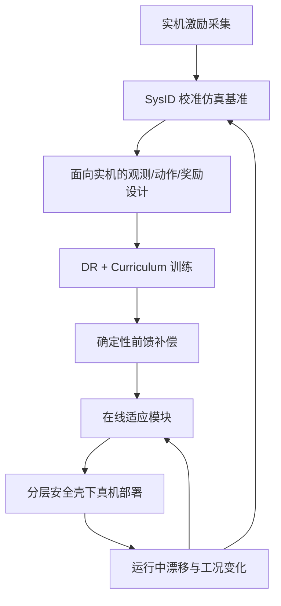

> **Query 产物**：本页由以下问题触发：「为什么说 Sim2Real 不是训完之后才考虑的事？工程上如何从系统辨识做到在线适应与安全部署？」
> 综合来源：[Sim2Real](../concepts/sim2real.md)、[System Identification](../concepts/system-identification.md)、[Domain Randomization](../concepts/domain-randomization.md)、[Privileged Training](../concepts/privileged-training.md)、[RMA](../entities/paper-rma-rapid-motor-adaptation.md)、[Sim2Real Checklist](./sim2real-checklist.md)、[Gap 缩减指南](./sim2real-gap-reduction.md)；叙述骨架编译自 [深蓝具身智能公众号文](../../sources/blogs/wechat_shenlan_sim2real_sysid_to_adaptation.md)（2026-07-28）。

# Sim2Real 闭环误差分层工程

## 一句话定义

把仿真策略上真机当成 **从 SysID 启动、贯穿训练与部署、运行中持续校准** 的闭环系统工程，而不是训练结束后的独立迁移步骤。

## 英文缩写速查

| 缩写 | 英文全称 | 简要说明 |
|------|----------|----------|
| Sim2Real | Simulation to Real | 仿真训练策略迁移到真机部署 |
| SysID | System Identification | 用实机数据校准仿真/控制模型参数 |
| DR | Domain Randomization | 训练时随机化参数覆盖残余不确定性 |
| RMA | Rapid Motor Adaptation | 从交互历史隐式估计环境外参并在线适应 |
| PD | Proportional–Derivative | 底层高频关节跟踪；策略常输出其 setpoint |
| IMU | Inertial Measurement Unit | 真机本体感受主传感器之一 |
| RL | Reinforcement Learning | 仿真中学习策略的常见范式 |
| E-Stop | Emergency Stop | 物理急停，分层安全的最外层 |

## 为什么重要

- **误判成本高：** 把迁移当成「训后一步」时，辨识、训练、部署彼此割裂——仿真参数训后冻结、漂移无反馈、前馈仍用过期标定，实机上才逐一暴露。
- **工具选错会伤运动质量：** 一失败就盲目扩大质量/摩擦/时延随机范围，策略容易过度保守，能效与跟踪变差。
- **安全必须独立：** 仿真跌倒可重置；真机跌倒会毁硬件。分层防护不能指望策略自己学会。

## 核心原理：先分解 Gap，再分流手段

面对实机性能下降，**先判断误差类型**，再选工具——这与 [Gap 缩减指南](./sim2real-gap-reduction.md) 的根因分类一致，本页强调的是**闭环时序**：校准发生在训练前，也发生在部署后。

| 误差类型 | 典型来源 | 优先手段 |
|----------|----------|----------|
| 可建模参数偏差 | 质量、连杆惯量、关节摩擦与厂商 URDF 默认值不符 | [SysID](../concepts/system-identification.md) + 底层前馈 |
| 难完整建模的动态/环境 | 齿轮回差、皮带/结构柔性、执行器延迟与温升、地面柔顺 | [DR](../concepts/domain-randomization.md)（围绕已校准基准） |
| 观测误差 | 传感器噪声、偏置、量化；训练用了部署不可得特权 | 观测对齐 + [特权教师–学生](../concepts/privileged-training.md) |
| 时变工况 | 地形 μ、负载、电池电压 | 在线适应（如 [RMA](../entities/paper-rma-rapid-motor-adaptation.md)） |
| 部署风险 | 过流、限位撞击、跌倒 | 分层安全（[Safety Filter](../concepts/safety-filter.md) / [安全 FSM](../concepts/robot-safety-state-machine.md)） |

### 流程总览

要点：**系统不再是「训完部署就结束」**；运行反馈应回到基准校准或适应模块，而不是只改策略超参。

## 工程实践：六段闭环

### 1. SysID：先建可靠物理基准

1. 让真机执行**激励丰富**的轨迹（速度/加速度覆盖目标工况）。
2. 仿真施加相同控制信号，比较关节位置/速度/力矩轨迹。
3. 优化摩擦、惯量等参数，使响应对齐。

实践约束：

- **参数不是越多越好**：激励不足时拟合高频相关项易过拟合。单关节上延迟/摩擦/惯量在阶跃上纠缠时，先按 [实验设计](../methods/sim2real-joint-sysid-experiment-design.md) 分级拆开，再写回仿真。
- **目标不是永恒精确模型**，而是给 RL 一个合理中心；随后 DR 覆盖公差与测量误差——**不要在错误默认 URDF 上盲目放大随机范围**。
- 早期参照：Minitaur 路线先建电机与延迟模型再随机化（见 [四足敏捷 Sim2Real RSS 2018](../entities/paper-quadruped-agile-sim2real-rss2018.md) 与 [SysID](../concepts/system-identification.md)）。

### 2. 观测 / 动作 / 奖励：训练即面向部署

| 设计面 | 工程准则 |
|--------|----------|
| 观测 | 学生策略只使用真机可得通道（关节、IMU、历史动作等）；特权（精确速度、高度图、μ）留给教师或蒸馏阶段 |
| 动作 | 常见「低频策略目标位姿 + 高频 PD」：RL 管全局非线性，反馈管局部快扰 |
| 奖励 | 速度跟踪之外加姿态、平滑、力矩与能耗惩罚，避免仿真高分、真机过热/冲击 |

盲行四足经典叙事：策略从历史交互线索（打滑、阻挡）推断地形，而非分类「雪地」标签——见 [Privileged Training](../concepts/privileged-training.md)。

### 3. DR + Curriculum：范围与顺序同样重要

- **DR：** 质量、摩擦、延迟等随机范围应锚定硬件公差与测量误差；过大 → 保守次优。细则见 [Domain Randomization 参数指南](./domain-randomization-guide.md)。
- **Curriculum：** 先平地/微扰建基本运动，再抬地形与外扰；难度随表现推进。代表：[Curriculum Learning](../concepts/curriculum-learning.md) 与 Rudin et al. *Learning to Walk in Minutes*（大规模并行 + 游戏启发课程）。

### 4. 确定性前馈：能公式算清的别硬塞给策略

已辨识的关节摩擦等，可进底层按速度前馈补偿：在跟踪误差出现前消掉系统性偏差，策略更易调试，也少背「隐式补偿」负担。与 [Actuator Network](../methods/actuator-network.md) / [BAM](../entities/paper-bam-extended-friction-servo-actuators.md) 等执行器对齐手段可并存——前馈消已知项，学习模型盖残余。

### 5. 在线适应：从近期交互估当前动力学

地形 μ、负载、电压等难静态覆盖时，用适应模块吃近期状态–动作历史，推断环境隐变量并调制基础策略（[RMA](../entities/paper-rma-rapid-motor-adaptation.md)）：真机无需直接测量摩擦系数。

敏捷扩展时，Sim2Real 还覆盖深度噪声、光照与技能切换：例如专家技能蒸馏为第一人称深度统一策略，或保留技能库由高层导航选技（[ANYmal Parkour](../entities/paper-notebook-anymal-parkour-robust-perceptive-locomotion.md)）。

### 6. 分层安全：独立于策略

物理急停、驱动电流限、机械止挡、软件力矩/软限位、跌倒检测等，分布在算法 / 控制板 / 驱动 / 机械层——**不依赖单一机制**。上机清单见 [Sim2Real Checklist](./sim2real-checklist.md)；动作投影类约束见 [Safety Filter](../concepts/safety-filter.md)。

## 局限与风险

- **本页是工程叙事骨架**，不是替代各纵深深页；具体 DR 数值、SysID 实验设计、RMA 训练细节以对应 wiki / 论文为准。
- **综述文来自课程宣传编译**，文内插图与表述为二次整理；量化结论请回到原始论文与站内实体页。
- **闭环不等于无限真机 SysID**：激励轨迹本身有安全成本；实践上常「粗校准 + DR + 轻量在线适应」组合。
- **前馈标定会漂移**（温升、磨损）：需要周期性再辨识或适应模块接力，否则前馈会从「帮忙」变成「系统性偏置」。

## 关联页面

- [Sim2Real](../concepts/sim2real.md) — 概念总览与工程流程
- [System Identification](../concepts/system-identification.md) — 物理基准
- [人形整机闭环惯量标定](../concepts/humanoid-closed-loop-inertia-calibration.md) — 量产出厂 / 在役整机辨识，绑机身序列号
- [关节动力学辨识实验设计](../methods/sim2real-joint-sysid-experiment-design.md) — 单关节分级实验，把 SysID 从「优化器」落到可分离工况
- [Domain Randomization](../concepts/domain-randomization.md) / [DR 参数指南](./domain-randomization-guide.md)
- [Curriculum Learning](../concepts/curriculum-learning.md)
- [Privileged Training](../concepts/privileged-training.md)
- [RMA](../entities/paper-rma-rapid-motor-adaptation.md)
- [Sim2Real Checklist](./sim2real-checklist.md) / [Gap 缩减](./sim2real-gap-reduction.md)
- [Safety Filter](../concepts/safety-filter.md) / [Robot Safety FSM](../concepts/robot-safety-state-machine.md)
- [Sim2Real 知识链](../overview/hub-sim2real.md)
- [Locomotion](../tasks/locomotion.md)

## 参考来源

- [深蓝具身智能：Sim-to-Real 不是训完之后的事情（微信公众号，2026-07-28）](../../sources/blogs/wechat_shenlan_sim2real_sysid_to_adaptation.md) — 主叙事与误差分流骨架；课程出处声明见该归档
- [自由度FreeDof：Sim2Real 动力学辨识](../../sources/blogs/wechat_freedof_sim2real_dynamics_identification.md) — 单关节可辨识性与实验分级
- [sources/raw 抓取原文](../../sources/raw/wechat_shenlan_sim2real_sysid_to_adaptation_2026-07-28.md)
- 站内交叉编译：[Sim2Real](../concepts/sim2real.md)、[SysID](../concepts/system-identification.md)、[RMA 论文实体](../entities/paper-rma-rapid-motor-adaptation.md)、[Gap 缩减](./sim2real-gap-reduction.md)

## 推荐继续阅读

- 原始公众号文：<https://mp.weixin.qq.com/s/6rbLz_6nQz9z6kma9K4BFQ>
- Rudin et al., *Learning to Walk in Minutes Using Massively Parallel Deep Reinforcement Learning* — <https://arxiv.org/abs/2109.11978>
- Kumar et al., *RMA: Rapid Motor Adaptation for Legged Robots* — 见 [RMA 实体页](../entities/paper-rma-rapid-motor-adaptation.md)
