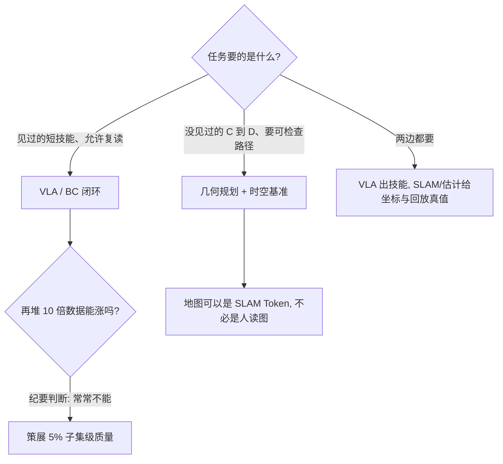

> **Query 产物**：本页由以下问题触发：「具身智能时代，SLAM 还该不该做？精华是什么、糟粕是什么？」
> 综合来源：[VLA](../methods/vla.md)、[状态估计枢纽](../overview/hub-state-estimation.md)、[LiDAR SLAM / LIO / VIO 选型](../comparisons/lidar-slam-lio-vio-selection.md)、[具身 Infra 2026 全景](../overview/embodied-infra-2026-panorama.md)

# 具身时代：SLAM 的精华与糟粕

深蓝学院 2026-08-28「ROBO MIXER」纪要（[公众号](https://mp.weixin.qq.com/s/0MUtW7aaPPltT9oO3SUtSg)）把现场争论收成可执行的选型，而不是再发一篇终局口号。嘉宾：高翔、史雪松、石成玉。文末声明 **不代表** 学院或嘉宾的当前官方立场。

## 一句话定义

**SLAM 的数学内核（时空基准、可约束几何）还在；该退役的是「必须长得像一张给人看的地图」这一工程习惯。**

## 英文缩写速查

| 缩写 | 英文全称 | 简要说明 |
|------|----------|----------|
| SLAM | Simultaneous Localization and Mapping | 同步定位与建图 |
| VLA | Vision-Language-Action | 现场被拆成行为克隆 + 均值轨迹 |
| BC | Behavior Cloning | 高翔：VLA 本质是复读演示 |
| WM | World Model | 现场称「大筐」：能预测就能自称 |
| TTC | Test-Time Compute | 对照站内 [τ₀-VLA](../entities/paper-tau0-vla.md) 的规划补丁 |

## 为什么重要

线上全是「VLA / 世界模型终局」，线下交付队伍要的是：还能不能靠几何约束检查路径、回放真值从哪来、以及再堆十倍数据会不会白烧。

## TL;DR 决策路径

1. **不要把「通用 VLA 复刻 LLM」当成已兑现时间表。** 纪要称大厂高强度采数后真机未显著超过一年前；转述 1228 篇分析：精选 5% 可恢复全量 85–90%。这与站内 [Data Pyramid](../entities/paper-data-pyramid-embodied-manipulation.md) / [VLA](../methods/vla.md)「配方重于总小时」一致，但 **百分比以原综述为准**。
2. **VLA 缺的是 Planning，不是再大两三个数量级就自动出现的规划。** 现场类比：经典方法建图 + A\*；VLA 对 A→B 演示取均值。C→D 只能靠覆盖。站内补丁看 [τ₀-VLA](../entities/paper-tau0-vla.md) 的子任务 TTC，而不是假设 3B–8B 端到端会突然会搜路。
3. **世界模型标签先问预测的是什么。** 视频、latent、仿真器都可以自称 WM；部署前对齐 [生成式世界模型](../methods/generative-world-models.md) 的 I/O 边界。
4. **场景赛比 Demo。** 史雪松用运动会餐饮/商超/家庭 + 外卖打断当体检：随机订单、缺货、任务切换，比单项抓取 SR 更接近「自主性」。
5. **SLAM 留下基准，丢掉中间图崇拜。** 高翔：语义不必是 3D box；可以是高维 token。这与 [状态估计枢纽](../overview/hub-state-estimation.md)「估计是控制输入基础」同向：机器人需要的是可融合的位姿与约束，不是一张给人看的 Occupancy 截图。

## 核心原理

现场把「更大」拆成三问：数据翻倍能力涨了吗；通用 VLA 该有多大；VLA 有没有 Planning。否定支都指向同一结构——**反应式复读覆盖不了没见过的 C→D**，而 SLAM 式约束至少能给出可检查的时空基准。世界模型被当成筐时，先问预测对象，再谈是否进入控制环。

## 工程实践

| 场景 | 先做什么 |
|------|----------|
| 只要短技能 Demo | VLA/BC 可以先上，但用隐藏任务而不是训练 loss 验收 |
| 要随机订单 / 任务打断 | 用场景赛式体检，不要只报单项 SR |
| 外感知退化仍要走 | 本体里程计与接触可靠度，见 [FOCUS](../entities/paper-focus-foot-observation-confidence.md) |
| 还要给人看的地图 | 当作调试视图，不要当成唯一世界表示 |

## 详细对照

| 主张 | 现场说法 | 站内怎么用 |
|------|----------|------------|
| Scaling | 十倍数据未必十倍能力 | 先查数据层是否可对齐，再加小时 |
| 模型尺寸 | 产品化卡在 3B–8B：端侧塞不下、相对 VLM 又不够大 | 部署见 [VLA 部署指南](./vla-deployment-guide.md) |
| 训练信号 | loss 像人 ≠ 任务成功 | 评测要物理后果，见 [具身评测闭环](./embodied-eval-benchmark-selection-loop.md) |
| SLAM 精华 | 时空基准、数据真值、认知地图下一站 | [LIO/VIO 选型](../comparisons/lidar-slam-lio-vio-selection.md)、腿式 odom 见 [FOCUS](../entities/paper-focus-foot-observation-confidence.md) |
| SLAM 糟粕 | 必须可视化成工程 Label 地图 | 可视化是调试工具，不是表示本身 |

## 局限与风险

- 沙龙转述，不是对照实验；声明已排除「官方立场」。
- 「1228 篇 / 5% 子集」未在本页核原论文，引用时回查。
- 不能把本页读成「不要做 VLA」或「SLAM 已死」。

## 关联页面

- [VLA](../methods/vla.md)
- [状态估计枢纽](../overview/hub-state-estimation.md)
- [具身 Infra 2026 全景](../overview/embodied-infra-2026-panorama.md)
- [FOCUS 连续足部里程计](../entities/paper-focus-foot-observation-confidence.md)

## 参考来源

- [wechat_shenlan_slam_second_spring_2026-09-02](../../sources/blogs/wechat_shenlan_slam_second_spring_2026-09-02.md)
- [raw 抓取](../../sources/raw/wechat_shenlan_slam_second_spring_2026-09-02.md)

## 推荐继续阅读

- 原文：<https://mp.weixin.qq.com/s/0MUtW7aaPPltT9oO3SUtSg>
- 高翔《视觉 SLAM 十四讲》— 现场嘉宾的经典教材坐标

## 一句话记忆

**画地图的人没有过时，只是地图画在了新的地方。**
