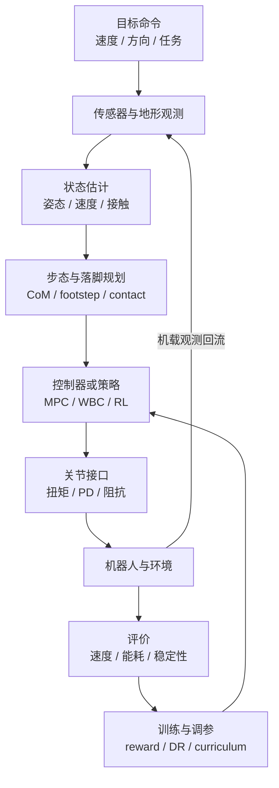

# Locomotion

**运动/行走**：让机器人（尤其人形/足式）实现稳定、高效、多地形移动的能力。

## 一句话定义

让机器人在不需要轮子的情况下，用腿走路，而且走得稳、走得快、走得自然。

## 英文缩写速查

| 缩写 | 英文全称 | 简要说明 |
|------|----------|----------|
| Locomotion | Robot Locomotion | 足式/人形等无轮移动能力总称 |
| ZMP | Zero Moment Point | 足底支撑多边形内零力矩点，经典动态平衡判据 |
| DCM | Divergent Component of Motion | 与 Capture Point 配套的质心发散分量，用于落脚调节 |
| MPC | Model Predictive Control | 滚动优化质心/接触/足端轨迹的高层规划 |
| WBC | Whole-Body Control | 全身 QP/HQP，协调多肢关节满足平衡与任务 |
| RL | Reinforcement Learning | 从奖励直接学策略，常见 PPO 训行走/跑跳 |
| AMP | Adversarial Motion Prior | 对抗运动先验，约束策略状态转移接近人类分布 |
| PD | Proportional–Derivative | 关节位置/阻抗底层，策略常输出 setpoint 由其跟踪 |

## 任务边界

Locomotion 不是单个“会走路的策略”，而是一套闭环运动系统：把机体状态、接触状态、地形信息和目标速度/落脚点转成可稳定执行的关节指令。

| 视角 | 输入 | 输出 | 典型失败模式 |
|------|------|------|--------------|
| 任务层 | 目标速度、目标方向、地形约束 | 步态模式、落脚区域、速度跟踪目标 | 走得快但不可控，或只能在训练地形上工作 |
| 规划层 | 机器人状态、地形高度、接触约束 | 质心轨迹、足端轨迹、期望接触力 | 落脚点不可达、摩擦约束违反 |
| 控制层 | 参考轨迹、关节状态、接触估计 | 关节力矩、位置目标或 PD setpoint | 抖动、打滑、膝盖过伸、接触切换失稳 |
| 学习层 | 奖励、示范数据、扰动分布 | 策略、价值函数、运动先验 | reward hacking、sim2real 退化、动作不自然 |

## 闭环流程总览

阅读这张图时可以抓住两条主线：

- **在线闭环**：观测 → 状态估计 → 规划/策略 → 关节接口 → 机器人执行。
- **离线迭代**：真实或仿真 rollout 产生指标，再回到 reward、domain randomization、curriculum 和控制参数调试。

## 核心挑战

### 1. 平衡
人形机器人是天然不稳定的系统，必须主动维持平衡。

- 静态平衡：重心在支撑多边形内
- 动态平衡：ZMP（Zero Moment Point）条件
- 接触力分配：多接触时的力分配问题

### 2. 接触切换
行走本质是不断在单脚支撑和双脚支撑之间切换，每次切换都容易失稳。

### 3. 高维动作空间
30+ 自由度，每次决策都要协调所有关节。

### 4. 地形变化
平坦、崎岖、不平整、楼梯——每种地形需要不同的步态策略。

- **楼梯 / 越障纵深索引：** [楼梯与障碍 Locomotion（感知/盲走中心节点）](./stair-obstacle-perceptive-locomotion.md) — 带/不带感知、上下楼梯与跑酷文献的 **维护挂接点**。
- **楼梯与离散接触上的学习案例：** [FastStair（论文实体页）](../entities/paper-faststair-humanoid-stair-ascent.md) 归纳 arXiv:2601.10365：用 **GPU 并行 DCM 落脚点离散搜索** 在 Isaac Lab RL 中提供显式可行落点监督，再以 **分速专家 + LoRA 融合** 缓解保守性与全速域动作分布差异，在 LimX Oli 上给出高速上楼梯实机叙事。
- **显式楼梯几何条件化：** [Explicit Stair Geometry Conditioning（论文实体页）](../entities/paper-explicit-stair-geometry-humanoid-locomotion.md)（arXiv:2605.09944）从点云 BEV 预测 **踢面高度 / 踏面深度 / 航向 / 楼梯状态** 四维 token，直接条件化 **PPO**；在 **Unitree G1** 上零样本实机，户外 **连续 33 级** 上楼，训练分布外踢面高度优于视觉 **MoRE** 基线。
- **Spot 平地 velocity 零样本部署：** [NVIDIA Isaac Lab Spot locomotion Sim2Real](../entities/nvidia-isaac-lab-spot-locomotion-sim2real.md) — **Researcher Kit** + `Isaac-Velocity-Flat-Spot-v0` + RSL-rl PPO → Jetson Orin **ONNX** + `spot-rl-example`；教程级对照 [Spot 分布距离 Sim2Real 论文](../entities/paper-spot-rl-distributional-sim2real.md)。
- **四足真机安全微调：** [SLowRL（论文实体页）](../entities/paper-slowrl-safe-lora-locomotion-sim2real.md)（arXiv:2603.17092）在 **Unitree Go2** 上对 jump/trot 做 **冻结主策略 + rank-1 LoRA + Recovery 安全滤波** 真机 PPO 微调，相对全参微调显著降摔倒与墙钟时间（见 [Sim2Real](../concepts/sim2real.md)）。
- **家用四足低噪行走：** [Learning Quiet Walking（aibo）](../entities/paper-learning-quiet-walking-aibo.md)（arXiv:2502.10983，ICRA 2025）用仿真 **足端接触速度** 作声学代理，配合可变 PD 与开关接触，真机安静度优于索尼商用 quiet 控制器（与人形 [QuietWalk GRF](../entities/paper-quietwalk-humanoid-locomotion.md) 对照）。
- **轮足多技能盲走：** [MUJICA（论文实体页）](../entities/paper-mujica-wheel-legged-multi-skill.md)（arXiv:2605.13058）在 **Go2-W** 上用 **单策略 + 技能选择器** 联合全向移动、高台攀爬与摔倒恢复，并以 **DC 电机 P3O 约束** 零样本上真机（**1 m 高台**）。
- **轮足高动态反射避障：** [AWARE](../entities/paper-aware-wheeled-legged-reflexive-evasion.md)（arXiv:2604.23761）在 **M20** 上用分层 RL + 双专家硬切换做快速障碍反射规避（导航全向 / 高动态逃逸），Isaac Lab 与真机抛箱/棍戳/脚踢验证。
- **轮腿双足开源训练栈：** [轮腿双足](../concepts/wheel-legged-biped.md) 汇总 TITA / Flamingo / CJ-003；官方 Gym 入口 [tita_rl](../entities/tita-rl.md)，Lab 扩展 [lab.flamingo](../entities/isaac-rl-two-wheel-legged-bot.md)，Genesis 入口 [wheel_legged_genesis](../entities/wheel-legged-genesis.md)。

### 5. 状态估计与延迟
足式机器人在接触切换时很难直接观测机身速度和足端滑移；IMU、编码器、足端接触和视觉地形之间还存在时间同步与延迟问题。状态估计偏一点，控制器可能表现为“突然踢地”“脚底打滑”或“落脚点漂移”。

### 6. 仿真到真实
仿真里的摩擦、执行器带宽、关节间隙、地面柔顺性都比真实世界干净。只在仿真指标上最优的策略，常在真实机上因动作高频、冲击过大或接触模型偏差而退化。

## 子问题地图

| 子问题 | 要回答的问题 | 常见方法 | 对应页面 |
|--------|--------------|----------|----------|
| 平衡稳定 | 机器人被推、落脚偏差时如何不摔 | ZMP、Capture Point / DCM、step adjustment、WBC | [Capture Point / DCM](../concepts/capture-point-dcm.md)、[Balance Recovery](./balance-recovery.md) |
| 步态生成 | 何时抬脚、落哪里、摆腿轨迹如何生成 | CPG、参数化步态、MPC、RL gait command | [Gait Generation](../concepts/gait-generation.md)、[Footstep Planning](../concepts/footstep-planning.md) |
| 全身协调 | 腿、躯干、手臂如何共同满足平衡与任务 | WBC、centroidal dynamics、QP 优先级 | [Whole-Body Control](../concepts/whole-body-control.md)、[MPC-WBC Integration](../concepts/mpc-wbc-integration.md) |
| 接触建模 | 支撑脚、摩擦锥、冲击和滑移如何处理 | contact dynamics、friction cone、impedance control | [Contact Dynamics](../concepts/contact-dynamics.md) |
| 地形适应 | 楼梯、斜坡、碎石地如何转成可执行动作 | 高程图、落脚点评分、teacher-student、盲走鲁棒策略 | [Terrain Adaptation](../concepts/terrain-adaptation.md) |
| 数据与学习 | 如何获得自然、多样、可迁移的运动 | RL、IL、AMP、motion retargeting、curriculum | [Reinforcement Learning](../methods/reinforcement-learning.md)、[Imitation Learning](../methods/imitation-learning.md) |
| 真机部署 | 如何让策略在硬件上稳定运行 | domain randomization、系统辨识、低通滤波、PD/阻抗接口 | [Sim2Real](../concepts/sim2real.md)、[Kp/Kd 设置 query](../queries/legged-humanoid-rl-pd-gain-setting.md) |

## 主要方法路线

### 传统控制路线
- **ZMP + 预观控制**：经典人形行走（Honda ASIMO）
- **LIP + 步长调节**：简单高效的行走控制
- **Hybrid Zero Dynamics**：考虑机器人动力学结构的步态生成
- **MPC + WBC**：高层用简化动力学预测质心/接触，低层用 QP 或层级 WBC 跟踪全身任务。

### 学习路线
- **RL from scratch**：直接在仿真里训，不需要人工步态设计。
  - 代表：PPO 训四足/双足行走（Legged Gym, IsaacGymEnvs）。
  - 新趋势：**BRRL / BPO (2026)** 在 IsaacLab 环境下报告了比 PPO 更稳健的 locomotion 训练表现。
  - **FlashSAC（arXiv:2604.04539）**：高 DoF 人形盲行走 sim-to-real 墙钟可较 PPO 缩短约一个数量级（见 [FlashSAC 方法页](../methods/flashsac.md)）。
- **IL + RL**：用 MoCap 数据初始化，再用 RL 提升。
  - 代表：DeepMimic, AMP
- **Multi-Gait Learning (多步态学习)**：在一个统一的 RL 框架下训练多种步态。
  - 新趋势：使用 **Selective AMP (选择性 AMP)** 策略，对周期性步态（如行走、上楼梯）应用 AMP 以提高稳定性，对高动态步态（如跑、跳）则省略 AMP，避免正则化过度约束。
  - **SD-AMP（arXiv:2605.18611）**：训练期用投影重力门控在 **recovery / 速度条件 locomotion** 两个 AMP 判别器间切换，部署单策略覆盖走、跑与起身（见 [SD-AMP 实体页](../entities/paper-unified-walk-run-recovery-sdamp.md)）。
  - **ADP（arXiv:2607.03454）**：对抗先验目标从运动学风格改为 **SRBD-TO 动力学时间窗**（CoM/动量/接触），强化推扰恢复；见 [ADP 实体页](../entities/paper-adp.md)。
  - **HoST（arXiv:2502.08378）**：无 MoCap 参考的**纯起身**技能，多 critic + 四地形课程 + 真机运动约束，G1 室内外与俯仰卧验证（见 [HoST 实体页](../entities/paper-host-humanoid-standingup.md)）。
- **世界模型**：学习环境模型，在模型里规划。
  - 代表：[Model-Based RL（Dreamer 等）](../methods/model-based-rl.md)、[LIFT（BIGAI 三阶段管线）](../entities/lift-humanoid.md)

### 混合路线

实际系统常把传统控制和学习策略组合起来，而不是二选一：

- **RL policy + PD/阻抗底层**：策略输出关节位置增量或期望角度，PD/阻抗层保证高频执行稳定。
- **MPC/WBC baseline + learned residual**：模型控制提供安全可解释的主干，学习模块补偿摩擦、冲击或模型误差。[PhyFilter](../entities/paper-phyfilter.md) 把残差送进物理低通滤波，平地 RL 策略可泛化到未见真机地形（arXiv:2608.22701）。
- **Teacher-student / privileged learning**：训练时 teacher 使用高度图、真实速度等 privileged information；部署时 student 只用机载传感器。经典 **在线适应** 实例：[RMA](../entities/paper-rma-rapid-motor-adaptation.md)（特权 extrinsics → 历史 $\hat{z}_t$ 估计，A1 零微调）。**箱载动态载荷** 实例：[Legged Load Adapt](../entities/paper-legged-load-adapt-unknown-dynamic-load.md)（load characteristics 特权 + concurrent estimator，Go2 零样本）。
- **Motion prior + task RL**：先用 MoCap/视频/重定向得到自然运动先验，再用任务奖励获得速度、转向和地形适应能力。
- **LLM 高层摇杆（非力矩）：** [Embody](../entities/anthropic-embody.md) 表明通用语言模型 **直接力矩控 Go2/G1 几乎失败**（人形倒塌站起 0 成功），但接到预训练步态后能做简单寻的；空间记忆与开环长计划仍系统性失败。见 [LLM 控制接口](../concepts/llm-robotics-control-interfaces.md)。不要把聊天模型当低频 WBC。

## 方法选型速查

| 目标 | 优先路线 | 关键验证 |
|------|----------|----------|
| 做可解释、约束清晰的研究 baseline | LIP/ZMP 或 MPC + WBC | 轨迹跟踪误差、摩擦锥、力矩限幅是否满足 |
| 快速得到四足/人形平地移动策略 | PPO/BRRL + PD action interface | 随机扰动、不同速度命令、不同摩擦地面上的成功率 |
| 追求人形动作自然性 | IL/AMP/Selective AMP + RL fine-tuning | 与示范动作相似度、能耗、摔倒率 |
| 复杂地形与楼梯 | 地形感知 + footstep planning 或 teacher-student RL | 未见地形、感知延迟、落脚点可达性 |
| 真机部署 | Sim2Real + 系统辨识 + 动作平滑 | 长时间运行、温升、电流峰值、恢复站立能力 |

## 评价指标

- **行走速度**：m/s
- **能耗效率**：J/kg/m 或 Cost of Transport (CoT)
- **地形适应能力**：是否能处理楼梯、不平整地面
- **稳定性**：摔倒频率
- **运动自然性**：和人类步态的相似度
- **泛化能力**：能否迁移到未见过的地形
- **命令跟踪误差**：目标速度/角速度与实际速度的误差
- **硬件安全裕度**：关节力矩、电流、温度和冲击峰值是否留有余量
- **敏捷课一体化分数（研究基准）**：例如 [Barkour](../entities/paper-barkour-quadruped-agility-benchmark.md) 将 **多障碍序列 + 计时扣分** 压成 **0–1 敏捷分**，便于对比 **专长切换 vs Transformer 通才** 与 **sim2real** 管线。

> 上面这些指标怎么读、和跟踪误差类/求解类/硬件类指标怎么分工，见 [运控模型评测指标](../concepts/motion-control-policy-evaluation-metrics.md)。

## 工程落地检查

1. **先定义动作接口**：策略输出扭矩、关节位置、位置增量还是阻抗参数，会直接决定训练难度和真机风险。
2. **先做站立与恢复**：能稳定站立、被推后恢复、跌倒后安全停机，再进入高速步态。
3. **把评测分层**：仿真看成功率和能耗；半实物看延迟和电流；真机看温升、冲击和长时间稳定性。
4. **保存失败 rollout**：摔倒、打滑、膝盖反关节、脚底震荡等失败样本比平均 reward 更能指导下一轮改动。
5. **不要只调 reward**：很多问题来自状态估计、动作滤波、PD gain、接触模型或 actuator lag，不能全部用奖励函数掩盖。

## RL + 底层 PD / 阻抗 / 扭矩接口（论文实体子页）

下列页面各含 **提炼正文 + Mermaid**，对应 [RL+PD 动作接口论文索引](../../sources/papers/rl_pd_action_interface_locomotion.md) 中的十一篇；与 [Kp/Kd 设置 query](../queries/legged-humanoid-rl-pd-gain-setting.md) 交叉阅读。

- [DeepRL 动作空间对比（SCA 2017）](../entities/paper-deeprl-locomotion-action-space-sca2017.md)
- [Digit 人形 RL 行走](../entities/paper-digit-humanoid-locomotion-rl.md)
- [Cassie 双足多技能 RL](../entities/paper-cassie-biped-versatile-locomotion-rl.md)
- [可变刚度腿足 RL](../entities/paper-variable-stiffness-locomotion-rl.md)
- [Cassie 迭代式 sim2real](../entities/paper-cassie-iterative-locomotion-sim2real.md)
- [ANYmal 分钟级并行 DRL](../entities/paper-anymal-walk-minutes-parallel-drl.md)
- [Walk These Ways（MoB）](../entities/paper-walk-these-ways-quadruped-mob.md)
- [Learning to Adapt（Nature MI 2025 四足多步态 + 生物力学切换）](../entities/paper-learning-to-adapt-bio-inspired-quadruped-gait.md)
- [Cassie 反馈控制 DRL](../entities/paper-cassie-feedback-control-drl.md)
- [四足扭矩控制 RL](../entities/paper-quadruped-torque-control-rl.md)
- [RSS 2018 敏捷四足 sim2real](../entities/paper-quadruped-agile-sim2real-rss2018.md)
- [Barkour（四足敏捷课 + 开源机体 / Menagerie）](../entities/paper-barkour-quadruped-agility-benchmark.md)
- [DreamWaQ++（多模态点云 + 本体四足障碍感知行走）](../entities/dreamwaq-plus.md)
- [可变阻抗接触任务 RL](../entities/paper-variable-impedance-contact-rl.md)
- [Learning Quiet Walking（Sony aibo 低噪四足）](../entities/paper-learning-quiet-walking-aibo.md)

## 参考来源

- Rudin et al., *Learning to Walk in Minutes Using Massively Parallel Deep Reinforcement Learning* — legged_gym 路线奠基论文
- Peng et al., *DeepMimic: Example-Guided Deep Reinforcement Learning of Physics-Based Character Skills* — IL+RL 融合代表
- [Locomotion RL 论文导航](../../references/papers/locomotion-rl.md) — 论文集合
- **ingest 档案：** [sources/papers/policy_optimization.md](../../sources/papers/policy_optimization.md) — PPO/SAC/TD3 + Rudin legged_gym
- **ingest 档案：** [sources/papers/state_estimation.md](../../sources/papers/state_estimation.md) — EKF/InEKF 状态估计
- **ingest 档案：** [Multi-Gait Learning for Humanoid Robots Using Reinforcement Learning with Selective Adversarial Motion Priority](../../sources/papers/multi-gait-learning.md) — 多步态学习中的 Selective AMP 策略
- **ingest 档案：** [sources/papers/rl_pd_action_interface_locomotion.md](../../sources/papers/rl_pd_action_interface_locomotion.md) — RL + PD/阻抗/扭矩接口论文索引
- **ingest 档案：** [sources/papers/deeprl_locomotion_action_space_sca2017.md](../../sources/papers/deeprl_locomotion_action_space_sca2017.md) — Peng SCA 2017 四动作空间对照
- **ingest 档案：** [sources/papers/rma_arxiv_2107_04034.md](../../sources/papers/rma_arxiv_2107_04034.md) — RMA：四足快速运动自适应（RSS 2021）
- **ingest 档案：** [sources/papers/learning_quiet_walking_aibo_arxiv_2502_10983.md](../../sources/papers/learning_quiet_walking_aibo_arxiv_2502_10983.md) — Sony aibo 低噪行走（ICRA 2025）
- **ingest 档案：** [sources/papers/legged_load_adapt_arxiv_2507_07825.md](../../sources/papers/legged_load_adapt_arxiv_2507_07825.md) — Legged Load Adapt：未知动态载荷四足崎岖地形适应（arXiv:2507.07825）
- **ingest 档案：** [sources/papers/p3_arxiv_2607_25541.md](../../sources/papers/p3_arxiv_2607_25541.md) — P³：VAE 潜变量下 PPO 边缘似然

## 关联系统/方法

- [Whole-Body Control](../concepts/whole-body-control.md)
- [Sim2Real](../concepts/sim2real.md)
- [人形腿部行星滚柱丝杠直线驱动（PRS）](../concepts/planetary-roller-screw-humanoid-leg-actuation.md)（直线执行器 + 闭链连杆与行走动态、能耗叙事）
- [膝/腿主承力链为何通常避开谐波](../concepts/humanoid-knee-harmonic-drive-limits.md)（冲击谱载与主力流布置；与臂部精密谐波选型对照）
- [State Estimation](../concepts/state-estimation.md)
- [Reinforcement Learning](../methods/reinforcement-learning.md)
- [Imitation Learning](../methods/imitation-learning.md)
- [MPC](https://en.wikipedia.org/wiki/Model_predictive_control)（在行走中常用于步态预览）
- [MPC 与 WBC 集成](../concepts/mpc-wbc-integration.md)（人形/腿足 locomotion 的典型分层控制架构）
- [Capture Point / DCM](../concepts/capture-point-dcm.md)（步行平衡与扰动恢复的核心方法）
- [Lyapunov 稳定性](../formalizations/lyapunov.md)（分析闭环步态稳定性、扰动恢复和误差收敛的统一语言）
- [Gait Generation](../concepts/gait-generation.md)（步态时序编排：CPG / 参数化 / MPC 联合优化）
- [Footstep Planning](../concepts/footstep-planning.md)（接触序列规划：每步踩哪里、踩多久）
- [Terrain Adaptation](../concepts/terrain-adaptation.md)（把高度图 / 点云转成可执行的落脚点与姿态调整）
- [轮足四足机器人（四轮足）](../concepts/wheel-legged-quadruped.md)（Go2W / B2W 类：腿末驱动轮与足式步态混合）
- [轮腿双足（双轮足）](../concepts/wheel-legged-biped.md)（TITA / Flamingo：两轮倒立摆）
- [tita_rl](../entities/tita-rl.md)
- [wheel_legged_genesis](../entities/wheel-legged-genesis.md)
- [Isaac-RL-Two-wheel-Legged-Bot](../entities/isaac-rl-two-wheel-legged-bot.md)
- [HiPAN](../methods/hipan.md)（四足在非结构化 3D 环境中的分层深度导航 + 姿态自适应低层跟踪）
- [四足机器人](../entities/quadruped-robot.md)（四足形态与典型平台的实体入口）
- [Open Duck Mini](../entities/open-duck-mini.md)（BDX 风格迷你双足 DIY：MuJoCo Playground RL + 舵机 sim2real）
- [Disney Holotile](../entities/disney-holotile.md)（全向活动地板：地面代偿行走，对照「机器人自身 locomotion」）
- [Unitree](../entities/unitree.md)（当前主流人形/四足研究硬件平台）
- [unitree_ros（ROS1 / Gazebo）](../entities/unitree-ros.md)（官方 URDF + Gazebo 关节级仿真；高层行走不在 Gazebo 包承诺内）
- [ULTRA：统一多模态 loco-manipulation 控制](./ultra-survey.md)（UIUC 2026，新一代全身移动操作统一控制器）
- [Query：何时用 WBC vs RL？](../queries/when-to-use-wbc-vs-rl.md) — 实践决策指南

## 关联任务

- [Manipulation](./manipulation.md)：行走+操作 = loco-manipulation
- [Loco-Manipulation](./loco-manipulation.md)：全身移动操作的统一挑战
- [Balance Recovery](./balance-recovery.md)：扰动恢复，鲁棒 locomotion 的核心子能力
- [Query：人形机器人运动控制 Know-How](../queries/humanoid-motion-control-know-how.md) — locomotion 实战经验结构化摘要
- [Query：开源运动控制项目导航](../queries/open-source-motion-control-projects.md) — 主流开源框架与项目概览

## 继续深挖入口

如果你想沿着 locomotion 继续往下挖，建议从这里进入：

### 论文入口
- [Extreme Parkour（端到端四足感知跑酷）](../entities/extreme-parkour.md) — arXiv:2309.14341（ICRA 2024；scandots + 航向双重蒸馏 → 单目深度，Go1）
- [SWAP（对称等变世界模型四足跑酷）](../entities/paper-swap-parkour.md) — arXiv:2606.19928（SE-RSSM + 等变 Actor-Critic 端到端；Apollo 2.13 m 远跳 / 1.63 m 攀台）
- [E-SDS（环境统计条件化 VLM 奖励 + 人形感知地形 RL）](../entities/paper-e-sds-environment-aware-humanoid-locomotion-rl.md) — arXiv:2512.16446（UCL / Isaac Lab / G1）
- [Learning to Adapt（Nature MI 2025 四足 bio-inspired 多步态）](../entities/paper-learning-to-adapt-bio-inspired-quadruped-gait.md) — πG/BGS/πL 分层 DRL，盲零样本复杂地形（RaiSim / ihcr）
- [APT-RL（Science Robotics 2026 封面）](../entities/paper-apt-rl-agile-perceptive-quadruped-locomotion.md) — TO+TVAE 力矩先验 + 深度/LiDAR 蒸馏；HOUND 野外长程与 trot/bound 感知切换
- [执行器约束 RL 高速四足（arXiv:2312.17507）](../entities/paper-actuator-constrained-rl-high-speed-quadruped-locomotion.md) — MOR 扭矩–转速包络进训练；HOUND **6.5 m/s** 跑步机纪录；无 MOR 策略 **5 m/s 实机摔倒**
- [Perceptive Humanoid Parkour（PHP）](../entities/paper-hrl-stack-22-perceptive_humanoid_parkour.md) — arXiv:2602.15827（motion matching 长程参考 + 深度多技能蒸馏，G1 跑酷）
- [DPL（单深度感知人形行走）](../entities/paper-notebook-dpl-depth-only-perceptive-humanoid-locomotion-vi.md) — arXiv:2510.07152（IEEE RA-L；深度合成 + 交叉注意力高程重建 + 盲骨干多教师；TienKung Ultra；代码未开源）
- [SOLO（长程感知人形运动）](../entities/paper-solo.md) — arXiv:2608.26583（QR + TA-MSE；天工 Omni 零样本 1.5 km；截至入库日未开源）
- [Light-Loco-Parkour（LightLP）](../entities/paper-light-loco-parkour.md) — Light Origins 2026-08-03（稀疏种子 Real2Sim2Real + 转移组 RL；Lightbot 0 无技能标签深度跑酷；代码未开源）
- [ParkourFormer](../entities/paper-parkourformer.md) — arXiv:2605.25782（query 历史 + 未来两步本体监督；G1 九类地形单策略 93.85%；代码 Coming Soon）
- [SMPLOlympics](../entities/smplolympics.md) — arXiv:2407.00187（SMPL 仿真人形 10 项奥运运动 benchmark；PPO/AMP/PULSE 基线）
- [Table Tennis Strategy & Skill（PhysicsPingPong）](../methods/table-tennis-strategy-skill-learning.md) — arXiv:2407.16210（SIGGRAPH 2024 分层乒乓球 + VR 人–机）
- [乒乓球分层技能选型指南](../queries/table-tennis-hierarchical-skill-learning-guide.md) — ASE 专家 + mixer + 策略层选型
- [MTRG](../methods/mtrg-reference-goal-driven-rl.md) — arXiv:2602.20375（G1 箱式跑酷：参考仅塑形 + goal 部署，无对抗）
- [HIL](../methods/hil-hybrid-imitation-learning.md) / [HIL 论文实体](../entities/paper-hil-hybrid-imitation-learning.md) — TOG 2026 / arXiv:2505.12619（物理角色跑酷 + heading：tracking + 场景条件 AMP）
- [HIL vs MTRG vs ZEST 跑酷路线对比](../comparisons/hil-vs-mtrg-vs-zest-parkour-imitation.md) — 跑酷模仿三条路线选型
- [ZEST](../methods/zest.md) — arXiv:2602.00401（跨形态高动态模仿与零样本硬件部署）
- [Locomotion RL 论文导航](../../references/papers/locomotion-rl.md)
- [Argus（动态对称 / 球形腿式全向移动）](../entities/paper-argus-dynamic-symmetry.md) — Science Robotics 2026；动态各向同性 η 与 20 腿无朝向偏好 locomotion
- [PhyFilter](../entities/paper-phyfilter.md) — 物理滤波残差修正；四足平地训练泛化到未见地形（arXiv:2608.22701）
- [仿生多模态机器人综述（Science Robotics 2026）](../entities/paper-bioinspired-multimodal-robotics.md) — 跨介质仿生多模态定义 + 五项评测指标（MCM/CRP/TC 等）+ 物理×计算智能路线图
- [腿式机器人进展/挑战/机遇综述（Science Robotics 2026）](../entities/paper-legged-robots-advances-challenges.md) — 硬件/locomotion/自主/数据/应用五柱 + 伦理–政策展望（ETH 牵头）

### Benchmark 入口
- [Locomotion Benchmarks](../../references/benchmarks/locomotion-benchmarks.md)

### 开源项目 / 框架入口
- [RL Frameworks](../../references/repos/rl-frameworks.md)
- [Simulation](../../references/repos/simulation.md)

## 关联页面

- [Humanoid Locomotion](./humanoid-locomotion.md) — 人形机器人全身移动任务
- [LLM 机器人控制接口](../concepts/llm-robotics-control-interfaces.md) — 通用 LLM 接步态 vs 直接力矩
- [Embody](../entities/anthropic-embody.md) — Go2/G1 上的语言模型 locomotion 评测
- [HumanoidVLN](../entities/paper-humanoidvln.md) — 把分本体 RL 步态接到室内 VLN 评测；H1 摔倒率暴露控制–导航耦合
- [Hybrid Locomotion](./hybrid-locomotion.md)
- [轮腿双足](../concepts/wheel-legged-biped.md)
- [tita_rl](../entities/tita-rl.md)
- [人形腿部行星滚柱丝杠直线驱动（PRS）](../concepts/planetary-roller-screw-humanoid-leg-actuation.md) — 腿部执行器路线与行走动态、能耗叙事
- [Whole-Body Control](../concepts/whole-body-control.md)
- [MoRE：复杂地形多步态 AMP](../entities/paper-amp-survey-08-more.md) — 深度相机 + 多判别器先验 + gait command 切换
- [MPC](../methods/model-predictive-control.md)
- [磁驱动双稳态软跳跃机器人](../entities/paper-bistable-soft-jumper-magnetic.md)
- [统一流体-机器人多物理游泳仿真](../entities/paper-unified-fluid-robot-multiphysics-swimming.md)
- [ergoCub Shared Embodied Intelligence](../entities/paper-ergocub-shared-embodied-intelligence.md) — 硬件优化抬高 CoM + 分层 WBC 行走，相对 iCub3 更大步长/更短步周期
- [EgoHTR](../entities/paper-egohtr.md) — rough-terrain 人–场景 4D 演示 → G1 感知 mimic（数据/代码待发布）
- [ADP](../entities/paper-adp.md) — 对抗动力学先验（SRBD-TO + 动力学窗），抗扰相对 AMP 提升；代码待发布
- [SD-AMP](../entities/paper-unified-walk-run-recovery-sdamp.md) — 重力门控双 AMP，走跑起身统一策略
- [PRISM](../entities/paper-prism.md) — 多项式本体交互；Humanoid-Gym 生存率大幅高于同容量更大 MLP（arXiv:2607.23473）
- [Fault-Tolerant Locomotion](../entities/paper-fault-tolerant-locomotion.md) — KYON 68 kg 执行器功率损失容错 + 可学习步态频率（arXiv:2608.07328；未开源）
- [P³](../entities/paper-p3.md) — VAE-PPO 边缘似然；G1 感知踏石/楼梯/缺口（arXiv:2607.25541）

## 推荐继续阅读

- Rudin et al., *Learning to Walk in Minutes Using Massively Parallel Deep Reinforcement Learning*（legged_gym 原论文）
- Won et al., *Perpetual Robot Control: Designing Robot Agility and Recovery*（CPI + RL 路线）
- Jin et al., *Rapid and Scalable Reinforcement Learning for Legged Robots*（Isaac Lab 路线）
- [Humanoid Control Roadmap](../roadmaps/humanoid-control-roadmap.md) — 人形机器人运控的学习成长路线
- [Query：人形机器人硬件怎么选](../queries/humanoid-hardware-selection.md)
- [Query：人形机器人 RL 实战 Cookbook](../queries/humanoid-rl-cookbook.md)
