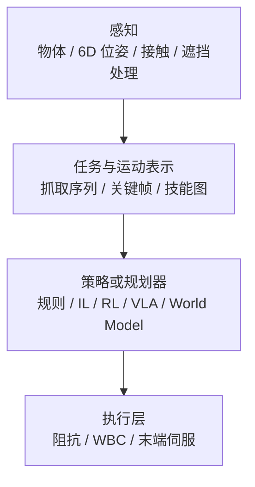

# Manipulation

**操作**：让机器人的手/末端执行器抓取、移动、操作物体。

## 一句话定义

让机器人的手能做事情——抓东西、搬东西、用东西。

## 英文缩写速查

| 缩写 | 英文全称 | 简要说明 |
|------|----------|----------|
| Manipulation | Robot Manipulation | 抓取、移动、操作物体的任务总称 |
| IL | Imitation Learning | 示教驱动路线，扩散策略、BC 等常见于操作 |
| VLA | Vision-Language-Action | 开放词汇操作与自然语言任务接口 |
| TAMP | Task and Motion Planning | 离散任务规划与连续运动/抓取联合求解 |
| WBC | Whole-Body Control | 移动操作中人形全身协调与阻抗执行 |
| 6DoF | Six Degrees of Freedom | 物体位姿（位置+朝向）抓取表示 |
| RL | Reinforcement Learning | 接触丰富场景中探索式策略学习 |

## 核心挑战

### 1. 接触力学
操作涉及多指接触、摩擦、约束——比纯运动控制复杂。

### 2. 视觉感知
需要识别物体、理解姿态、估计空间位置；**2D 目标检测**（见 [目标检测](../methods/object-detection.md)、[YOLO v1](../entities/paper-yolo-unified-realtime-detection.md)）常作第一级 **物体锚点**；抓取子问题中常需要 **6D/7DoF 抓取位姿** 或 **候选集合**（见 [AnyGrasp](../entities/anygrasp.md) 一类检测式管线）。视觉特征多来自 [视觉骨干](../concepts/vision-backbones.md)（如 [ResNet](../entities/paper-resnet-deep-residual-learning.md)）预训练微调。

### 3. 灵巧操作
很多操作需要多指协调、精细力控（如插头、拧瓶盖）。工业侧把这类任务收成可采购实物 + 状态终态的规格，见 [DexBench](../entities/dexbench.md)（18 原子任务 / OSC；官方评测仓待发布）。真机扑克桌面协议见 [DexHoldem](../entities/paper-dexholdem.md)（ShadowHand + UR10e；报 SPSR 而不是只报做成）。

### 4. 开放词汇
现实世界物体种类几乎无限，不可能为每个物体单独训练。

### 5. 仿真场景与交互资产
操作仿真除策略外，还依赖 **可关节、带物理字段的 3D 资产**（尺度、材料、affordance、运动学）。近期 **sim-ready 生成**（如 [PhysX-Omni](../entities/physx-omni.md)、[PhysForge](../entities/paper-physforge-physics-grounded-3d-assets.md)）试图缓解 **PartNet-Mobility 系数据** 在类别与标注上的瓶颈，但导入目标引擎（SAPIEN、MuJoCo、Isaac 等）时仍需核对 **URDF/碰撞/关节限位**。**真机视频孪生**路线见 [SimFoundry](../entities/paper-simfoundry-real2sim-scene-generation.md)（arXiv:2606.28276，[NVlabs/SimFoundry](https://github.com/NVlabs/SimFoundry) **部分开源**）：单段 RGB 视频 → 数字孪生 + **digital cousins**，开源导出 **OmniGibson**；论文级策略训练/评测未随仓。 **Episode 级 agentic Real2Sim** 见 [Agentic Real2Sim](../entities/paper-agentic-real2sim.md)（DROID→MuJoCo 回放孪生，代码待开放，arXiv:2607.19190）。**室内物体级可编辑副本** 见 [Lucida](../entities/paper-lucida-r2s.md)（parse–generate–place + GizmoAct 9-DoF，arXiv:2608.30821，未开源）。

## 操作闭环流程总览

## 主要方法路线

### 传统路线
- **Pick and Place**：先移动到物体，再抓取，再移动
- **Keyframe/Constrained IL**：关键帧 + 约束
- **Task Space Control**：在任务空间控制末端执行器
- **TAMP / TAMPAS（任务–运动–调度）**：离散任务层 + 连续 stream（抓取、IK、轨迹）+ **多臂时间表**；[ScheduleStream](../entities/schedulestream.md) 把经典 TAMP 的 **顺序计划** 扩展到 **并行无碰撞 schedule**，并可用 **GPU 批处理** 加速采样

### 学习路线
- **RL**：在仿真中学习抓取策略
- **IL**：从演示中学习操作技能
- **Task-Level ILC（可变形体）**：[Flying Knots](../entities/paper-flying-knots.md)（arXiv:2602.21302）— **单次人类示教 + 粒子绳模型 + critical-point 逆模型 QP**，在 xArm7 真机上 **≤10 trials** 完成动态打结，绳型间 **2–5 trials** 可迁移；与大规模 BC/扩散策略形成 **样本效率** 对照
- **真机分钟级动态技能（抛接）**：[Robot Juggling / AthenaZero](../entities/paper-robot-juggling-athenazero.md)（arXiv:2608.26800，RAI）— **正则化记忆学习 + 互达集 MRS**；五种三球花样 **<5 min** 墙钟；先验零样本一轮都失败但仍正则学习；**确认未开源**
- **神经布料仿真（可变形体 sim）**：[ClothTransformer](../entities/paper-clothtransformer-unified-latent-cloth-simulation.md)（arXiv:2605.27852）— **统一 latent Transformer** 覆盖 **人体着装 / 夹爪抓布 / 刚体碰撞**；~493.4k 帧 **GIPC 无穿透** 数据 + **可微 CCD**；可作 **操作规划 / 仿真加速** 的动力学先验（论文 Robotic Manip. 为仿真，非真机闭环）
- **VLA (Vision-Language-Action Model)**：端到端视觉-语言-动作模型
  - 代表：UnifoLM, π₀, [Green-VLA](../entities/paper-greenvla-staged-vla-humanoid.md)（五阶段课程 + 统一多本体动作 + Green 人形上身部署，arXiv:2602.00919）
  - **LLM 监督预训练 VLA：** [Embody](../entities/anthropic-embody.md) 让通用聊天模型接受/修改 MolmoAct 提案，成功率远高于直接 7 维控制，但通常仍 **低于 VLA 单独跑**；见 [LLM 控制接口](../concepts/llm-robotics-control-interfaces.md)
  - **跨本体相机几何：** [UCAG-P](../entities/paper-ucag-p.md)（arXiv:2608.26058）— 共享腕/抓取锚点 + 翻译器；单 checkpoint LIBERO **98.3%** / RoboTwin **88.7%/89.2%** / GR-1 **62.0%**；**代码待发布**
  - **动态低延迟：** [ReflexVLA](../entities/paper-reflexvla.md)（arXiv:2608.14379）— ReflexBench 延迟感知六任务 + 1B 预测/时序/CUDA Graph；均值 **50.4%**、LIBERO **97.2%**、延迟 **65.0 ms**；**代码待开放**
  - **人手→灵巧手统一动作：** [AdvDex](../entities/paper-advdex.md)（arXiv:2608.14028）— OmniShare + JAAS + 域对抗；Paxini DexH13 少样本/零样本人→机；**确认未开源**
  - **Copilot 嵌套采数：** [NestDex](../entities/paper-nestdex.md)（arXiv:2608.13362）— 人控臂 + 1-DoF clutch，内层手技能只服务示范；外层 visuomotor 部署卸 copilot；**确认未开源**
  - **过程评测：** [PRM-as-a-Judge](../entities/paper-prm-as-a-judge.md)（arXiv:2608.14284）— 冻结 PRM 进度曲线 + OPD；工具仓 **已开源**
  - **产线后训练：** [KinetIQ Ascend](../entities/kinetiq-ascend.md)（Humanoid, 2026）在 **CFM-VLA** 上用 **真机 PPO** 把 BC 策略推到工业级吞吐/可靠性（双臂 Alpha、稀疏奖励、数天 robot-time）
- **World Model**：学习操作的世界模型，在模型里 planning；像素域上「静态场景 + 手轨迹 → 交互视频」的显式分解路线见 [DWM（Dexterous World Models）](../methods/dwm.md)；**语言条件 3D 物体点轨迹** 先验见 [MolmoMotion](../entities/molmo-motion.md)（DROID 微调后可提升 MolmoBot 规划样本效率）与产业侧级联样本 [VLOA（RoboScience）](../entities/roboscience-vloa.md)（物体中心 3D 点云轨迹 + 轨迹条件操作模型，闭源）；**训练期物理对齐** 见 [PhysisForcing](../entities/paper-physisforcing.md)（CoTracker3 轨迹 + 语义关系双层监督，强化接触丰富操纵视频的可模拟性，arXiv:2606.28128）；**动态目标 + 3D Gaussian 速度场** 见 [PhysMani](../entities/paper-physmani-dynamic-manipulation-world-model.md)（在线无散度 WM + 3DFA 策略，PhysMani-Bench 16 任务，arXiv:2607.01938）；**像素掩码动作统一前向/逆向** 见 [Masked Visual Actions](../entities/paper-masked-visual-actions.md)（策略评估 **r=0.982**，arXiv:2607.19343）；**多视角 VLA 闭环可控 WM + 合成 SFT** 见 [Ctrl-World](../entities/paper-ctrl-world.md)（ICLR 2026，**38.7%→83.4%**）；**next-scale AR 长程 WM + 虚实成功率校准** 见 [WALL-SS](../entities/paper-wall-ss.md)（\(r=0.93\)，训练代码待发布）；**自一致视频策略评估** 见 [SC3-Eval](../entities/paper-sc3-eval.md)（闭环 \(r=0.929\)，arXiv:2606.18610）；**IR 条件世界模型 + plan-then-execute VLA** 见 [RoboInter1.5](../entities/paper-robointer-1-5.md)（230k+ episode，arXiv:2607.18709）；**物理时间 latent ODE + 子目标引导** 见 [ODEWorld](../entities/paper-odeworld.md)（LIBERO-LONG **83.6%**，AgileX+X-VLA **55%→80%**，arXiv:2607.27924）
- **Video-Action Model（VAM）**：用语义–动力学一体的 **视频扩散骨干潜计划** 条件化 **流匹配 / 逆动力学式动作头**，与 VLA 的静态 VLM 先验形成对照；入口见 [mimic-video](../methods/mimic-video.md)。**联合训练 + 测试时仿真选动作** 见 [τ₀-WM](../entities/tau0-world-model.md)（异构掩码预训练、propose–evaluate–revise）；**开源 Wan+MoT 三专家 + RobotWin JSONL 管线** 见 [Dexmal DW05](../entities/dexmal-dw05.md)（DW05-Base / DW05-Robotwin）
- **分层 VLA + 子任务级 TTC：** [τ₀-VLA](../entities/paper-tau0-vla.md)（arXiv:2608.16885）— **记忆增强高层** + **世界模型引导 beam search** 比较候选子任务想象后果；**Qwen3.5+MoT** 低层 **40 维** generalist（**40,115 h**）；四类 **13–25 步** 长程真机分层 **45.0%** vs 整任务 **27.5%**；低层权重与后训练 **已开源**，高层 TTC **逐步发布**
- **DeFI**：**GFDM + GIDM** 分阶段预训练解耦前向/逆动力学，再用扩散适配器耦合微调；强调无动作标签人视频与 CALVIN / SimplerEnv 长程表现；入口见 [DeFI](../methods/defi-decoupled-dynamics-vla.md)
- **EgoScale**：在 **海量 egocentric 人视频** 上对 **流式 VLA** 做 **腕 + 重定向灵巧手** 显式预训练，并以 **对齐人–机 mid-training** 承接 embodiment gap，面向 **高 DoF 长程灵巧** 任务；入口见 [EgoScale](../methods/egoscale.md)
- **EgoWorld-100W**：StellarNex **百万级** 头戴第一人称操作语料，按 **场景×物体×动作×手性** 结构化；**申请制**合作开放（非公开一键下载）；入口见 [EgoWorld-100W](../entities/egoworld-100w.md)（与 ICLR [EgoWorld exo→ego](../entities/paper-egoworld.md) **同名异物**）
- **EgoSteer**：用 **EgoSmith** 策展 **9.6K h** 全标注 egocentric 语料 + **统一 Robot Stack HITL DAgger** + **训练-only DINOv3 世界专家** 的 flow-VLA；**40+** 自由语言双灵巧任务约 **75%** SR，双具身长程 few-shot **75+%**；代码与权重已开源；入口见 [EgoSteer](../entities/paper-egosteer.md)（arXiv:2607.09701）
- **EgoWAM**：在 **双臂真机** 上实证 **朴素 BC 人–机共训** 可因具身差距 **负迁移**，而 **WAM 可替换世界目标**（DINO / 3D flow）使性能随 **[EgoVerse](../entities/paper-egoverse.md) 野外人数据** 扩展；入口见 [EgoWAM](../entities/paper-egowam-egocentric-human-wam-co-training.md)
- **Riemann-1.0**：黎曼动力 **全因果动作优先** WAM——先出 action chunk 再滚未来视觉；**232K+ h** 人/UMI/机三阶段预训练；RoboCasa365 **62.6%**、天机 Marvin 真机均 **85.0% SR**；**确认未开源**；入口见 [Riemann-1.0](../entities/paper-riemann-1.md)
- **LD4WAM**：在 DINOv3 语义空间用 **Delta EE 运动对齐** 学跨本体潜动力学，再以 MoT WAM 的 learnable queries 从生成未来蒸馏该码；RoboTwin **93.4%**、夹爪+灵巧手真机均 **70.5%**；**确认未开源**；入口见 [LD4WAM](../entities/paper-ld4wam.md)（arXiv:2608.22403）
- **ROS2SmolVLA**：把 **SmolVLA 450M** 接到 **ROS 2 + UR10e** 本地拾放；九场景总体 **77.72%**；**Docker + HF 已开源**；入口见 [ROS2SmolVLA](../entities/paper-ros2smolvla.md)（arXiv:2608.23320）
- **Indi**：把示范片段的 **局部目标** 蒸馏进 VLA 解码器；GR00T-N1.7 SimplerEnv-Bridge **64.3→84.7%**；**未开源**；入口见 [Indi](../entities/paper-indi.md)（arXiv:2608.23478）
- **JoyAI-RA 0.5**：京东 **VLWA** 通才操作——**隐式 latent-action** + **显式 130-D** 双对齐吃人/仿/机异构数据，**内–外环 RL**；AgiBot G1 seen **92.0** / unseen **75.5**，人视频缩放未见饱和；**未开源**；入口见 [JoyAI-RA 0.5](../entities/paper-joyai-ra-05.md)（arXiv:2608.05674）
- **EgoVerse**：联盟式 **1,362 h** egocentric 人示教 + 跨实验室三具身共训研究——共训可涨分，但缩放需 **域对齐锚定**，场景多样性主导有限预算泛化；入口见 [EgoVerse](../entities/paper-egoverse.md)
- **StellaVLA**：**结构化 in-context 示范**——离线 VLM 自动抽取任务计划、子目标与 2D/3D 运动 verbalization；训练期 **spatial-language 专家**、推理仅 action expert；**VLA-Arena overall 0.63**、LIBERO **98.8%**、LIBERO-Plus **85.1%**；入口见 [StellaVLA](../entities/paper-stellavla-structured-icl-vla.md)（arXiv:2608.11671；无官方代码）
- **WAM-TTT**：在 **冻结 LDA WAM** 上用 **人视频测试时 TTT fast-weight 记忆** **steer** 新任务变体——**meta-training** 对齐人–机相位 + **KV 重建**；部署仅需 **无标注 egocentric 人视频**；**G1 + Galbot 双臂 9 任务** New 家庭场景 **46.2%** avg progress，显著优于 **WAM-ICL（7.1%）**；入口见 [WAM-TTT](../entities/paper-wam-ttt-human-video-test-time-steering.md)（arXiv:2607.06988）
- **T-Rex**（[实体页](../entities/paper-trex-tactile-reactive-dexterous-manipulation.md)，arXiv:2606.17055）：**触觉反应式灵巧操作**——人视频预训练 + **100 h 触觉 play mid-training** + 变频率 MoT；开源触觉数据集与 **12 任务** 双手真机基准
- **OmniTacTune**（[实体页](../entities/paper-omnitactune-tactile-residual-adaptation.md)，arXiv:2607.03723）：**策略无关触觉残差真机 RL**——冻结 Flow/ACT/DP/π₀.₅ 视觉基策略，**40–80 min** 在线练习把接触丰富任务 **5–40% → 85–100%**；**无需离线触觉演示**
- **FM-VLA**（[实体页](../entities/paper-fm-vla.md)，arXiv:2607.18231）：**力觉长程记忆**——冻结 Force-VAE 压缩整集腕部 wrench 为 **K=8** token（+短窗状态）注入 **π₀.₅**；智元 G1 三项记忆依赖接触任务平均 **83.3%**，推理仅 **+3.3 ms**（官方代码 coming soon）
- **FA-RDP**（[实体页](../entities/paper-fa-rdp.md)，arXiv:2607.28596）：**频率自适应反应扩散**——接触前 10 Hz 多步保多模态，接触后指示器切 30 Hz MCD 一步采样；Flexiv 翻箱/拨开关/按按钮平均 **81.7%**（代码 coming soon）
- **World Action Planner**（[实体页](../entities/paper-world-action-planner.md)，arXiv:2607.27599）：**VLM + pose-image 世界模型规划**——想象 rollout 上优化/搜索，LIBERO 组合与新布局显著优于 π₀.₅ / cosmos-policy；代码与 HF 权重已开源
- **Chronos**（[实体页](../entities/paper-chronos.md)，arXiv:2606.30318）：**全历史 SSM + IMLE + 二阶加速度桥**——历史作策略潜状态；RMBench **73.6%**（相对 π₀.₅ **+62.4 pt**），真机双臂平均 **78%**；RMBench+UR3 代码与 HF ckpt 已开源
- **VTAP Gripper**（[实体页](../entities/paper-vtap-gripper.md)，arXiv:2607.15448）：**视触觉主动掌 + FlexiTac 三指夹爪**——硬件级指–掌协同与手势条件遥操作重定向；反应抓取 **93.3%**、peg-in-hole **70%**（确认未开源）
- **NeoteAI 𝒩₀**（[公司实体](../entities/neoteai.md)）：OpenNeoData **5k h** + NeoForce 力场；[𝒩₀-VTLA](../entities/paper-n0-vtla.md) NeoReal **47.2%**；[𝒩₀-TWAM](../entities/paper-n0-twam.md) 真机接触均 **46.3%**（模型代码待 2026-07-31）
- **家用可变形操作 · Solve 叙事**：[ACT-2（Sunday Robotics）](../entities/sunday-robotics-act2.md)（2026-07）在 **Memo** 移动平台上以 **人类 sensorized 预训练 + in-house post-training** 报告 **叠衣 99.1%（785 ep、未见家庭、零部署适配）**；评测框架见 [Robotics Solve 标准](../concepts/robotics-solve-standard.md)——与开源 [TidyBot2](../entities/tidybot2.md)、[LeRobot folding](../entities/lerobot.md)、竞赛全链路 [Learning to Fold / LeHome](../entities/paper-lehome-learning-to-fold.md)（仿真 1st / 真机 2nd，SO-ARM101）、以及 [χ₀ / kai0](../entities/paper-kai0.md)（双臂协同展平/折叠/挂衣，相对 π₀.₅ 约 +250% SR，代码数据权重已开）形成 **闭源可靠性主张 vs 可复现栈** 对照
- **FastGrasp**（[实体页](../entities/paper-fastgrasp-mobile-dexterous-grasping.md)，arXiv:2604.12879）：**移动底盘 + 臂 + LeapHand 全身 RL 快速灵巧抓取**——CVAE 点云引导 + PPO + **二值触觉** 冲击稳定；仿真 **50.09%**、真机 **32–35%**
- **ADEPT**（[实体页](../entities/paper-adept-dexterity.md)，arXiv:2608.19182）：**16 primitive reposing RL 预训练 + 保守 post-training + 两阶段 vision distill**——Kuka–Allegro / Flexiv–Sharpa **zero-shot** FMB peg insertion 与 dish placement；visuo-tactile **8/10** vs vision **3/10**；Code Coming soon
- **DemoMimic**（[实体页](../entities/paper-demomimic.md)，Stanford 2026）：**单次人类示范** + **接触局部几何** 与 **AR/SCR** → 仿真 RL 教师蒸馏 **腕部 depth IL**；真机 **16 物体** 平均 **71%** SR，**最小 sim-to-real gap**（相对 DexMachina* / HERMES*）；**Code / arXiv coming soon**
- **RoboEdit**（[实体页](../entities/paper-roboedit.md)，arXiv:2608.18948）：**人类操作 RGB 视频 → robot video + 3D hand states**（RoboEdit-14M）；下游 Franka 真机 YCB；无官方代码 URL
- **EmbodiedSkills**（[实体页](../entities/paper-embodiedskills.md)，arXiv:2609.01281）：**guarded AgentLoop** + 可执行 skill contract；Qwen3-VL 高层 + OpenPI/π₀.₅ 低层；RoboTwin **86.20%**、LIBERO **97.40%**；[GitHub 已开源](https://github.com/DCDmllm/EmbodiedSkills)

## 在人形机器人中的特殊性

人形机器人操作的特点：
- 浮动基：身体位置不直接可控，影响操作稳定性
- 双手协调：两手同时操作一个物体
- 全身协调：操作时需要保持身体平衡
- loco-manipulation：边走边操作

## 评价指标

- 成功率（抓取成功率、操作任务成功率）
- 动作自然性
- 泛化能力（对未见过的物体）
- 速度

## 关联方法

- [Imitation Learning](../methods/imitation-learning.md)
- [Reinforcement Learning](../methods/reinforcement-learning.md)
- [Whole-Body Control](../concepts/whole-body-control.md)
- [Diffusion Policy](../methods/diffusion-policy.md)
- [Behavior Cloning](../methods/behavior-cloning.md)
- [DAgger](../methods/dagger.md)
- [VLA](../methods/vla.md)
- [ReflexVLA](../entities/paper-reflexvla.md) — 延迟感知动态操纵 1B VLA + ReflexBench（arXiv:2608.14379；代码待开放）
- [ARLI](../entities/paper-arli.md) — 异步 VLA 延迟感知 RL 后训练；真机双臂 UR5e 约 40%→近 100%（arXiv:2608.23831；确认未开源）
- [SmoothRL](../entities/paper-smoothrl.md) — 异步 chunk 环内 value-gradient 在线 RL；S1 投掷/笔帽/开箱 250 ep 后 94%/83%/90%（arXiv:2608.29768；项目页已上线、仍未开源）
- [LAWA](../entities/paper-lawa.md) — 潜动作作测试时未来意图；RoboCasa few-shot 65.6% / full 80.8%（arXiv:2608.24882；代码待发布）
- [WorldEcho / WorldSync](../entities/paper-worldecho-worldsync.md) — AC-WM off-expert 动作跟随评测与对齐（arXiv:2608.24885；确认未开源）
- [AdvDex](../entities/paper-advdex.md) — 人手/灵巧手 JAAS 统一动作空间（arXiv:2608.14028；确认未开源）
- [NestDex](../entities/paper-nestdex.md) — copilot 嵌套采数 + 独立外层 visuomotor（arXiv:2608.13362；确认未开源）
- [PRM-as-a-Judge](../entities/paper-prm-as-a-judge.md) — 冻结 PRM 过程评测套件（arXiv:2608.14284；已开源）
- [mimic-video（Video-Action Model）](../methods/mimic-video.md) — 视频潜计划 + 轻量动作解码器的操作学习路线
- [mimic hand M1](../entities/mimic-hand-m1.md) — mimic 产业 AI-first 腱驱动手（15+6 DoF，>25 kg 抓握）
- [τ₀-World Model（τ0-WM）](../entities/tau0-world-model.md) — 5B 统一视频–动作世界模型与测试时后果评估
- [Dexmal DW05（OpenDW）](../entities/dexmal-dw05.md) — Wan+MoT 联合视频/动作/价值；开源 Base 与 RoboTwin SFT 权重
- [Dexmal DM0.5（OpenDM）](../entities/dexmal-dm05.md) — 开放世界 VLA；开源 DM05 权重与 LIBERO/RobotWin/Table30 评测栈
- [DeFI（解耦前向/逆动力学 VLA）](../methods/defi-decoupled-dynamics-vla.md) — 混合视频前向 + 自监督逆向预训练的操作策略
- [EgoScale](../methods/egoscale.md) — 人视频规模预训练 VLA + 对齐 mid-training 的灵巧操作迁移
- [EgoWorld-100W](../entities/egoworld-100w.md) — 百万级自中心操作数据（申请制；四维覆盖）
- [EgoWorld（exo→ego）](../entities/paper-egoworld.md) — 单张第三人称→第一人称视图翻译（ICLR 2026）
- [EgoSteer](../entities/paper-egosteer.md) — EgoSmith + HITL DAgger + WM 增强双灵巧手 VLA 全栈（arXiv:2607.09701）
- [EgoWAM](../entities/paper-egowam-egocentric-human-wam-co-training.md) — WAM 人–机协同训练与野外 egocentric 人数据缩放
- [LD4WAM](../entities/paper-ld4wam.md) — 运动对齐潜动力学人视频 WAM（arXiv:2608.22403；未开源）
- [ROS2SmolVLA](../entities/paper-ros2smolvla.md) — ROS 2 本地 SmolVLA × UR10e（arXiv:2608.23320；已开源）
- [Indi](../entities/paper-indi.md) — VLA 行为意图蒸馏（arXiv:2608.23478；未开源）
- [EgoVerse](../entities/paper-egoverse.md) — 联盟式 egocentric 人示教活数据集与跨实验室共训判据
- [WAM-TTT](../entities/paper-wam-ttt-human-video-test-time-steering.md) — 部署期人视频 TTT 记忆 steering 冻结 WAM（LDA 底座，arXiv:2607.06988）
- [T-Rex](../entities/paper-trex-tactile-reactive-dexterous-manipulation.md) — 触觉反应式灵巧 VLA + 开源触觉数据集与 12 任务基准
- [OmniTacTune](../entities/paper-omnitactune-tactile-residual-adaptation.md) — 冻结视觉策略 + 触觉残差真机 RL 的快速接触适应（arXiv:2607.03723）
- [VTAP Gripper](../entities/paper-vtap-gripper.md) — 视触觉主动掌三指夹爪 + 手势条件遥操作重定向（arXiv:2607.15448）
- [FastGrasp](../entities/paper-fastgrasp-mobile-dexterous-grasping.md) — 轮式移动全身 RL + CVAE 抓取引导 + 二值触觉高速灵巧抓取（arXiv:2604.12879）
- [NVIDIA Isaac Lab UR10e 工业装配 Sim2Real](../entities/nvidia-isaac-lab-ur10e-industrial-assembly-sim2real.md) — IndustReal 思路 + Factory 族环境 + Isaac ROS 6D 感知 + UR 力矩阻抗零样本装配
- [ADEPT](../entities/paper-adept-dexterity.md) — 灵巧 RL 预训练+后训练+sim2real FMB（NVIDIA/UMich，arXiv:2608.19182）
- [RoboEdit](../entities/paper-roboedit.md) — 人类视频编辑为 RoboEdit-14M robot experience（UCLA，arXiv:2608.18948）
- [Flying Knots](../entities/paper-flying-knots.md) — 绳索动态打结的 Task-Level ILC + 单示教真机迭代（arXiv:2602.21302）
- [ClothTransformer](../entities/paper-clothtransformer-unified-latent-cloth-simulation.md) — 统一 latent Transformer 神经布料仿真 + 无穿透数据集（arXiv:2605.27852）
- [ENPIRE](../methods/enpire.md) — coding agent 驱动的真机策略自改进闭环（自动 reset/verify + 多 PI 范式 + 机队 scaling）
- [ASPIRE](../methods/aspire.md) — 持续学习 code-as-policy：逐原语 trace 调试 + 技能库复利 + 进化搜索（LIBERO-Pro / Robosuite / BEHAVIOR-1K）
- [Harness VLA](../entities/paper-harness-vla.md) — 冻结 VLA + 固定原语记忆 harness；LIBERO-Pro / RoboCasa365 / RoboTwin C2R（arXiv:2607.08448）
- [EmbodiedSkills](../entities/paper-embodiedskills.md) — AgentLoop + skill contract；Qwen3-VL + π₀.₅；RoboTwin 86.20% / LIBERO 97.40%（arXiv:2609.01281，已开源）
- [RoboInter1.5](../entities/paper-robointer-1-5.md) — 稠密中间表示 Data/VQA/VLM/VLA + IR 条件 World（arXiv:2607.18709）
- [Learning to Fold（LeHome 2026）](../entities/paper-lehome-learning-to-fold.md) — π₀.₅ + AWR/RECAP 异步 RL 与真机 DAgger 叠衣；仿真 1st / 真机 2nd（arXiv:2606.27163）
- [χ₀ / kai0](../entities/paper-kai0.md) — Model Arithmetic + Stage Advantage + TDA；协同双臂叠衣/挂衣，相对 π₀.₅ 约 +250% SR（arXiv:2602.09021）
- [GaP](../entities/paper-gap-graph-as-policy.md) — Graph-as-Policy 多 agent harness：ROS 式计算图 + MORSL 技能 + 仿真排练自学习，面向 [变体自动化](../concepts/variational-automation.md)（arXiv:2607.05369）
- [3D-IC](../entities/paper-3d-ic-joint-navigation-manipulation-planning.md) — 共享 3D 地图的 OVMM 交互路点链联合规划（ICML 2026，Stretch 3）
- [Embodied Scaling Laws](../concepts/embodied-scaling-laws.md) — 操作数据的规模化定律
- [Auto-labeling Pipelines](../methods/auto-labeling-pipelines.md) — 自动化操作轨迹标注
- [Action Tokenization (动作分词)](../formalizations/vla-tokenization.md) — 操作模型中常见的动作表示
- [Contact-Rich Manipulation](../concepts/contact-rich-manipulation.md)
- [In-hand Reorientation (手内重定向)](../methods/in-hand-reorientation.md) — 极致的灵巧操作
- [UHAS](../methods/uhas-unified-hand-action-space.md) — 灵巧手 RL 球面统一动作空间
- [AdvDex](../entities/paper-advdex.md) — 人手/灵巧手 VLA 关节槽统一动作空间（对照 UHAS）
- [TopoRetarget（交互保留灵巧重定向）](../methods/toporetarget-interaction-preserving-dexterous-retargeting.md) — 人手演示 → 接触保真参考 → PPO 跟踪，Pen-Spin / 魔方重定向
- [REGRIND（重定向引导灵巧操作 RL）](../methods/regrind-retargeting-guided-rl.md) — MoCap 单次演示 → interaction mesh 重定向 → 残差 RL；LEAP/WUJI 剪刀与螺丝刀真机（arXiv:2607.11874）
- [CHORD（接触力旋量引导灵巧操作）](../entities/paper-chord-contact-wrench-dexterous-manipulation.md) — 人类演示 → CWS 奖励 + RL；4,739 项双手 benchmark 与 DexMachina/ManipTrans/SPIDER 对照
- [DemoMimic（单次示范灵巧泛化）](../entities/paper-demomimic.md) — 接触局部几何 + AR/SCR；16 物体真机 71% 均值（Stanford；代码待发布）
- [WARP（离线全身重定向）](../entities/paper-warp-whole-body-retargeting.md) — Meta Quest 离线人演示 → 闭式 c-SEW 机器人动作 → BC；全身移动操作数据管线（arXiv:2606.29940）
- [DexVerse](../entities/paper-dexverse.md) — 100 项多任务多具身灵巧 benchmark + 3,180 VR 示范；IL/VLA 基线均值成功率 34%（arXiv:2607.08751，UNC/HKU/Berkeley）
- [Grasp Pose Estimation (抓取位姿估计)](../methods/grasp-pose-estimation.md) — RGBD/点云 → 6-DoF 抓取候选；GraspNet → Contact-GraspNet → GSNet/AnyGrasp 方法谱系

## 关联实体

- [机器人关键帧与运动编辑工具](../entities/robot-motion-keyframe-editors.md) — 示教 CSV / NPZ / MuJoCo 关键帧的离线修整与导出
- [Allegro Hand](../entities/allegro-hand.md) — 主流灵巧操作研究硬件
- [AnyGrasp](../entities/anygrasp.md) — 平行夹爪稠密抓取感知与跨帧跟踪（GraspNet 系 SDK）
- [TransGraspNet](../entities/paper-transgraspnet.md) — 透明含液实验器皿：边界/深度一致 + GraspNet 物理重打分（arXiv:2607.29567；未开源）
- [RLDX-1](../entities/rldx-1.md) — 灵巧操作向 VLA，可选触觉/力矩条件与低延迟推理栈
- [Green-VLA](../entities/paper-greenvla-staged-vla-humanoid.md) — Sber Green 人形双手操作与电商货架 JPM 引导（arXiv:2602.00919）
- [JoyAI-RA 0.5](../entities/paper-joyai-ra-05.md) — 双动作对齐 VLWA；AgiBot G1 seen 92.0 / unseen 75.5（arXiv:2608.05674；未开源）
- [KEMO](../entities/paper-kemo-event-driven-keyframe-memory-vla.md) — 事件驱动关键帧记忆插拔 π₀.₅，真机双臂长程记忆依赖任务 TSR +23.6 pt（arXiv:2606.23589）
- [FM-VLA](../entities/paper-fm-vla.md) — Force-VAE 力觉长程记忆注入 π₀.₅；智元 G1 接触计数任务平均 83.3%（arXiv:2607.18231）
- [EventVLA](../entities/paper-eventvla-visual-evidence-memory.md) — 稀疏视觉证据记忆 + RoboTwin-MeM（arXiv:2606.20092）
- [Chronos](../entities/paper-chronos.md) — 全历史 SSM + IMLE + 二阶加速度桥；RMBench 73.6%、真机 78%（arXiv:2606.30318）
- [BridgeVLA++](../entities/paper-bridgevla-plusplus.md) — 3D heatmap VLA + 时空记忆；RMBench 96.0%、RLBench 93.7%（arXiv:2608.05042）
- [Riemann-1.0](../entities/paper-riemann-1.md) — 全因果动作优先 WAM；RoboCasa365 62.6%、真机 85% SR（闭源）
- [DreamWAM](../entities/paper-dreamwam.md) — beyond-RGB Joint WAM；LIBERO-Plus 75.47%、真机扰动 74.4%（arXiv:2608.04996）
- [Flex-π](../entities/paper-flex-pi.md) — 多流算力柔性 Joint WAM；真机双臂 YAM ID 83.0% / OOD 76.1%，action-only↔full joint（arXiv:2608.10860；代码待发布）
- [RTCF](../entities/paper-rtcf.md) — 免训练记忆检索 + 低频纠偏；LIBERO Long 61.6→68.6（arXiv:2608.04527）
- [Motubrain](../entities/paper-motubrain.md) — 生数 Joint WAM；RoboTwin 2.0 95.8/96.1（arXiv:2604.27792；仓占位）
- [WAM 实时异步部署](../entities/paper-wam-realtime-async.md) — 双臂 WAM 六策略对照（arXiv:2608.01880）
- [G0.5](../entities/paper-galaxea-g05.md) — 星海图 AR VLA；真机 76.7%、RoboTwin 93.3%（arXiv:2608.11739；已开源）
- [Seeker](../entities/paper-seeker.md) — 动作监督 ROI；MimicGen 62.6%、xArm 域内 76.7%（arXiv:2608.13422；已开源）
- [BooST](../entities/paper-boost-skill-transfer.md) — 语义+运动技能码；LIBERO-90 10 demo 0.70（arXiv:2608.10600；训练仓未开）
- [真机双臂灵巧抓取](../entities/paper-real-bi-dex-grasp.md) — 单视角 DDPM 双臂关节抓取（IROS 2026；已开源）
- [Prism-GRPO](../entities/paper-prism-grpo.md) — 同结果组 execution quality 回收 Binary GRPO 退化 rollout；RoboTwin rollout 最多 −56%（arXiv:2608.17423；SimpleVLA-RL 基座开源）
- [Temporal GRPO](../entities/paper-temporal-grpo.md) — 分阶段 VLA-RL 信用；RoboTwin 75.8%（arXiv:2608.13026；未开源）
- [Rift](../entities/paper-rift-wam.md) — 免视频 rollout WAM；LIBERO 98.8% / 247.9 ms（arXiv:2608.11521；未开源）
- [RoboTTT](../entities/paper-robottt-test-time-training-vla-context.md) — GR00T N1.7 内嵌 TTT fast weights，8K 步 visuomotor 上下文 + 部署后在线学习（arXiv:2607.15275）
- [StellaVLA](../entities/paper-stellavla-structured-icl-vla.md) — 结构化检索示范 ICL；VLA-Arena 0.63 / LIBERO 98.8%（arXiv:2608.11671；无官方代码）
- [πR²](../entities/paper-pi-r2.md) — GR00T-N1.7 反应式实时 flow 闭环（约 25 Hz；训练+部署已开源，arXiv:2607.26055）
- [HiFi-UMI / HiFi-UMI-2K](../entities/paper-hifi-umi.md) — 2000 h 高保真无机器人双臂数据；zero-robot 后训练（arXiv:2607.25895）
- [INTACT](../entities/paper-intact.md) — 意图→动作无搜索 latent WM；Direct 2.9–5.5 ms（arXiv:2607.26056）
- [KinetIQ Ascend](../entities/kinetiq-ascend.md) — 产线 CFM-VLA 真机 PPO 后训练（Humanoid, 2026）
- [MolmoMotion](../entities/molmo-motion.md) — 语言条件 3D 点轨迹预测与 DROID 微调规划先验（arXiv:2606.18558）
- [EN02-OP](../entities/en02-op.md) — Westwood 开源三指 7-DoF 夹爪（Dynamixel + 3D 打印，DIY 约 $200 量级）
- [Yale OpenHand](../entities/yale-openhand.md) — Grab Lab 开源欠驱动腱驱手族（T/T42/O/F3；CAD CC BY-NC；F3 免 FT 视觉估力）
- [HRDexDB](../entities/hrdexdb-dataset.md) — 同物体配对的人–灵巧机器人抓取序列集（100+ 物体 · 23 相机 · 3D + 触觉）
- [HumanTouch](../entities/humantouch.md) — Xspark SparkLAB 人手全掌压阻触觉 + EMF 手姿 + 头/腕 RGB（约 100 h 初版待 HF；代码未列）
- [OmniTacTune](../entities/paper-omnitactune-tactile-residual-adaptation.md) — 冻结视觉基策略 + 触觉残差真机 RL（arXiv:2607.03723）
- [VTAP Gripper](../entities/paper-vtap-gripper.md) — 视触觉主动掌三指夹爪 + FlexiTac；遥操作重定向参考架构（arXiv:2607.15448）
- [SoftVTBench](../entities/paper-softvtbench.md) — 可变形视触觉安全基准：Goal vs Safety Success（arXiv:2607.04234）
- [NeoteAI / 𝒩₀](../entities/neoteai.md) — OpenNeoData + NeoForce；[𝒩₀-VTLA](../entities/paper-n0-vtla.md) · [𝒩₀-TWAM](../entities/paper-n0-twam.md)
- [FastGrasp](../entities/paper-fastgrasp-mobile-dexterous-grasping.md) — Agilex 移动操作器 + LeapHand 高速灵巧抓取（arXiv:2604.12879）
- [PhysisForcing](../entities/paper-physisforcing.md) — 操纵视频 DiT 训练期分层物理对齐；R-Bench / WorldArena / Fast-WAM 下游增益（arXiv:2606.28128）
- [GaP](../entities/paper-gap-graph-as-policy.md) — 变体自动化计算图策略；可 staging VLA 提升工业位姿鲁棒性（arXiv:2607.05369）
- [PhysMani](../entities/paper-physmani-dynamic-manipulation-world-model.md) — 3D Gaussian 物理世界模型 + future-aware 3DFA，动态操作 Benchmark 与 Astribot 真机（ECCV 2026，arXiv:2607.01938）
- [Lumo-2](../entities/lumo-2.md) — Astribot latent WAM：三阶段模态预对齐、22 项 S1 真机 benchmark、32 段项目页演示视频（arXiv:2607.11270）
- [Philia](../entities/philia.md) — Astribot 多机器人物理 AI 助手运行时（OpenClaw + Robot Gateway，arXiv:2607.11377）
- [ssik](../entities/ssik.md) — 6R/7R **解析 IK** 全分支枚举；非 Pieper 6R 与 7R 冗余臂（UW PRL，BSD-3）
- [GEN-1.5 一次示范学习](../entities/generalist-gen15-one-shot.md) — physical prompting / 极少步适应的闭源产业对照
- [HOST](../entities/paper-host-one-shot-human-video.md) — 单视频秒级习得；双臂 ARX 八任务 62%；开源（arXiv:2607.20033）
- [Zero-WAM](../entities/paper-zero-wam.md) — 人视频 ICL 任务规格；RoboTwin 未见 46.95%；代码待发布
- [机器人 In-Context Learning（概念 taxonomy）](../concepts/robot-in-context-learning.md) — 示范/记忆/metadata/TTT 四类「上下文」拆解；长程未见视频 ICL 见 [S1](../entities/skild-s1.md)
- [GEN-1 千手](../entities/generalist-gen1-thousand-hands.md) — 跨末端/工具接口的通才操作叙事（闭源产业对照）

## 关联任务

- [Locomotion](./locomotion.md)：loco-manipulation 是两者的结合
- [Loco-Manipulation](./loco-manipulation.md)：边走边操作，manipulation 的全身协调扩展

## 参考来源

- Zhu et al., *Dexterous Manipulation from Images: Autonomous Grasping, Regrasping, Reorientation* — 视觉操作代表
- [Imitation Learning 论文导航](../../references/papers/imitation-learning.md) — IL 操作任务论文集合
- [Diffusion Policy 项目主页](https://diffusion-policy.cs.columbia.edu/) — 当前 SOTA IL 方法
- [sources/papers/vtap_gripper_arxiv_2607_15448.md](../../sources/papers/vtap_gripper_arxiv_2607_15448.md) — VTAP 视触觉主动掌夹爪
- [sources/papers/transgraspnet_arxiv_2607_29567.md](../../sources/papers/transgraspnet_arxiv_2607_29567.md) — TransGraspNet：透明实验器皿几何–物理一致抓取
- [sources/papers/ucag_p_arxiv_2608_26058.md](../../sources/papers/ucag_p_arxiv_2608_26058.md) — UCAG-P 相机系锚点跨本体操作 VLA

## 关联页面

- [MILO](../entities/paper-milo.md) — 单图 LRM 解释人—物三维交互（SMPL-H + 物体网格）；操作链路的上游几何，不是策略
- [ssik（解析逆运动学）](../entities/ssik.md) — 6R/7R 全分支解析 IK；遥操作跟踪与规划种子枚举，覆盖 EAIK 拒绝的几何
- [LLM 机器人控制接口](../concepts/llm-robotics-control-interfaces.md) — 通用 LLM 直接控制 vs 监督 VLA
- [Embody](../entities/anthropic-embody.md) — LIBERO 上的 LLM×VLA 监督评测
- [reBot-DevArm（Seeed B601）](../entities/rebot-devarm.md) — 全栈开源桌面六轴臂（DM/RS）；LeRobot / ROS2 / Pinocchio 已适配
- [cuRobo（GPU 无碰撞运动生成）](../entities/curobo.md) — 到达、避障与 MoveIt / Isaac ROS 集成路径上的规划–优化参考栈
- [MoveIt 2](../entities/moveit2.md) — ROS 2 机械臂运动规划、Planning Scene 与 pick-and-place（MTC）事实标准栈
- [ScheduleStream（多臂 TAMP 与调度）](../entities/schedulestream.md) — 双臂/多臂 **物体分配 + 并行运动时间表** 的规划层框架（ICRA 2026）
- [AprilTag（视觉 fiducial 库）](../entities/april-tag.md) — 工作台基准、手眼与对齐任务中的低成本位姿观测
- [AnyGrasp](../entities/anygrasp.md) — 深度点云稠密抓取检测与跟踪的工程/SDK 入口
- [Imitator Game](../entities/paper-imitator-game.md) — 人视频操作模仿 L0–L3：目标等价而非轨迹相似；IG-10K 已开源
- [Imitation Learning](../methods/imitation-learning.md) — 操作任务的主流学习方法
- [S1（Skild）](../entities/skild-s1.md) — 视频 ICL 长程未见操作（闭源产业样本）
- [机器人 In-Context Learning](../concepts/robot-in-context-learning.md) — 示范进上下文 vs 后训练克隆
- [LeTools](../entities/letools.md) — Kuavo 官方 IL/VLA 训练部署与原子技能栈
- [LET-Base-Dataset](../entities/let-base-dataset.md) — 全尺寸人形真机操作小时库
- [SLIM-0.5B](../entities/paper-slim-05b.md) — 0.47B 动作接地 latent 策略（LIBERO/CALVIN/真机）
- [UCAG-P](../entities/paper-ucag-p.md) — 相机系腕/抓取锚点跨本体操作 VLA（arXiv:2608.26058）
- [HIL-HARC](../entities/paper-hil-harc.md) — 真机在线 RL：CTDE 混合动作 + 分解 critic
- [Anytime GTMP](../entities/paper-anytime-gtmp.md) — 层状张量全局规划 + 黑盒局部器；MBM 60s 成功率约 85%
- [Zero-WAM](../entities/paper-zero-wam.md) — 人类视频提示 WAM；RoboTwin 未见 46.95%（待发布）
- [Loco-Manipulation](./loco-manipulation.md) — 边走边操作的全身协调扩展
- [Teleoperation](./teleoperation.md) — 操作数据采集的主要手段
- [Query：操作演示数据采集指南](../queries/demo-data-collection-guide.md) — 如何高效采集人类演示数据
- [DexBench](../entities/dexbench.md) — RLWRLD × NVIDIA 工业灵巧规格（OSC / T00–T17）；规范页已公开，Arena 评测栈仍标 coming soon
- [DexHoldem](../entities/paper-dexholdem.md) — 真机 ShadowHand 扑克基准：SPSR 47.5%、感知 exact match 34.3%（已开源）
- [Query：接触丰富操作实践指南](../queries/contact-rich-manipulation-guide.md) — 装配、插拔、拧紧等任务的工程排错顺序
- [Query：抓取策略选型](../queries/grasp-policy-selection.md) — 开放场景 vs 已知物体 / 稀疏 vs 稠密 / 几何 vs 学习的方案组合指南
- [Query：操作 VLA 与视频-动作架构选型](../queries/manipulation-vla-architecture-selection.md) — VLA / mimic-video / DeFI / DWM / 开源策略族选型
- [Query：灵巧操作数据管线与 RL 基建](../queries/dexterous-manipulation-data-pipeline.md) — 自动标注、WiLoR、GAE、Actuator Network
- [AnyGrasp vs GraspNet：抓取检测家族选型对比](../comparisons/anygrasp-vs-graspnet.md) — 检测式抓取路线内部的 SDK vs 白盒基线选型坐标
- [Query：在 RL 中利用触觉反馈提升操作鲁棒性](../queries/tactile-feedback-in-rl.md) — 处理视觉遮挡的进阶方法
- [T-RO 2026 操作学习 5 篇技术地图](../overview/tro-manip-5-papers-technology-map.md) — 数据 scaling / SE(3) 等变 / DexRep / G3M 视频预训练 / 生成模型综述（深蓝具身智能策展）
- [Is Diversity All You Need（T-RO 2026）](../entities/paper-tro-manip-01-diversity-scaling.md) — 任务/本体/演示者三维数据多样性 scaling 与 GO-1-Pro 分布去偏
- [Canonical Policy（T-RO 2026）](../entities/paper-tro-manip-02-canonical-policy.md) — 规范化 3D 点云 SE(3) 等变模仿学习策略
- [DexRepNet++（T-RO 2026）](../entities/paper-tro-manip-03-dexrepnet-plus-plus.md) — DexRep 手物几何表征 + 灵巧操作 DRL
- [G3M（T-RO 2026）](../entities/paper-tro-manip-04-g3m.md) — 图到图生成视频预训练 → 操作策略（GraphMimic 期刊版）
- [DGM Robot Learning Survey（T-RO 2026）](../entities/paper-tro-manip-05-dgm-robot-learning-survey.md) — 深度生成模型在 LfD 中的模型族、应用与 OOD 设计
- [操作鲁棒性综述（Dong et al., arXiv:2606.31494）](../entities/paper-robustness-robotic-manipulation-survey.md) — 不确定性与失败管理双原则、五模块机制与评测协议的系统框架
- [基础模型时代具身操作综述（Bai et al., arXiv:2512.22983）](../entities/paper-embodied-manipulation-foundation-models-survey.md) — 高层规划六类 × 低层学习管线双轴 taxonomy，配套 Awesome-Robotics-Manipulation
- [Impedance Control](../concepts/impedance-control.md) — 接触任务最常见的柔顺执行层
- [PhysX-Omni](../entities/physx-omni.md) — 统一刚体/可变形/关节体 sim-ready 3D 生成与 PhysXVerse 数据引擎
- [HomeWorld](../entities/paper-homeworld-whole-home-scene-generation.md) — 全屋 sim-ready  furnished 3D 与 **>15 manipulable objects/scene** 的场景级生成（arXiv:2606.06390）
- [SimFoundry](../entities/paper-simfoundry-real2sim-scene-generation.md) — 真机视频 → sim-ready 孪生 + object/scene/task cousins；real-to-sim 评测与 sim-to-real 训练（arXiv:2606.28276）
- [Arcadia](../entities/paper-arcadia.md) — 操作与 VLN 共享骨干 + Sim-from-Real；LIBERO 消融 87.2%、G1+Dex-3 27/100（arXiv:2512.00076；部分开源）
- [Agentic Real2Sim](../entities/paper-agentic-real2sim.md) — VLM agent 编排 DROID→MuJoCo episode twin（arXiv:2607.19190，代码待开放）
- [Lucida](../entities/paper-lucida-r2s.md) — 室内多视角 → 可编辑物体资产 + GizmoAct 闭环放置（arXiv:2608.30821，未开源）
- [TSIL](../entities/paper-tsil-temporal-self-imitation-learning.md) — 长时域 Meta-World 操作 PPO：自适应时间目标 + 效率加权自模仿（arXiv:2606.19752）
- [FabriVLA](../entities/paper-fabrivla.md) — 轻量 InternVL3.5 + gated SA flow-matching；Meta-World MT50 tier-avg **90.0%**（arXiv:2607.08575）
- [VLA SOTA Leaderboard](../entities/vla-sota-leaderboard.md) — EvoMind/MINT-SJTU 社区 VLA / 灵巧手多基准排行榜
- [DAPL 杂乱场景外在灵巧](../entities/paper-dapl-extrinsic-dexterity-clutter.md)
- [自动化仿生对话面部机构合成](../entities/paper-automated-facial-mechanisms-animatronic.md)
- [Deimel 柔顺欠驱动灵巧手（RSS ToT）](../entities/paper-deimel-compliant-underactuated-robotic-hand.md)
- [Yale OpenHand](../entities/yale-openhand.md) — 打印件 + Dynamixel 腱驱欠驱动开源手族（对照气动软体路线）
- [All Hands Up](../entities/all-hands-up.md) — RLWRLD 腕装灵巧手 URDF 画廊与仿真 Kapandji 对照
- [PRISM](../entities/paper-prism.md) — 多项式本体条件；LIBERO 无 force 输入达 91% 成功率（arXiv:2607.23473）
- [FA-RDP](../entities/paper-fa-rdp.md) — 频率自适应视觉–力反应扩散；Flexiv 接触丰富三任务 81.7%（arXiv:2607.28596）
- [World Action Planner](../entities/paper-world-action-planner.md) — pose-image WM + VLM 规划；LIBERO 组合/新布局泛化（arXiv:2607.27599）
- [开源可复现性 9 篇技术地图](../overview/open-source-reproducibility-9-papers-technology-map.md) — 2026-09-04 九篇：表征 / 抓取 / 数据 / 评测 / 硬件
- [GIFT](../entities/paper-gift-intermediate-feature-training.md) — 动作足够用的中间特征（arXiv:2609.04193）
- [AdaRoboVLG](../entities/paper-adarobovlg.md) — 物理抓取与语义先验解耦（arXiv:2609.04096）
- [MINERVA](../entities/paper-minerva-libero.md) — LIBERO 容量下限 0.54M / ~95%，CPU 5.1 ms/chunk（arXiv:2609.03715）
- [XR-2](../entities/paper-xr2-bimanual-household.md) — 1500 小时双臂家务（arXiv:2609.03591）
- [ARTiS](../entities/paper-artis-gripper.md) — 拆解工具夹爪（arXiv:2609.03362）

## 推荐继续阅读

- [机器人论文阅读笔记：HumDex](https://imchong.github.io/Robot_Learning_Paper_Notebooks/papers/06_Manipulation/HumDex_Humanoid_Dexterous_Manipulation_Made_Easy/HumDex_Humanoid_Dexterous_Manipulation_Made_Easy.html)
- [Imitation Learning](../methods/imitation-learning.md)
- [Diffusion Policy (Blog)](https://diffusion-policy.cs.columbia.edu/)（当前模仿学习 SOTA 路线之一）
- Unitree 开源操作项目：<https://github.com/unitreerobotics>
